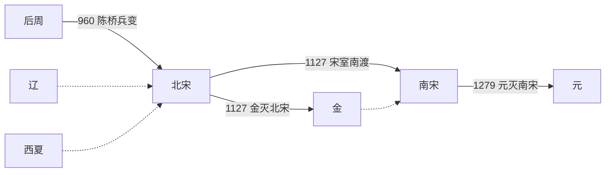

# 宋

## 时间

960年-1279年。

## 别称

赵宋。按都城和历史阶段分为[北宋](%E5%8C%97%E5%AE%8B.md)与[南宋](%E5%8D%97%E5%AE%8B.md)。

## 概括

宋朝承五代十国而起，下接元朝统一。960年，后周大将赵匡胤发动陈桥兵变，建立北宋；1127年靖康之变后，徽、钦二帝被金俘获，北宋灭亡。赵构南渡后重建宋朝，史称南宋，后来在蒙古和元军压力下长期抗战，1279年崖山海战后彻底灭亡。

宋朝经济、城市、文化教育、科技和科举制度高度发展，宋明理学形成并深刻影响后世。政治上采取重文抑武、分权制衡的制度设计，削弱了唐末五代以来藩镇割据的风险，但也造成军事指挥掣肘和对北方骑兵政权的防御压力。

## 演进流程

## 阶段

| 顺序 | 名称 | 时间 | 简要概括 |
|---:|---|---|---|
| 1 | [北宋](%E5%8C%97%E5%AE%8B.md) | 960年-1127年 | 定都东京开封，结束五代十国主要分裂局面，与辽、西夏长期并立；靖康之变后灭亡。 |
| 2 | [南宋](%E5%8D%97%E5%AE%8B.md) | 1127年-1279年 | 赵构南渡后建立，定都临安，与金、蒙古长期对峙；崖山海战后灭亡。 |

## 统治结构

| 角色 | 说明 |
|---|---|
| 君主 | 赵氏皇帝，名义和制度上的最高统治者。 |
| 中枢行政 | 以宰相、参知政事、枢密院、三司等机构分掌政务、军事和财政，具体设置随时期调整。 |
| 军事体制 | 重文抑武，以中央禁军和分权制衡防止武将坐大，但边防和机动作战能力受到影响。 |
| 地方治理 | 路、州、县等层级，转运使、提点刑狱、安抚使等职能分置，加强中央对地方的控制。 |

## 说明

- 宋真宗、宋仁宗时期，政治和经济进入相对稳定繁荣阶段。
- 北宋长期受燕云十六州缺失影响，面对辽和后来的金缺少北方天然屏障。
- 1120年宋金结成海上之盟攻辽，短期改变辽宋格局，但金灭辽后迅速南下，最终导致北宋灭亡。
- 南宋前期有李纲、宗泽、岳飞等主战力量，也有秦桧等主和力量；绍兴和议后宋金形成长期对峙。
- 南宋后期抗蒙战争持续数十年，临安于1276年陷落，宋残余政权至1279年崖山海战后灭亡。

## 世系

- [宋皇帝世系](%E4%B8%96%E7%B3%BB.md)
