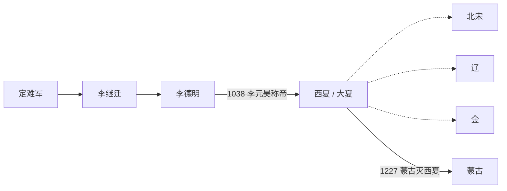

# 西夏

## 时间

1038年-1227年。其前身可追溯到唐末五代以来的定难军和党项李氏势力。

## 别称

大夏、夏。因位于宋朝西北，史称西夏。

## 概括

西夏由党项李氏建立，核心区域在今宁夏、甘肃、陕北和河西走廊一带。李继迁、李德明时期逐步扩张并在宋、辽之间取得自治和册封地位；1038年，李元昊称帝，国号大夏，标志西夏正式成为独立王朝。

西夏长期夹在宋、辽、金之间，通过战争、称臣、和议和贸易维持生存空间。它有自己的文字、官制和佛教文化传统，也吸收汉地、吐蕃、回鹘等多种文化。13世纪蒙古西征和南下过程中，西夏多次遭蒙古打击，1227年灭亡。

## 演进流程

## 阶段

| 顺序 | 名称 | 时间 | 简要概括 |
|---:|---|---|---|
| 1 | 党项李氏扩张 | 991年-1038年 | 李继迁、李德明经营西北，先后接受辽、宋册封，逐渐脱离宋朝控制。 |
| 2 | 建国与宋夏战争 | 1038年-1044年 | 李元昊称帝后与北宋爆发战争，确立独立地位。 |
| 3 | 宋辽金之间的西夏 | 1044年-1205年 | 在宋、辽、金之间调整臣属和外交关系，维持西北区域政权。 |
| 4 | 蒙古压力与灭亡 | 1205年-1227年 | 蒙古多次攻夏，1227年中兴府陷落，西夏灭亡。 |

## 统治结构

| 角色 | 说明 |
|---|---|
| 君主 | 党项李氏皇帝，兼具党项部族首领和中原式皇帝身份。 |
| 贵族与军政集团 | 党项贵族掌握军政核心，皇族、后族和部族势力影响继承与政治。 |
| 中枢行政 | 设置中原式官制，同时保留党项本族制度和军事组织。 |
| 文化制度 | 创制西夏文，发展佛教译经、法律和礼制，形成多族群混合文化。 |

## 说明

- 990年，辽圣宗册封李继迁为夏国王，显示党项李氏在辽宋之间取得政治空间。
- 1038年，李元昊称帝，脱离对北宋、辽朝的臣属关系。
- 西夏控制河西走廊后，对东西交通和边境贸易有重要影响。
- 西夏多次与宋战争，也会在辽、金压力变化时调整外交方向。
- 1227年，西夏在蒙古围攻下灭亡，部分文献传统和族群人口被并入元代版图。

## 世系

- [西夏君主世系](/%E4%BA%BA%E6%96%87%E7%A7%91%E5%AD%A6/%E5%8E%86%E5%8F%B2-%E4%B8%AD%E5%9B%BD/%E6%9C%9D%E4%BB%A3/%E8%BE%BD%E5%AE%8B%E9%87%91%E8%A5%BF%E5%A4%8F/%E8%A5%BF%E5%A4%8F/%E4%B8%96%E7%B3%BB.md)
