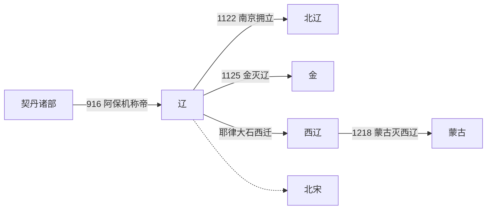

# 辽

## 时间

916年-1125年。辽亡后，另有北辽、西辽等延续政权。

## 别称

契丹、大辽。西迁中亚后的政权通常称[西辽](/%E4%BA%BA%E6%96%87%E7%A7%91%E5%AD%A6/%E5%8E%86%E5%8F%B2-%E4%B8%AD%E5%9B%BD/%E6%9C%9D%E4%BB%A3/%E8%BE%BD%E5%AE%8B%E9%87%91%E8%A5%BF%E5%A4%8F/%E8%BE%BD/%E8%A5%BF%E8%BE%BD.md)，又称喀喇契丹。

## 概括

辽朝由契丹耶律阿保机建立，是唐末五代以后北方最重要的非汉族王朝之一。辽控制东北、漠南草原和燕云地区，兼具草原部族政治与汉地州县制度，常以“南北面官”分别治理契丹、奚等北方群体和汉地农业人口。

辽与北宋长期并立，1005年澶渊之盟后形成相对稳定的边境秩序。12世纪初女真兴起，金朝联合宋朝攻辽，1125年天祚帝被俘，辽亡。耶律大石西迁后建立西辽，延续契丹政权至1218年。

## 演进流程

## 阶段

| 顺序 | 名称 | 时间 | 简要概括 |
|---:|---|---|---|
| 1 | 契丹建国 | 916年-947年 | 耶律阿保机称帝，建契丹国；辽太宗时期取得燕云十六州并南下中原。 |
| 2 | 大辽 | 947年-1125年 | 改国号大辽后形成多民族帝国，与北宋、西夏并立；1125年亡于金。 |
| 3 | 北辽 | 1122年-1123年 | 辽末南京地区短暂拥立的延续政权，迅速瓦解。 |
| 4 | [西辽](/%E4%BA%BA%E6%96%87%E7%A7%91%E5%AD%A6/%E5%8E%86%E5%8F%B2-%E4%B8%AD%E5%9B%BD/%E6%9C%9D%E4%BB%A3/%E8%BE%BD%E5%AE%8B%E9%87%91%E8%A5%BF%E5%A4%8F/%E8%BE%BD/%E8%A5%BF%E8%BE%BD.md) | 1132年-1218年 | 耶律大石西迁中亚后建立，1218年被蒙古灭亡。 |

## 统治结构

| 角色 | 说明 |
|---|---|
| 君主 | 耶律氏皇帝，兼具契丹可汗传统与中原皇帝制度。 |
| 后族与贵族 | 述律、萧氏等后族和契丹贵族在继承、军政和宫廷政治中影响很大。 |
| 北面官 | 主要治理契丹、奚等北方族群和草原事务。 |
| 南面官 | 主要治理燕云、渤海、汉人农业地区，吸收唐宋式官制。 |

## 说明

- 936年，后晋石敬瑭割让燕云十六州给契丹，辽获得进入华北的战略屏障。
- 947年，辽太宗攻入开封，灭后晋，并一度改国号为大辽。
- 1005年，辽宋订立澶渊之盟，宋每年给辽岁币，双方维持长期和平。
- 12世纪初，女真完颜部兴起，辽在金军压力下迅速衰落。
- 辽亡后，契丹政治传统在西辽继续存在，并影响中亚政治格局。

## 世系

- [辽、北辽、西辽世系](/%E4%BA%BA%E6%96%87%E7%A7%91%E5%AD%A6/%E5%8E%86%E5%8F%B2-%E4%B8%AD%E5%9B%BD/%E6%9C%9D%E4%BB%A3/%E8%BE%BD%E5%AE%8B%E9%87%91%E8%A5%BF%E5%A4%8F/%E8%BE%BD/%E4%B8%96%E7%B3%BB.md)
