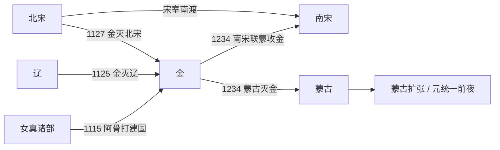

# 金

## 时间

1115年-1234年。

## 别称

大金、女真金。

## 概括

金朝由女真完颜阿骨打建立。它在辽朝统治东北和北方的背景下兴起，先灭辽，继而南下攻宋，1127年攻陷汴京并俘获宋徽宗、宋钦宗，造成靖康之变，北宋灭亡。此后金与南宋长期对峙，形成以淮河、大散关一线为大致边界的南北格局。

金朝前期保留女真猛安谋克制度，同时吸收辽、宋旧制治理汉地。中后期迁都中都、汴京，统治重心逐渐南移。13世纪蒙古兴起后，金在北方受到持续打击，又与南宋关系复杂，最终于1234年亡于蒙古与南宋夹击。

## 演进流程

## 阶段

| 顺序 | 名称 | 时间 | 简要概括 |
|---:|---|---|---|
| 1 | 建国与灭辽 | 1115年-1125年 | 完颜阿骨打建国，金太宗时期灭辽，取代辽成为北方强权。 |
| 2 | 灭北宋与宋金对峙 | 1125年-1161年 | 金军南下攻宋，1127年灭北宋；南宋建立后，双方经过战争与和议形成对峙。 |
| 3 | 中都时期 | 1153年-1214年 | 海陵王迁都中都，金朝进一步汉地化，世宗、章宗时期相对稳定。 |
| 4 | 汴京时期与灭亡 | 1214年-1234年 | 蒙古压力下南迁汴京，国势衰落，最终亡于蒙宋夹击。 |

## 统治结构

| 角色 | 说明 |
|---|---|
| 君主 | 完颜氏皇帝，兼具女真部族联盟首领和中原皇帝身份。 |
| 女真军事组织 | 猛安谋克是金朝重要的军事与社会组织基础。 |
| 中枢行政 | 吸收辽、宋官制，设置尚书省等机构治理广阔汉地。 |
| 地方治理 | 对东北女真旧地、华北汉地和边疆地区采取差异化治理。 |

## 说明

- 1115年，完颜阿骨打在上京会宁府建国，国号大金。
- 1125年，金灭辽；1127年，金攻陷汴京，北宋灭亡。
- 1153年，海陵王完颜亮迁都中都，加强对华北核心区的控制。
- 1214年，金宣宗在蒙古压力下南迁汴京，失去北方战略主动权。
- 1234年，蔡州陷落，金哀宗自缢，完颜承麟短暂即位后金亡。

## 世系

- [金皇帝世系](/%E4%BA%BA%E6%96%87%E7%A7%91%E5%AD%A6/%E5%8E%86%E5%8F%B2-%E4%B8%AD%E5%9B%BD/%E6%9C%9D%E4%BB%A3/%E8%BE%BD%E5%AE%8B%E9%87%91%E8%A5%BF%E5%A4%8F/%E9%87%91/%E4%B8%96%E7%B3%BB.md)
