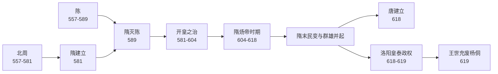

# 隋

> 导航：[南北朝](%E4%BA%BA%E6%96%87%E7%A7%91%E5%AD%A6/%E5%8E%86%E5%8F%B2-%E4%B8%AD%E5%9B%BD/%E6%9C%9D%E4%BB%A3/%E5%8D%97%E5%8C%97%E6%9C%9D/README.md) / [隋](%E4%BA%BA%E6%96%87%E7%A7%91%E5%AD%A6/%E5%8E%86%E5%8F%B2-%E4%B8%AD%E5%9B%BD/%E6%9C%9D%E4%BB%A3/%E9%9A%8B/README.md) / [唐](%E4%BA%BA%E6%96%87%E7%A7%91%E5%AD%A6/%E5%8E%86%E5%8F%B2-%E4%B8%AD%E5%9B%BD/%E6%9C%9D%E4%BB%A3/%E5%94%90/README.md)

## 概括

隋朝（581年—618年，洛阳皇泰政权延续至619年）上承南北朝、下启唐朝。581年杨坚受北周静帝禅让建隋，589年灭陈，结束西晋永嘉之乱以来近三百年的南北分裂。隋朝国祚较短，但在统一、制度、交通和财政户籍整合方面影响深远，常与唐朝并称“隋唐”。

## 演进流程

## 阶段导览

| 顺序 | 阶段 | 时间 | 简要概括 |
|---:|---|---|---|
| 1 | 杨坚代周建隋 | 581年 | 杨坚受北周静帝禅让，建立隋朝，定都大兴。 |
| 2 | 统一南北 | 581年—589年 | 587年废西梁，589年灭陈，完成南北统一。 |
| 3 | 开皇之治 | 581年—604年 | 整顿户籍、推行均田和租调制度，改革中央官制，削弱门阀垄断。 |
| 4 | 炀帝时期 | 604年—618年 | 营建东都洛阳，开凿大运河，修驰道，巡幸和对外战争加重财政与徭役压力。 |
| 5 | [隋末群雄](%E4%BA%BA%E6%96%87%E7%A7%91%E5%AD%A6/%E5%8E%86%E5%8F%B2-%E4%B8%AD%E5%9B%BD/%E6%9C%9D%E4%BB%A3/%E9%9A%8B/%E9%9A%8B%E6%9C%AB%E7%BE%A4%E9%9B%84.md) | 611年—624年左右 | 农民起义、地方军阀和关陇集团分化并起，隋朝中央迅速瓦解。 |
| 6 | 隋亡与唐兴 | 617年—619年 | 李渊入长安立杨侑，618年受禅建唐；洛阳杨侗政权于619年被王世充废除。 |

## 核心线索

- **重新统一**：隋灭陈后重新整合南北，结束长期分裂，为唐代大一统奠定基础。
- **制度承前启后**：三省六部制、科举取士、监察和考绩制度在隋代定型或强化，深刻影响唐宋以后政治结构。
- **财政与户籍**：均田制、租调制和清查户口增强国家汲取能力，也支撑开皇时期的恢复和积累。
- **交通工程**：大兴城、东都洛阳、大运河和驰道强化了政治控制与南北经济联系，但也集中消耗民力。
- **灭亡原因**：关陇贵族与地方势力暗流、门阀对新制度的抵触、连续大工程和高句丽战争、隋炀帝后期政治失衡，共同引发统治崩解。

## 相关笔记

- [隋世系](%E4%BA%BA%E6%96%87%E7%A7%91%E5%AD%A6/%E5%8E%86%E5%8F%B2-%E4%B8%AD%E5%9B%BD/%E6%9C%9D%E4%BB%A3/%E9%9A%8B/%E4%B8%96%E7%B3%BB.md)
- [隋末群雄](%E4%BA%BA%E6%96%87%E7%A7%91%E5%AD%A6/%E5%8E%86%E5%8F%B2-%E4%B8%AD%E5%9B%BD/%E6%9C%9D%E4%BB%A3/%E9%9A%8B/%E9%9A%8B%E6%9C%AB%E7%BE%A4%E9%9B%84.md)
- [南北朝](%E4%BA%BA%E6%96%87%E7%A7%91%E5%AD%A6/%E5%8E%86%E5%8F%B2-%E4%B8%AD%E5%9B%BD/%E6%9C%9D%E4%BB%A3/%E5%8D%97%E5%8C%97%E6%9C%9D/README.md)
- [唐](%E4%BA%BA%E6%96%87%E7%A7%91%E5%AD%A6/%E5%8E%86%E5%8F%B2-%E4%B8%AD%E5%9B%BD/%E6%9C%9D%E4%BB%A3/%E5%94%90/README.md)
