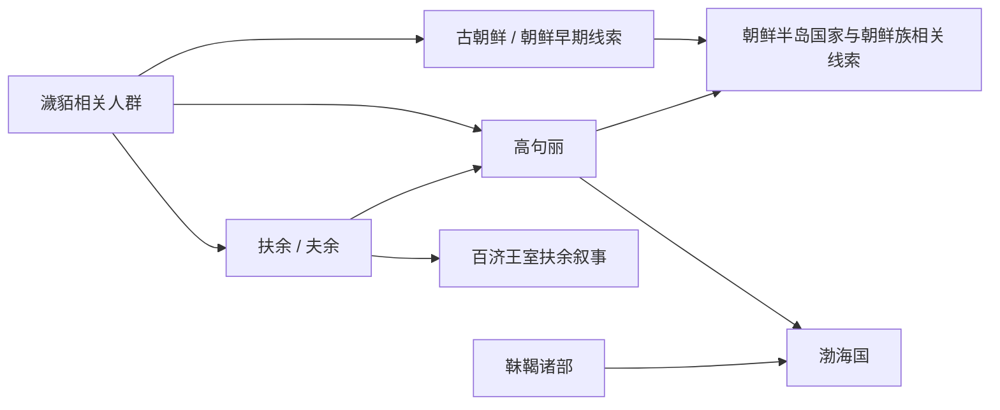

# 东北濊貊与朝鲜

## 概括

这一类整理辽东、朝鲜半岛北部、鸭绿江、图们江、松花江流域的濊貊、古朝鲜、扶余、高句丽和渤海国线索。它不是通古斯语族的分支，也不是单一现代民族的直线祖源，而是东北边缘和朝鲜半岛古代国家形成的重要历史轴线。

## 起源

濊貊常被视为古朝鲜、扶余、高句丽、沃沮、东濊等相关人群的文献线索。古朝鲜与汉四郡、扶余、高句丽、百济、新罗、高丽、朝鲜王朝之间存在复杂的政治和文化继承。

## 变迁

古朝鲜灭亡后，东北和朝鲜半岛北部出现扶余、高句丽、沃沮、东濊等政权或部族。高句丽灭亡后，一部分遗民进入唐、渤海、新罗和后来的高丽系统。渤海国由粟末靺鞨和高句丽遗民共同构成，因而在本目录中作为东北濊貊与通古斯交界线索处理。

## 包含民族 / 政权

- [濊貊](/%E4%BA%BA%E6%96%87%E7%A7%91%E5%AD%A6/%E5%8E%86%E5%8F%B2-%E4%B8%AD%E5%9B%BD/%E6%B0%91%E6%97%8F/%E4%B8%9C%E5%8C%97%E6%BF%8A%E8%B2%8A%E4%B8%8E%E6%9C%9D%E9%B2%9C/%E6%BF%8A%E8%B2%8A%E6%89%B6%E4%BD%99%E5%8F%A4%E5%9B%BD/%E6%BF%8A%E8%B2%8A.md)
- [扶余](/%E4%BA%BA%E6%96%87%E7%A7%91%E5%AD%A6/%E5%8E%86%E5%8F%B2-%E4%B8%AD%E5%9B%BD/%E6%B0%91%E6%97%8F/%E4%B8%9C%E5%8C%97%E6%BF%8A%E8%B2%8A%E4%B8%8E%E6%9C%9D%E9%B2%9C/%E6%BF%8A%E8%B2%8A%E6%89%B6%E4%BD%99%E5%8F%A4%E5%9B%BD/%E6%89%B6%E4%BD%99.md)
- [朝鲜](/%E4%BA%BA%E6%96%87%E7%A7%91%E5%AD%A6/%E5%8E%86%E5%8F%B2-%E4%B8%AD%E5%9B%BD/%E6%B0%91%E6%97%8F/%E4%B8%9C%E5%8C%97%E6%BF%8A%E8%B2%8A%E4%B8%8E%E6%9C%9D%E9%B2%9C/%E6%BF%8A%E8%B2%8A%E6%89%B6%E4%BD%99%E5%8F%A4%E5%9B%BD/%E6%9C%9D%E9%B2%9C.md)
- [渤海国](/%E4%BA%BA%E6%96%87%E7%A7%91%E5%AD%A6/%E5%8E%86%E5%8F%B2-%E4%B8%AD%E5%9B%BD/%E6%B0%91%E6%97%8F/%E4%B8%9C%E5%8C%97%E6%BF%8A%E8%B2%8A%E4%B8%8E%E6%9C%9D%E9%B2%9C/%E6%B8%A4%E6%B5%B7%E7%BA%BF%E7%B4%A2/%E6%B8%A4%E6%B5%B7%E5%9B%BD.md)

## 演进图

## 相关总览

- [华夏周边民族](/%E4%BA%BA%E6%96%87%E7%A7%91%E5%AD%A6/%E5%8E%86%E5%8F%B2-%E4%B8%AD%E5%9B%BD/%E6%B0%91%E6%97%8F/README.md)
- [起源](/%E4%BA%BA%E6%96%87%E7%A7%91%E5%AD%A6/%E5%8E%86%E5%8F%B2-%E4%B8%AD%E5%9B%BD/%E6%B0%91%E6%97%8F/README.md#起源)
- [变迁](/%E4%BA%BA%E6%96%87%E7%A7%91%E5%AD%A6/%E5%8E%86%E5%8F%B2-%E4%B8%AD%E5%9B%BD/%E6%B0%91%E6%97%8F/README.md#变迁)
