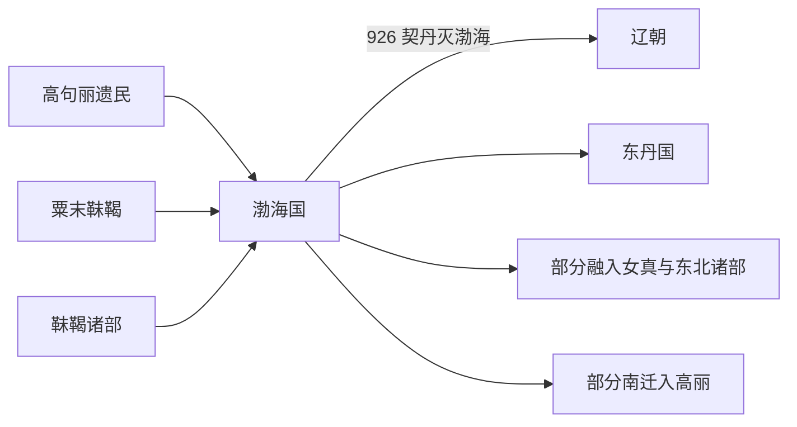

# 渤海国

## 概括

渤海国由大祚荣建立，统治核心包含粟末靺鞨、高句丽遗民及东北多族群。

## 起源

粟末靺鞨、高句丽遗民和东北诸部

### 起源详细补充

- 渤海国由大祚荣建立，核心来源为粟末靺鞨和高句丽遗民。
- 其政治中心在今吉林、黑龙江、俄罗斯滨海边疆区和朝鲜半岛北部交界。
- 渤海不是单一族群国家，而是东北多民族王国。

## 变迁

926 年被契丹辽朝灭亡，遗民分散进入辽、女真、高丽等政治体系。

### 变迁详细补充

- 698年建国后，渤海接受唐册封并发展出五京制度。
- 926年被契丹辽灭亡，遗民被迁徙或并入辽、女真、高丽等体系。
- 渤海遗民和靺鞨-女真线索共同影响后来的东北民族格局。

## 演进图

## 君主世系表

| 顺序 | 姓名 | 庙号 / 谥号 | 在位时间 | 关键事件 / 备注 |
|---|---|---|---|---|
| 1 | **大祚荣** | 高王 | 698-719 | 建立震国，后称渤海。 |
| 2 | 大武艺 | 武王 | 719-737 | 对外扩张，与唐、新罗、日本互动。 |
| 3 | **大钦茂** | 文王 | 737-793 | 渤海制度和文化发展，迁都上京龙泉府。 |
| 4 | 大元义 | 废王 | 793 | 在位极短。 |
| 5 | 大华玙 | 成王 | 793-794 | 在位短。 |
| 6 | 大嵩璘 | 康王 | 794-809 | 渤海中期。 |
| 7 | 大元瑜 | 定王 | 809-812 | 在位短。 |
| 8 | 大言义 | 僖王 | 812-817 | 渤海中期。 |
| 9 | 大明忠 | 简王 | 817-818 | 在位短。 |
| 10 | 大仁秀 | 宣王 | 818-830 | 渤海后期强盛。 |
| 11 | 大彝震 | 大王 | 830-857 | 后期君主。 |
| 12 | 大虔晃 | 大王 | 857-871 | 后期君主。 |
| 13 | 大玄锡 | 大王 | 871-895 | 后期君主。 |
| 14 | 大玮瑎 | 大王 | 895-906 | 后期君主。 |
| 15 | 大諲撰 | 末王 | 906-926 | 926 年契丹灭渤海。 |

## 所属大类

- [东北濊貊与朝鲜](/%E4%BA%BA%E6%96%87%E7%A7%91%E5%AD%A6/%E5%8E%86%E5%8F%B2-%E4%B8%AD%E5%9B%BD/%E6%B0%91%E6%97%8F/%E4%B8%9C%E5%8C%97%E6%BF%8A%E8%B2%8A%E4%B8%8E%E6%9C%9D%E9%B2%9C/README.md)

## 相关总览

- [华夏周边民族](/%E4%BA%BA%E6%96%87%E7%A7%91%E5%AD%A6/%E5%8E%86%E5%8F%B2-%E4%B8%AD%E5%9B%BD/%E6%B0%91%E6%97%8F/README.md)
- [起源](/%E4%BA%BA%E6%96%87%E7%A7%91%E5%AD%A6/%E5%8E%86%E5%8F%B2-%E4%B8%AD%E5%9B%BD/%E6%B0%91%E6%97%8F/README.md#起源)
- [变迁](/%E4%BA%BA%E6%96%87%E7%A7%91%E5%AD%A6/%E5%8E%86%E5%8F%B2-%E4%B8%AD%E5%9B%BD/%E6%B0%91%E6%97%8F/README.md#变迁)
