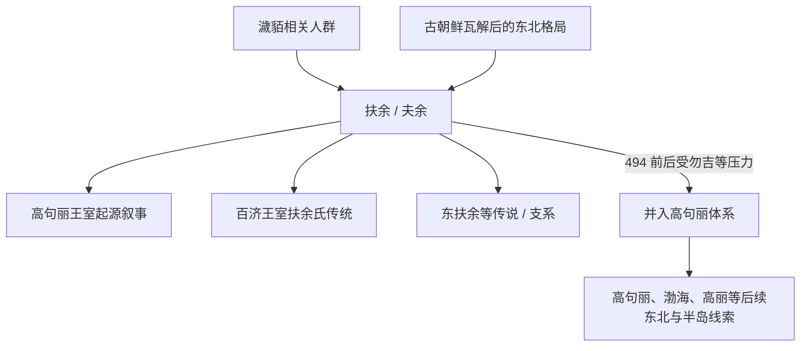

# 扶余

## 概括

扶余，又作夫余，是公元前后至 5 世纪活动于今中国东北松嫩平原、吉林北部和朝鲜半岛北部边缘的重要古国。它与濊貊、古朝鲜、扶余-高句丽-百济传统密切相关；高句丽和百济都在王室叙事中强调与扶余的继承关系。

## 起源

扶余的形成通常放在古朝鲜瓦解后东北亚政治重组的背景下理解。其核心区域在松花江、嫩江流域的农牧交错地带，既不同于纯草原游牧国家，也不同于中原郡县社会。扶余人群常被纳入濊貊系统讨论，语言和族属资料有限，不能简单等同于现代朝鲜族或任何单一现代民族。

### 起源详细补充

- 扶余形成于松嫩平原和吉林北部，是濊貊系统中的重要古国。
- 它处于农耕、渔猎、畜牧交错区，社会组织以王和诸加为核心。
- 扶余与古朝鲜、高句丽和汉魏东北郡县体系都有关系。

## 变迁

扶余在汉魏时期与中原王朝、玄菟郡、高句丽、鲜卑和东北诸部保持互动。到 5 世纪，扶余受到高句丽和勿吉等力量挤压，494 年前后其残余归附或并入高句丽。此后“扶余”更多作为高句丽、百济王室合法性和族源叙事中的重要名称保留。

### 变迁详细补充

- 扶余长期与高句丽、鲜卑、勿吉和中原王朝互动。
- 高句丽和百济都在王室传统中强调扶余继承。
- 494年前后扶余残余并入高句丽，扶余作为独立政权消失。

## 主要王系表（可考与传说混合）

扶余王系资料零散，汉文和朝鲜半岛史书只保存少数王名；以下为常见可考或传说性节点，不能视为完整连续世系。

| 顺序 | 姓名 / 称号 | 时间 | 性质 | 关键事件 / 备注 |
|---|---|---|---|---|
| 1 | 东明 | 传说时代 | 始祖传说 | 扶余建国始祖叙事，与高句丽朱蒙传说互有关联。 |
| 2 | 尉仇台 | 2 世纪前后 | 可考王名 | 东汉时期扶余王，曾与汉朝和公孙氏互动。 |
| 3 | 简位居 | 3 世纪 | 可考王名 | 《三国志》记载的扶余王。 |
| 4 | 麻余 | 3 世纪 | 可考王名 | 简位居之后的扶余王。 |
| 5 | 依虑 | 3 世纪后期 | 可考王名 | 受鲜卑、晋和高句丽局势影响。 |
| 6 | 依罗 | 3-4 世纪 | 可考王名 | 扶余后期王名之一。 |
| 7 | 玄王 | 5 世纪 | 后期王名 | 扶余衰落期，后并入高句丽。 |

## 所属大类

- [东北濊貊与朝鲜](/%E4%BA%BA%E6%96%87%E7%A7%91%E5%AD%A6/%E5%8E%86%E5%8F%B2-%E4%B8%AD%E5%9B%BD/%E6%B0%91%E6%97%8F/%E4%B8%9C%E5%8C%97%E6%BF%8A%E8%B2%8A%E4%B8%8E%E6%9C%9D%E9%B2%9C/README.md)

## 相关笔记

- [濊貊](/%E4%BA%BA%E6%96%87%E7%A7%91%E5%AD%A6/%E5%8E%86%E5%8F%B2-%E4%B8%AD%E5%9B%BD/%E6%B0%91%E6%97%8F/%E4%B8%9C%E5%8C%97%E6%BF%8A%E8%B2%8A%E4%B8%8E%E6%9C%9D%E9%B2%9C/%E6%BF%8A%E8%B2%8A%E6%89%B6%E4%BD%99%E5%8F%A4%E5%9B%BD/%E6%BF%8A%E8%B2%8A.md)
- [朝鲜](/%E4%BA%BA%E6%96%87%E7%A7%91%E5%AD%A6/%E5%8E%86%E5%8F%B2-%E4%B8%AD%E5%9B%BD/%E6%B0%91%E6%97%8F/%E4%B8%9C%E5%8C%97%E6%BF%8A%E8%B2%8A%E4%B8%8E%E6%9C%9D%E9%B2%9C/%E6%BF%8A%E8%B2%8A%E6%89%B6%E4%BD%99%E5%8F%A4%E5%9B%BD/%E6%9C%9D%E9%B2%9C.md)
- [渤海国](/%E4%BA%BA%E6%96%87%E7%A7%91%E5%AD%A6/%E5%8E%86%E5%8F%B2-%E4%B8%AD%E5%9B%BD/%E6%B0%91%E6%97%8F/%E4%B8%9C%E5%8C%97%E6%BF%8A%E8%B2%8A%E4%B8%8E%E6%9C%9D%E9%B2%9C/%E6%B8%A4%E6%B5%B7%E7%BA%BF%E7%B4%A2/%E6%B8%A4%E6%B5%B7%E5%9B%BD.md)
- [变迁](/%E4%BA%BA%E6%96%87%E7%A7%91%E5%AD%A6/%E5%8E%86%E5%8F%B2-%E4%B8%AD%E5%9B%BD/%E6%B0%91%E6%97%8F/README.md#变迁)

