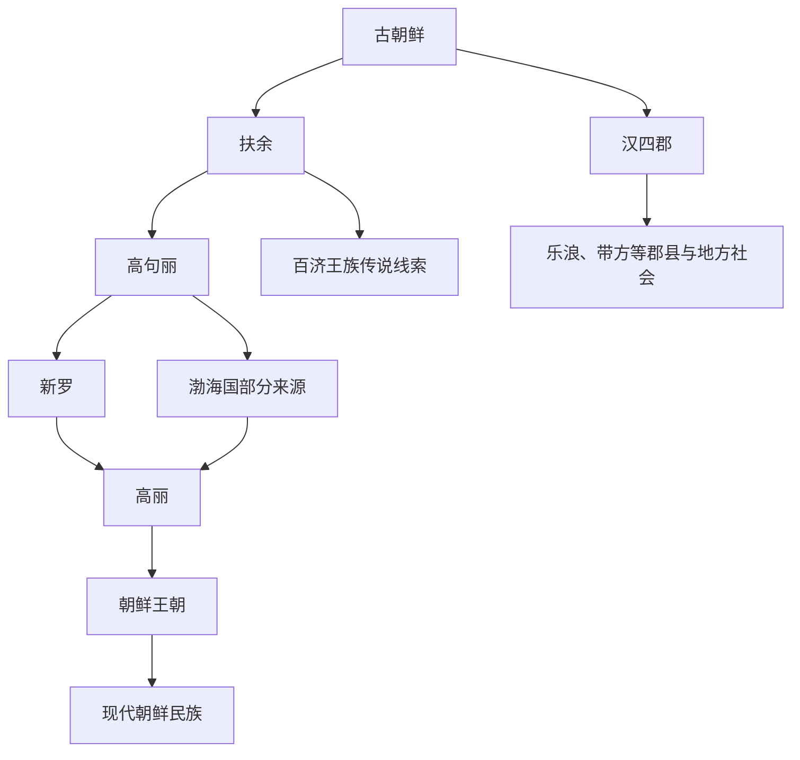

# 朝鲜

## 校正版演进图

> 原图把朝鲜民族形成画成过直的王朝线。校正版补入扶余、高句丽、百济、新罗、渤海、高丽之间的多源整合。

## 概括

这里指古朝鲜及朝鲜半岛北部历史线索，不等于现代民族国家概念。古朝鲜、扶余、高句丽、沃沮、东濊等与濊貊和半岛古代族群有关。

## 起源

濊貊、古朝鲜、扶余、高句丽等线索

### 起源详细补充

- 本页的朝鲜主要指古朝鲜到朝鲜民族形成的历史线索，不等于现代国家概念。
- 古朝鲜位于辽东和朝鲜半岛北部，后与汉四郡、扶余、高句丽、三韩互动。
- 朝鲜民族形成包含濊貊、三韩、扶余-高句丽、百济、新罗、渤海等多重来源。

## 变迁

汉四郡、三国时代、高丽、朝鲜王朝以后形成朝鲜民族的历史主体。

### 变迁详细补充

- 卫满朝鲜被汉武帝灭后，汉四郡影响半岛北部。
- 高句丽、百济、新罗三国竞争，后由新罗和唐灭百济、高句丽。
- 高丽、朝鲜王朝整合半岛主体人群，近现代形成朝鲜民族身份。

## 主要世系表（古朝鲜节点）

“朝鲜”在本目录主要指古朝鲜和朝鲜族历史线索，不等同于单一王朝。古朝鲜世系传说性很强，较可靠的政治世系是卫氏朝鲜。

| 顺序 | 姓名 / 称号 | 在位时间 | 性质 | 关键事件 / 备注 |
|---|---|---|---|---|
| 1 | 檀君王俭 | 传说时代 | 建国传说 | 古朝鲜始祖传说，不能作严格历史世系。 |
| 2 | 箕子 | 传统叙事 | 传说 / 后世追述 | 箕子朝鲜有强烈后世建构色彩。 |
| 3 | **卫满** | 约前 194-? | 卫氏朝鲜 | 取代准王，建立卫氏朝鲜。 |
| 4 | 不详 | ? | 卫氏朝鲜 | 卫满之后一代，史料不明。 |
| 5 | 右渠王 | ?-前 108 | 卫氏朝鲜末王 | 汉武帝灭卫氏朝鲜，置汉四郡。 |

## 所属大类

- [东北濊貊与朝鲜](/%E4%BA%BA%E6%96%87%E7%A7%91%E5%AD%A6/%E5%8E%86%E5%8F%B2-%E4%B8%AD%E5%9B%BD/%E6%B0%91%E6%97%8F/%E4%B8%9C%E5%8C%97%E6%BF%8A%E8%B2%8A%E4%B8%8E%E6%9C%9D%E9%B2%9C/README.md)

## 相关总览

- [华夏周边民族](/%E4%BA%BA%E6%96%87%E7%A7%91%E5%AD%A6/%E5%8E%86%E5%8F%B2-%E4%B8%AD%E5%9B%BD/%E6%B0%91%E6%97%8F/README.md)
- [起源](/%E4%BA%BA%E6%96%87%E7%A7%91%E5%AD%A6/%E5%8E%86%E5%8F%B2-%E4%B8%AD%E5%9B%BD/%E6%B0%91%E6%97%8F/README.md#起源)
- [变迁](/%E4%BA%BA%E6%96%87%E7%A7%91%E5%AD%A6/%E5%8E%86%E5%8F%B2-%E4%B8%AD%E5%9B%BD/%E6%B0%91%E6%97%8F/README.md#变迁)
