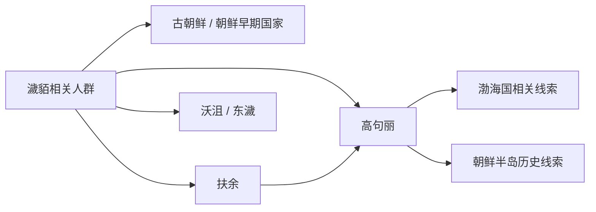

# 濊貊

## 概括

濊貊是中国东北和朝鲜半岛北部古代族群称谓，与扶余、高句丽、沃沮、东濊等有密切关系。

## 起源

辽东、松花江、朝鲜半岛北部古代族群

### 起源详细补充

- 濊貊是中国古代文献中东北和朝鲜半岛北部族群称谓。
- 它常与古朝鲜、扶余、高句丽、沃沮、东濊等联系。
- 濊貊不是现代民族名，而是东北边缘多群体的历史标签。

## 变迁

濊貊线索更多关联朝鲜半岛和扶余-高句丽系统，不应简单归入肃慎或通古斯。

### 变迁详细补充

- 古朝鲜瓦解后，濊貊相关区域出现扶余、高句丽、沃沮、东濊等政权或部族。
- 高句丽兴起后吸收大量濊貊系统人群。
- 其后续影响进入高句丽、渤海、高丽和朝鲜半岛民族形成史。

## 演进图

## 世系说明

濊貊不是一个单一王朝或固定家族名称，而是东北和朝鲜半岛北部古代人群的泛称，因此没有能够连续排列的统一君主世系。可考的政治世系应分别放在扶余、朝鲜、渤海国以及高句丽、百济等具体政权等具体政权或部族笔记中。

## 所属大类

- [东北濊貊与朝鲜](/%E4%BA%BA%E6%96%87%E7%A7%91%E5%AD%A6/%E5%8E%86%E5%8F%B2-%E4%B8%AD%E5%9B%BD/%E6%B0%91%E6%97%8F/%E4%B8%9C%E5%8C%97%E6%BF%8A%E8%B2%8A%E4%B8%8E%E6%9C%9D%E9%B2%9C/README.md)

## 相关总览

- [华夏周边民族](/%E4%BA%BA%E6%96%87%E7%A7%91%E5%AD%A6/%E5%8E%86%E5%8F%B2-%E4%B8%AD%E5%9B%BD/%E6%B0%91%E6%97%8F/README.md)
- [起源](/%E4%BA%BA%E6%96%87%E7%A7%91%E5%AD%A6/%E5%8E%86%E5%8F%B2-%E4%B8%AD%E5%9B%BD/%E6%B0%91%E6%97%8F/README.md#起源)
- [变迁](/%E4%BA%BA%E6%96%87%E7%A7%91%E5%AD%A6/%E5%8E%86%E5%8F%B2-%E4%B8%AD%E5%9B%BD/%E6%B0%91%E6%97%8F/README.md#变迁)
