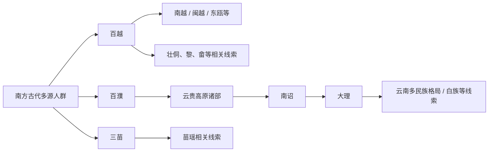

# 南方百越百濮苗瑶

## 概括

以长江中下游、江汉、云贵、岭南、东南沿海和越南北部为主要区域，包括三苗、百濮、百越等泛称。

## 起源

三苗、百濮、百越都不是单一民族或单一语言共同体。它们更适合作为南方古代多群体集合来处理，可能涉及苗瑶、侗台 / 壮侗、南亚、南岛以及已经消失的语言。

## 变迁

这一大类的演进通常不是单线血缘继承，而是多部族联盟、迁徙、征服、内附、语言转用和文化融合的结果。

## 演进图

## 包含民族

### [南方古族群](/%E4%BA%BA%E6%96%87%E7%A7%91%E5%AD%A6/%E5%8E%86%E5%8F%B2-%E4%B8%AD%E5%9B%BD/%E6%B0%91%E6%97%8F/%E5%8D%97%E6%96%B9%E7%99%BE%E8%B6%8A%E7%99%BE%E6%BF%AE%E8%8B%97%E7%91%B6/%E5%8D%97%E6%96%B9%E5%8F%A4%E6%97%8F%E7%BE%A4/README.md)

- [三苗](/%E4%BA%BA%E6%96%87%E7%A7%91%E5%AD%A6/%E5%8E%86%E5%8F%B2-%E4%B8%AD%E5%9B%BD/%E6%B0%91%E6%97%8F/%E5%8D%97%E6%96%B9%E7%99%BE%E8%B6%8A%E7%99%BE%E6%BF%AE%E8%8B%97%E7%91%B6/%E5%8D%97%E6%96%B9%E5%8F%A4%E6%97%8F%E7%BE%A4/%E4%B8%89%E8%8B%97.md)
- [百濮](/%E4%BA%BA%E6%96%87%E7%A7%91%E5%AD%A6/%E5%8E%86%E5%8F%B2-%E4%B8%AD%E5%9B%BD/%E6%B0%91%E6%97%8F/%E5%8D%97%E6%96%B9%E7%99%BE%E8%B6%8A%E7%99%BE%E6%BF%AE%E8%8B%97%E7%91%B6/%E5%8D%97%E6%96%B9%E5%8F%A4%E6%97%8F%E7%BE%A4/%E7%99%BE%E6%BF%AE.md)
- [百越](/%E4%BA%BA%E6%96%87%E7%A7%91%E5%AD%A6/%E5%8E%86%E5%8F%B2-%E4%B8%AD%E5%9B%BD/%E6%B0%91%E6%97%8F/%E5%8D%97%E6%96%B9%E7%99%BE%E8%B6%8A%E7%99%BE%E6%BF%AE%E8%8B%97%E7%91%B6/%E5%8D%97%E6%96%B9%E5%8F%A4%E6%97%8F%E7%BE%A4/%E7%99%BE%E8%B6%8A.md)

### [西南政权](/%E4%BA%BA%E6%96%87%E7%A7%91%E5%AD%A6/%E5%8E%86%E5%8F%B2-%E4%B8%AD%E5%9B%BD/%E6%B0%91%E6%97%8F/%E5%8D%97%E6%96%B9%E7%99%BE%E8%B6%8A%E7%99%BE%E6%BF%AE%E8%8B%97%E7%91%B6/%E8%A5%BF%E5%8D%97%E6%94%BF%E6%9D%83/README.md)

- [南诏](/%E4%BA%BA%E6%96%87%E7%A7%91%E5%AD%A6/%E5%8E%86%E5%8F%B2-%E4%B8%AD%E5%9B%BD/%E6%B0%91%E6%97%8F/%E5%8D%97%E6%96%B9%E7%99%BE%E8%B6%8A%E7%99%BE%E6%BF%AE%E8%8B%97%E7%91%B6/%E8%A5%BF%E5%8D%97%E6%94%BF%E6%9D%83/%E5%8D%97%E8%AF%8F.md)
- [大理](/%E4%BA%BA%E6%96%87%E7%A7%91%E5%AD%A6/%E5%8E%86%E5%8F%B2-%E4%B8%AD%E5%9B%BD/%E6%B0%91%E6%97%8F/%E5%8D%97%E6%96%B9%E7%99%BE%E8%B6%8A%E7%99%BE%E6%BF%AE%E8%8B%97%E7%91%B6/%E8%A5%BF%E5%8D%97%E6%94%BF%E6%9D%83/%E5%A4%A7%E7%90%86.md)

## 相关总览

- [起源](/%E4%BA%BA%E6%96%87%E7%A7%91%E5%AD%A6/%E5%8E%86%E5%8F%B2-%E4%B8%AD%E5%9B%BD/%E6%B0%91%E6%97%8F/README.md#起源)
- [变迁](/%E4%BA%BA%E6%96%87%E7%A7%91%E5%AD%A6/%E5%8E%86%E5%8F%B2-%E4%B8%AD%E5%9B%BD/%E6%B0%91%E6%97%8F/README.md#变迁)
