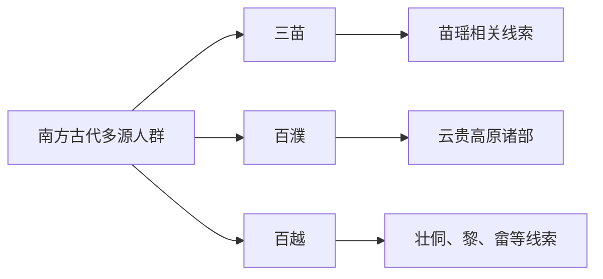

# 南方古族群

本目录是“南方百越百濮苗瑶”下的二级线索，用于收纳南方古族群相关民族、部族或政权笔记。

## 演进图

## 包含笔记

- [三苗](/%E4%BA%BA%E6%96%87%E7%A7%91%E5%AD%A6/%E5%8E%86%E5%8F%B2-%E4%B8%AD%E5%9B%BD/%E6%B0%91%E6%97%8F/%E5%8D%97%E6%96%B9%E7%99%BE%E8%B6%8A%E7%99%BE%E6%BF%AE%E8%8B%97%E7%91%B6/%E5%8D%97%E6%96%B9%E5%8F%A4%E6%97%8F%E7%BE%A4/%E4%B8%89%E8%8B%97.md)
- [百濮](/%E4%BA%BA%E6%96%87%E7%A7%91%E5%AD%A6/%E5%8E%86%E5%8F%B2-%E4%B8%AD%E5%9B%BD/%E6%B0%91%E6%97%8F/%E5%8D%97%E6%96%B9%E7%99%BE%E8%B6%8A%E7%99%BE%E6%BF%AE%E8%8B%97%E7%91%B6/%E5%8D%97%E6%96%B9%E5%8F%A4%E6%97%8F%E7%BE%A4/%E7%99%BE%E6%BF%AE.md)
- [百越](/%E4%BA%BA%E6%96%87%E7%A7%91%E5%AD%A6/%E5%8E%86%E5%8F%B2-%E4%B8%AD%E5%9B%BD/%E6%B0%91%E6%97%8F/%E5%8D%97%E6%96%B9%E7%99%BE%E8%B6%8A%E7%99%BE%E6%BF%AE%E8%8B%97%E7%91%B6/%E5%8D%97%E6%96%B9%E5%8F%A4%E6%97%8F%E7%BE%A4/%E7%99%BE%E8%B6%8A.md)

## 上级目录

- [南方百越百濮苗瑶](/%E4%BA%BA%E6%96%87%E7%A7%91%E5%AD%A6/%E5%8E%86%E5%8F%B2-%E4%B8%AD%E5%9B%BD/%E6%B0%91%E6%97%8F/%E5%8D%97%E6%96%B9%E7%99%BE%E8%B6%8A%E7%99%BE%E6%BF%AE%E8%8B%97%E7%91%B6/README.md)
- [华夏周边民族](/%E4%BA%BA%E6%96%87%E7%A7%91%E5%AD%A6/%E5%8E%86%E5%8F%B2-%E4%B8%AD%E5%9B%BD/%E6%B0%91%E6%97%8F/README.md)
