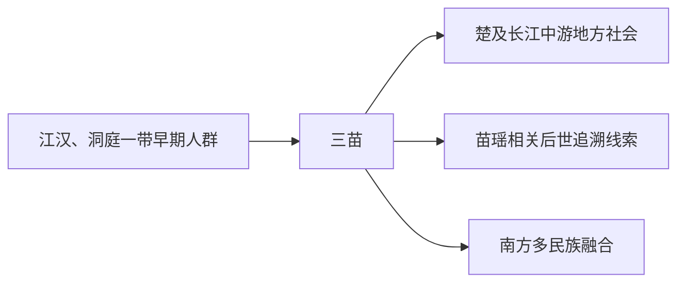

# 三苗

## 概括

三苗是尧舜禹传说和先秦文献中的古国 / 部族名，常与江汉、洞庭、鄱阳之间联系。

## 起源

长江中游古代人群和传说族群

### 起源详细补充

- 三苗是尧舜禹传说和先秦文献中的古国、部族或政治共同体名称。
- 其活动区常被放在江汉、洞庭、鄱阳之间。
- 三苗与九黎、苗瑶语系或长江中游古文化之间可能有关联，但不能直接等同现代苗族。

## 变迁

与后世苗瑶语系可能有文化或名称联想，但不能直接等同现代苗族。

### 变迁详细补充

- 传说中三苗多次与尧舜禹联盟发生冲突，并有迁徙三危等叙事。
- 进入历史时期后，三苗作为独立族名不再清晰出现。
- 其文化记忆被后世用于解释苗瑶、南方山地族群和长江中游古人群来源。

## 演进图

## 世系说明

三苗不是一个单一王朝或固定家族名称，而是传说和早期文献中的南方族群泛称，因此没有能够连续排列的统一君主世系。可考的政治世系应分别放在苗瑶、楚地和南方多民族相关线索等具体政权或部族笔记中。

## 所属大类

- [南方百越百濮苗瑶](/%E4%BA%BA%E6%96%87%E7%A7%91%E5%AD%A6/%E5%8E%86%E5%8F%B2-%E4%B8%AD%E5%9B%BD/%E6%B0%91%E6%97%8F/%E5%8D%97%E6%96%B9%E7%99%BE%E8%B6%8A%E7%99%BE%E6%BF%AE%E8%8B%97%E7%91%B6/README.md)

## 相关总览

- [华夏周边民族](/%E4%BA%BA%E6%96%87%E7%A7%91%E5%AD%A6/%E5%8E%86%E5%8F%B2-%E4%B8%AD%E5%9B%BD/%E6%B0%91%E6%97%8F/README.md)
- [起源](/%E4%BA%BA%E6%96%87%E7%A7%91%E5%AD%A6/%E5%8E%86%E5%8F%B2-%E4%B8%AD%E5%9B%BD/%E6%B0%91%E6%97%8F/README.md#起源)
- [变迁](/%E4%BA%BA%E6%96%87%E7%A7%91%E5%AD%A6/%E5%8E%86%E5%8F%B2-%E4%B8%AD%E5%9B%BD/%E6%B0%91%E6%97%8F/README.md#变迁)
