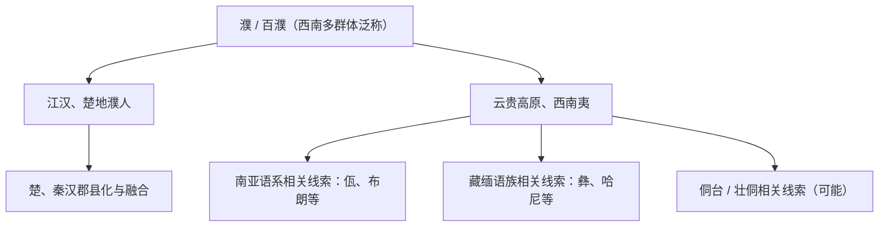

# 百濮

## 校正版演进图

> 百濮是泛称，原图把多个现代民族直接列为“濮人后人”过于确定；校正版按语言和区域线索处理。

## 概括

百濮是古代西南、江汉、云贵地区若干族群的泛称。

## 起源

西南山地和江汉地区多群体

### 起源详细补充

- 百濮是西南、江汉、云贵和南方山地多群体泛称。
- “濮”不是单一语族名称，可能涉及南亚语系、藏缅语族、侗台语系等不同线索。
- 它与商周楚地、西南夷和云贵高原民族形成都有关系。

## 变迁

可能涉及南亚语系、侗台语系、藏缅语族等多种线索；佤、布朗等常被讨论为濮人后裔线索，但不能单线化。

### 变迁详细补充

- 商周时期濮人参与中原与楚、周的战争和交流。
- 秦汉以后，濮系人群被纳入西南夷、郡县、土司等体系。
- 现代佤、布朗、德昂、彝、哈尼等与百濮有不同程度的学术关联，但不能单线对应。

## 世系说明

百濮不是一个单一王朝或固定家族名称，而是西南、江汉和云贵多个濮系人群的泛称，因此没有能够连续排列的统一君主世系。可考的政治世系应分别放在南诏、大理等具体政权等具体政权或部族笔记中。

## 所属大类

- [南方百越百濮苗瑶](/%E4%BA%BA%E6%96%87%E7%A7%91%E5%AD%A6/%E5%8E%86%E5%8F%B2-%E4%B8%AD%E5%9B%BD/%E6%B0%91%E6%97%8F/%E5%8D%97%E6%96%B9%E7%99%BE%E8%B6%8A%E7%99%BE%E6%BF%AE%E8%8B%97%E7%91%B6/README.md)

## 相关总览

- [华夏周边民族](/%E4%BA%BA%E6%96%87%E7%A7%91%E5%AD%A6/%E5%8E%86%E5%8F%B2-%E4%B8%AD%E5%9B%BD/%E6%B0%91%E6%97%8F/README.md)
- [起源](/%E4%BA%BA%E6%96%87%E7%A7%91%E5%AD%A6/%E5%8E%86%E5%8F%B2-%E4%B8%AD%E5%9B%BD/%E6%B0%91%E6%97%8F/README.md#起源)
- [变迁](/%E4%BA%BA%E6%96%87%E7%A7%91%E5%AD%A6/%E5%8E%86%E5%8F%B2-%E4%B8%AD%E5%9B%BD/%E6%B0%91%E6%97%8F/README.md#变迁)
