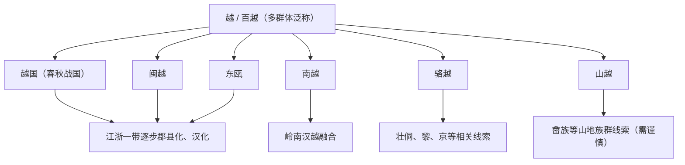

# 百越

## 校正版演进图

> 百越不是单一民族。现代壮、侗、黎、畲、京等都可能与不同越人线索有关，但不能用一条直线概括。

## 概括

百越是江南、岭南、东南沿海和越南北部古代多群体泛称。

## 起源

越、闽越、东瓯、南越、骆越等多群体

### 起源详细补充

- 百越是江南、岭南、东南沿海和越南北部诸越人的泛称。
- 它包含越国、闽越、东瓯、南越、骆越、西瓯、山越等不同群体。
- 百越可能涉及侗台、南亚、南岛及已消失语言，不是单一民族。

## 变迁

秦汉以后大量汉化或融入地方汉族，也与壮、侗、黎、畲、京等族群形成有关；语言可能涉及侗台、南亚、南岛等多种线索。

### 变迁详细补充

- 秦汉以后，江浙、福建、岭南多次郡县化，越人逐步与汉人融合。
- 部分越人线索进入壮侗、黎、畲、京等现代民族形成史。
- 南越、闽越、东瓯等政权灭亡后，百越作为政治称谓逐渐消失，但区域文化延续很长。

## 主要世系表（百越相关政权节选）

百越是泛称，没有统一世系。以下列出秦汉之际最具代表性的百越相关政权王系节点。

| 顺序 | 姓名 | 政权 / 称号 | 在位时间 | 关键事件 / 备注 |
|---|---|---|---|---|
| 1 | 无诸 | 闽越王 | 前 202-前 192 | 汉初受封闽越王。 |
| 2 | 郢 | 闽越王 | ?-前 135 | 攻南越，后被杀。 |
| 3 | 余善 | 东越王 / 闽越王 | 前 135-前 110 | 前 110 年汉灭东越。 |
| 4 | **赵佗** | 南越武王 / 武帝 | 前 203-前 137 | 建立南越国。 |
| 5 | 赵眜 | 南越文王 | 前 137-前 122 | 南越第二代。 |
| 6 | 赵婴齐 | 南越明王 | 前 122-前 115 | 南越后期。 |
| 7 | 赵兴 | 南越哀王 | 前 115-前 112 | 拟内属汉朝，被吕嘉所杀。 |
| 8 | 赵建德 | 南越末王 | 前 112-前 111 | 汉灭南越。 |

## 所属大类

- [南方百越百濮苗瑶](/%E4%BA%BA%E6%96%87%E7%A7%91%E5%AD%A6/%E5%8E%86%E5%8F%B2-%E4%B8%AD%E5%9B%BD/%E6%B0%91%E6%97%8F/%E5%8D%97%E6%96%B9%E7%99%BE%E8%B6%8A%E7%99%BE%E6%BF%AE%E8%8B%97%E7%91%B6/README.md)

## 相关总览

- [华夏周边民族](/%E4%BA%BA%E6%96%87%E7%A7%91%E5%AD%A6/%E5%8E%86%E5%8F%B2-%E4%B8%AD%E5%9B%BD/%E6%B0%91%E6%97%8F/README.md)
- [起源](/%E4%BA%BA%E6%96%87%E7%A7%91%E5%AD%A6/%E5%8E%86%E5%8F%B2-%E4%B8%AD%E5%9B%BD/%E6%B0%91%E6%97%8F/README.md#起源)
- [变迁](/%E4%BA%BA%E6%96%87%E7%A7%91%E5%AD%A6/%E5%8E%86%E5%8F%B2-%E4%B8%AD%E5%9B%BD/%E6%B0%91%E6%97%8F/README.md#变迁)
