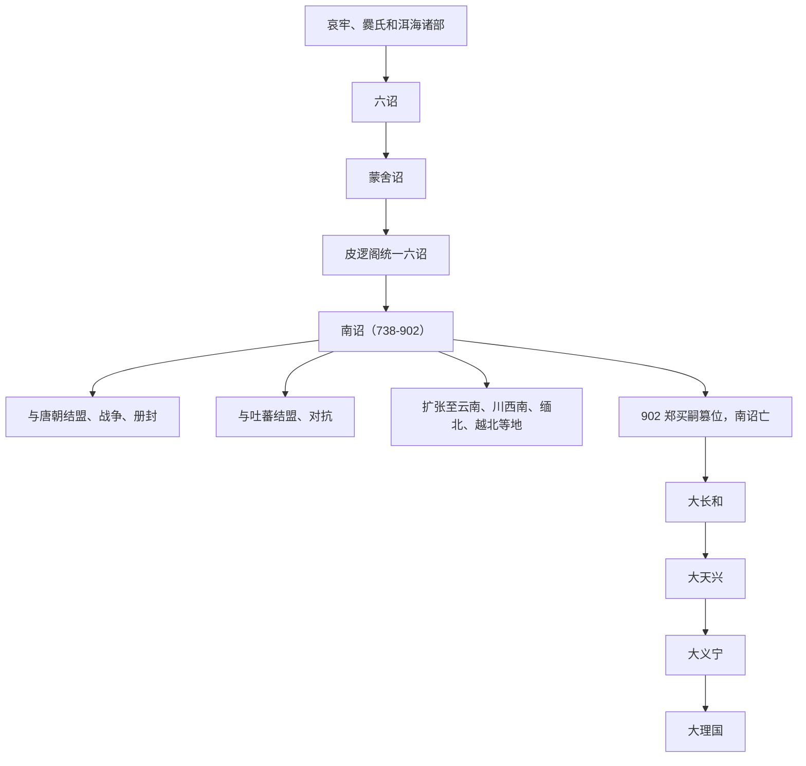

# 南诏

## 概括

南诏是 8 至 10 世纪初兴起于云南洱海地区的政权，中心在今大理一带。它由六诏中的蒙舍诏发展而来，在唐与吐蕃之间扩张，统治范围一度覆盖云南大部并影响缅北、川西南和越南北部。南诏不是单一现代民族政权，其统治集团族属存在争议，常与白族、彝族先民、哀牢和爨氏系统等联系讨论。

## 起源

南诏前身为洱海周边“六诏”之一的蒙舍诏。皮逻阁在唐朝支持下兼并其他五诏，形成南诏。南诏人口结构复杂，包含白蛮、乌蛮、爨氏遗民、濮系和其他西南族群；不能简单写成“白族政权”或“彝族政权”。

### 起源详细补充

- 南诏起于洱海地区六诏中的蒙舍诏。
- 其统治集团族属争议很大，不能简单定为白族、彝族或泰族政权。
- 南诏核心人口包含白蛮、乌蛮、爨氏遗民、濮系和其他西南族群。

## 变迁

### 变迁详细补充

- 皮逻阁统一六诏后，南诏在唐与吐蕃之间取得战略空间。
- 阁罗凤、异牟寻以后，南诏多次在唐、吐蕃之间转换盟友并向外扩张。
- 902年郑买嗣篡位后南诏亡，后继大长和、大天兴、大义宁最终被大理取代。

## 君主世系表

| 顺序 | 姓名 | 身份 / 称号 | 在位时间 | 关键事件 / 备注 |
|---|---|---|---|---|
| 1 | 细奴逻 | 蒙舍诏主 | 约 649-674 | 蒙舍诏早期君主，后世追为南诏始祖。 |
| 2 | 逻盛 | 蒙舍诏主 | 约 674-712 | 继承蒙舍诏。 |
| 3 | 盛逻皮 | 蒙舍诏主 | 约 712-728 | 皮逻阁之父。 |
| 4 | **皮逻阁** | 南诏王 | 约 728-748 | 统一六诏，受唐册封为云南王。 |
| 5 | 阁罗凤 | 南诏王 | 约 748-779 | 与唐关系破裂，转与吐蕃结盟。 |
| 6 | **异牟寻** | 南诏王 | 约 779-808 | 重新归唐，南诏制度和佛教发展。 |
| 7 | 寻阁劝 | 南诏王 | 约 808-809 | 在位很短。 |
| 8 | 劝丰祐 | 南诏王 | 约 809-859 | 南诏持续扩张。 |
| 9 | 世隆 | 南诏王 | 约 859-877 | 改称大礼国，一度攻掠安南、成都。 |
| 10 | 隆舜 | 南诏王 | 约 877-897 | 后期政局不稳。 |
| 11 | **舜化贞** | 末代南诏王 | 约 897-902 | 902 年被权臣郑买嗣篡夺，南诏亡。 |

## 所属大类

- [南方百越百濮苗瑶](/%E4%BA%BA%E6%96%87%E7%A7%91%E5%AD%A6/%E5%8E%86%E5%8F%B2-%E4%B8%AD%E5%9B%BD/%E6%B0%91%E6%97%8F/%E5%8D%97%E6%96%B9%E7%99%BE%E8%B6%8A%E7%99%BE%E6%BF%AE%E8%8B%97%E7%91%B6/README.md)

## 相关笔记

- [大理](/%E4%BA%BA%E6%96%87%E7%A7%91%E5%AD%A6/%E5%8E%86%E5%8F%B2-%E4%B8%AD%E5%9B%BD/%E6%B0%91%E6%97%8F/%E5%8D%97%E6%96%B9%E7%99%BE%E8%B6%8A%E7%99%BE%E6%BF%AE%E8%8B%97%E7%91%B6/%E8%A5%BF%E5%8D%97%E6%94%BF%E6%9D%83/%E5%A4%A7%E7%90%86.md)
- [百濮](/%E4%BA%BA%E6%96%87%E7%A7%91%E5%AD%A6/%E5%8E%86%E5%8F%B2-%E4%B8%AD%E5%9B%BD/%E6%B0%91%E6%97%8F/%E5%8D%97%E6%96%B9%E7%99%BE%E8%B6%8A%E7%99%BE%E6%BF%AE%E8%8B%97%E7%91%B6/%E5%8D%97%E6%96%B9%E5%8F%A4%E6%97%8F%E7%BE%A4/%E7%99%BE%E6%BF%AE.md)
- [变迁](/%E4%BA%BA%E6%96%87%E7%A7%91%E5%AD%A6/%E5%8E%86%E5%8F%B2-%E4%B8%AD%E5%9B%BD/%E6%B0%91%E6%97%8F/README.md#变迁)

## 参考

- [Nanzhao](https://en.wikipedia.org/wiki/Nanzhao)
- [Nanzhao - Britannica](https://www.britannica.com/place/Nanzhao)
