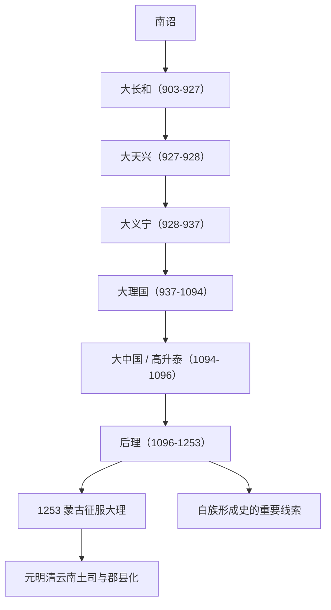

# 大理

## 概括

大理国是 937 至 1253 年存在于云南洱海地区的政权，由段思平建立，承接南诏灭亡后大长和、大天兴、大义宁等短暂政权。大理统治集团以段氏为核心，通常与白族形成史关系密切；但大理国本身仍是多民族区域政权，包含白、彝、濮系、汉地移民和其他西南族群。

## 起源

南诏于 902 年灭亡后，云南先后出现大长和、大天兴、大义宁。937 年段思平夺取大义宁，建立大理国。1094 年高升泰短暂建立大中国，1096 年段正淳恢复大理，史称后理。

### 起源详细补充

- 大理承接南诏后云南洱海地区的政治传统。
- 段氏统治集团通常与白族形成史关系密切，但国家内部仍是多民族结构。
- 其制度、佛教文化和汉文书写都受唐宋和南诏传统影响。

## 变迁

### 变迁详细补充

- 937年段思平建立大理，1094年高升泰短暂篡位为大中国。
- 1096年段正淳恢复段氏，后理时期高氏长期掌权。
- 1253年蒙古征服大理后，段氏转为大理总管，云南逐步进入元明清土司和郡县体系。

## 君主世系表

| 顺序 | 姓名 | 庙号 / 谥号 | 在位时间 | 关键事件 / 备注 |
|---|---|---|---|---|
| 1 | **段思平** | 太祖 / 圣神文武皇帝 | 937-944 | 建立大理国。 |
| 2 | 段思英 | 文经帝 | 944-945 | 被废为僧。 |
| 3 | 段思良 | 圣慈文武皇帝 | 945-952 | 段思平之弟。 |
| 4 | 段思聪 | 至道广慈皇帝 | 952-968 | 继续巩固段氏统治。 |
| 5 | 段素顺 | 应道皇帝 | 968-985 | 段氏继承。 |
| 6 | 段素英 | 昭明皇帝 | 985-1009 | 在位较久。 |
| 7 | 段素廉 | 宣肃皇帝 | 1009-1022 | 段氏继承。 |
| 8 | 段素隆 | 秉义皇帝 | 1022-1026 | 后出家。 |
| 9 | 段素真 | 圣德皇帝 | 1026-1041 | 段氏继承。 |
| 10 | 段素兴 | 天明皇帝 | 1041-1044 | 被废。 |
| 11 | 段思廉 | 世宗 / 孝德皇帝 | 1044-1075 | 高氏势力增强。 |
| 12 | 段廉义 | 上德皇帝 | 1075-1080 | 被杨义贞所杀。 |
| 13 | 段寿辉 | 上明皇帝 | 1080-1081 | 在位短。 |
| 14 | 段正明 | 保定皇帝 | 1081-1094 | 被高升泰迫使让位。 |
| 间 | 高升泰 | 大中国皇帝 | 1094-1096 | 短暂改国号大中国，临终还政段氏。 |
| 15 | 段正淳 | 中宗 / 文安皇帝 | 1096-1108 | 恢复大理，史称后理。 |
| 16 | 段正严 / 段和誉 | 宪宗 / 宣仁皇帝 | 1108-1147 | 后出家；常被小说附会为“段誉”。 |
| 17 | 段正兴 | 景宗 / 正康皇帝 | 1147-1171 | 后理君主。 |
| 18 | **段智兴** | 宣宗 / 功极皇帝 | 1172-1200 | 大理佛教艺术重要时期。 |
| 19 | 段智廉 | 享天皇帝 | 1200-1204 | 在位短。 |
| 20 | 段智祥 | 神宗 / 天开皇帝 | 1204-1238 | 在位较久。 |
| 21 | 段祥兴 | 孝义皇帝 | 1238-1251 | 蒙古压力加重。 |
| 22 | **段兴智** | 末代国王 | 1251-1253/1254 | 蒙古灭大理，后任大理总管。 |

## 所属大类

- [南方百越百濮苗瑶](/%E4%BA%BA%E6%96%87%E7%A7%91%E5%AD%A6/%E5%8E%86%E5%8F%B2-%E4%B8%AD%E5%9B%BD/%E6%B0%91%E6%97%8F/%E5%8D%97%E6%96%B9%E7%99%BE%E8%B6%8A%E7%99%BE%E6%BF%AE%E8%8B%97%E7%91%B6/README.md)

## 相关笔记

- [南诏](/%E4%BA%BA%E6%96%87%E7%A7%91%E5%AD%A6/%E5%8E%86%E5%8F%B2-%E4%B8%AD%E5%9B%BD/%E6%B0%91%E6%97%8F/%E5%8D%97%E6%96%B9%E7%99%BE%E8%B6%8A%E7%99%BE%E6%BF%AE%E8%8B%97%E7%91%B6/%E8%A5%BF%E5%8D%97%E6%94%BF%E6%9D%83/%E5%8D%97%E8%AF%8F.md)
- [百濮](/%E4%BA%BA%E6%96%87%E7%A7%91%E5%AD%A6/%E5%8E%86%E5%8F%B2-%E4%B8%AD%E5%9B%BD/%E6%B0%91%E6%97%8F/%E5%8D%97%E6%96%B9%E7%99%BE%E8%B6%8A%E7%99%BE%E6%BF%AE%E8%8B%97%E7%91%B6/%E5%8D%97%E6%96%B9%E5%8F%A4%E6%97%8F%E7%BE%A4/%E7%99%BE%E6%BF%AE.md)
- [变迁](/%E4%BA%BA%E6%96%87%E7%A7%91%E5%AD%A6/%E5%8E%86%E5%8F%B2-%E4%B8%AD%E5%9B%BD/%E6%B0%91%E6%97%8F/README.md#变迁)

## 参考

- [Dali Kingdom](https://en.wikipedia.org/wiki/Dali_Kingdom)
- [大理君主列表](https://zh.wikipedia.org/wiki/%E5%A4%A7%E7%90%86%E5%90%9B%E4%B8%BB%E5%88%97%E8%A1%A8)
