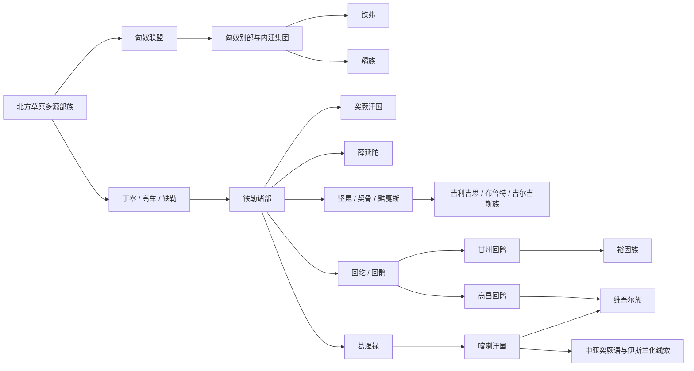

# 突厥语族与北方草原

## 概括

以蒙古高原、漠北、阿尔泰、叶尼塞、河套和中亚草原为主要活动空间，包含匈奴、丁零 / 铁勒、突厥、回鹘、黠戛斯等线索。这里的“突厥语族”是语言和历史共同体线索，不等于所有古代北方政权都确定说突厥语。

## 起源

丁零、高车、铁勒是突厥语族早期史中常见的汉文称谓线索；突厥汗国以后，“突厥”成为欧亚草原政治和语言扩散的重要名称。匈奴、羯、铁弗等与突厥语族可能有关，但语言归属不宜写成定论。

## 变迁

这一大类的演进通常不是单线血缘继承，而是多部族联盟、迁徙、征服、内附、语言转用和文化融合的结果。

## 演进图

## 包含民族

### [早期草原与内迁](/%E4%BA%BA%E6%96%87%E7%A7%91%E5%AD%A6/%E5%8E%86%E5%8F%B2-%E4%B8%AD%E5%9B%BD/%E6%B0%91%E6%97%8F/%E7%AA%81%E5%8E%A5%E8%AF%AD%E6%97%8F%E4%B8%8E%E5%8C%97%E6%96%B9%E8%8D%89%E5%8E%9F/%E6%97%A9%E6%9C%9F%E8%8D%89%E5%8E%9F%E4%B8%8E%E5%86%85%E8%BF%81/README.md)

- [匈奴](/%E4%BA%BA%E6%96%87%E7%A7%91%E5%AD%A6/%E5%8E%86%E5%8F%B2-%E4%B8%AD%E5%9B%BD/%E6%B0%91%E6%97%8F/%E7%AA%81%E5%8E%A5%E8%AF%AD%E6%97%8F%E4%B8%8E%E5%8C%97%E6%96%B9%E8%8D%89%E5%8E%9F/%E6%97%A9%E6%9C%9F%E8%8D%89%E5%8E%9F%E4%B8%8E%E5%86%85%E8%BF%81/%E5%8C%88%E5%A5%B4.md)
- [丁零铁勒](/%E4%BA%BA%E6%96%87%E7%A7%91%E5%AD%A6/%E5%8E%86%E5%8F%B2-%E4%B8%AD%E5%9B%BD/%E6%B0%91%E6%97%8F/%E7%AA%81%E5%8E%A5%E8%AF%AD%E6%97%8F%E4%B8%8E%E5%8C%97%E6%96%B9%E8%8D%89%E5%8E%9F/%E6%97%A9%E6%9C%9F%E8%8D%89%E5%8E%9F%E4%B8%8E%E5%86%85%E8%BF%81/%E4%B8%81%E9%9B%B6%E9%93%81%E5%8B%92.md)
- [铁弗](/%E4%BA%BA%E6%96%87%E7%A7%91%E5%AD%A6/%E5%8E%86%E5%8F%B2-%E4%B8%AD%E5%9B%BD/%E6%B0%91%E6%97%8F/%E7%AA%81%E5%8E%A5%E8%AF%AD%E6%97%8F%E4%B8%8E%E5%8C%97%E6%96%B9%E8%8D%89%E5%8E%9F/%E6%97%A9%E6%9C%9F%E8%8D%89%E5%8E%9F%E4%B8%8E%E5%86%85%E8%BF%81/%E9%93%81%E5%BC%97.md)
- [羯族](/%E4%BA%BA%E6%96%87%E7%A7%91%E5%AD%A6/%E5%8E%86%E5%8F%B2-%E4%B8%AD%E5%9B%BD/%E6%B0%91%E6%97%8F/%E7%AA%81%E5%8E%A5%E8%AF%AD%E6%97%8F%E4%B8%8E%E5%8C%97%E6%96%B9%E8%8D%89%E5%8E%9F/%E6%97%A9%E6%9C%9F%E8%8D%89%E5%8E%9F%E4%B8%8E%E5%86%85%E8%BF%81/%E7%BE%AF%E6%97%8F.md)

### [突厥铁勒诸部](/%E4%BA%BA%E6%96%87%E7%A7%91%E5%AD%A6/%E5%8E%86%E5%8F%B2-%E4%B8%AD%E5%9B%BD/%E6%B0%91%E6%97%8F/%E7%AA%81%E5%8E%A5%E8%AF%AD%E6%97%8F%E4%B8%8E%E5%8C%97%E6%96%B9%E8%8D%89%E5%8E%9F/%E7%AA%81%E5%8E%A5%E9%93%81%E5%8B%92%E8%AF%B8%E9%83%A8/README.md)

- [突厥](/%E4%BA%BA%E6%96%87%E7%A7%91%E5%AD%A6/%E5%8E%86%E5%8F%B2-%E4%B8%AD%E5%9B%BD/%E6%B0%91%E6%97%8F/%E7%AA%81%E5%8E%A5%E8%AF%AD%E6%97%8F%E4%B8%8E%E5%8C%97%E6%96%B9%E8%8D%89%E5%8E%9F/%E7%AA%81%E5%8E%A5%E9%93%81%E5%8B%92%E8%AF%B8%E9%83%A8/%E7%AA%81%E5%8E%A5.md)
- [薛延陀](/%E4%BA%BA%E6%96%87%E7%A7%91%E5%AD%A6/%E5%8E%86%E5%8F%B2-%E4%B8%AD%E5%9B%BD/%E6%B0%91%E6%97%8F/%E7%AA%81%E5%8E%A5%E8%AF%AD%E6%97%8F%E4%B8%8E%E5%8C%97%E6%96%B9%E8%8D%89%E5%8E%9F/%E7%AA%81%E5%8E%A5%E9%93%81%E5%8B%92%E8%AF%B8%E9%83%A8/%E8%96%9B%E5%BB%B6%E9%99%80.md)
- [回纥回鹘](/%E4%BA%BA%E6%96%87%E7%A7%91%E5%AD%A6/%E5%8E%86%E5%8F%B2-%E4%B8%AD%E5%9B%BD/%E6%B0%91%E6%97%8F/%E7%AA%81%E5%8E%A5%E8%AF%AD%E6%97%8F%E4%B8%8E%E5%8C%97%E6%96%B9%E8%8D%89%E5%8E%9F/%E7%AA%81%E5%8E%A5%E9%93%81%E5%8B%92%E8%AF%B8%E9%83%A8/%E5%9B%9E%E7%BA%A5%E5%9B%9E%E9%B9%98.md)
- [葛逻禄](/%E4%BA%BA%E6%96%87%E7%A7%91%E5%AD%A6/%E5%8E%86%E5%8F%B2-%E4%B8%AD%E5%9B%BD/%E6%B0%91%E6%97%8F/%E7%AA%81%E5%8E%A5%E8%AF%AD%E6%97%8F%E4%B8%8E%E5%8C%97%E6%96%B9%E8%8D%89%E5%8E%9F/%E7%AA%81%E5%8E%A5%E9%93%81%E5%8B%92%E8%AF%B8%E9%83%A8/%E8%91%9B%E9%80%BB%E7%A6%84.md)

### [回鹘西迁与西域](/%E4%BA%BA%E6%96%87%E7%A7%91%E5%AD%A6/%E5%8E%86%E5%8F%B2-%E4%B8%AD%E5%9B%BD/%E6%B0%91%E6%97%8F/%E7%AA%81%E5%8E%A5%E8%AF%AD%E6%97%8F%E4%B8%8E%E5%8C%97%E6%96%B9%E8%8D%89%E5%8E%9F/%E5%9B%9E%E9%B9%98%E8%A5%BF%E8%BF%81%E4%B8%8E%E8%A5%BF%E5%9F%9F/README.md)

- [高昌回鹘](/%E4%BA%BA%E6%96%87%E7%A7%91%E5%AD%A6/%E5%8E%86%E5%8F%B2-%E4%B8%AD%E5%9B%BD/%E6%B0%91%E6%97%8F/%E7%AA%81%E5%8E%A5%E8%AF%AD%E6%97%8F%E4%B8%8E%E5%8C%97%E6%96%B9%E8%8D%89%E5%8E%9F/%E5%9B%9E%E9%B9%98%E8%A5%BF%E8%BF%81%E4%B8%8E%E8%A5%BF%E5%9F%9F/%E9%AB%98%E6%98%8C%E5%9B%9E%E9%B9%98.md)
- [甘州回鹘](/%E4%BA%BA%E6%96%87%E7%A7%91%E5%AD%A6/%E5%8E%86%E5%8F%B2-%E4%B8%AD%E5%9B%BD/%E6%B0%91%E6%97%8F/%E7%AA%81%E5%8E%A5%E8%AF%AD%E6%97%8F%E4%B8%8E%E5%8C%97%E6%96%B9%E8%8D%89%E5%8E%9F/%E5%9B%9E%E9%B9%98%E8%A5%BF%E8%BF%81%E4%B8%8E%E8%A5%BF%E5%9F%9F/%E7%94%98%E5%B7%9E%E5%9B%9E%E9%B9%98.md)
- [喀喇汗国](/%E4%BA%BA%E6%96%87%E7%A7%91%E5%AD%A6/%E5%8E%86%E5%8F%B2-%E4%B8%AD%E5%9B%BD/%E6%B0%91%E6%97%8F/%E7%AA%81%E5%8E%A5%E8%AF%AD%E6%97%8F%E4%B8%8E%E5%8C%97%E6%96%B9%E8%8D%89%E5%8E%9F/%E5%9B%9E%E9%B9%98%E8%A5%BF%E8%BF%81%E4%B8%8E%E8%A5%BF%E5%9F%9F/%E5%96%80%E5%96%87%E6%B1%97%E5%9B%BD.md)
- [裕固族](/%E4%BA%BA%E6%96%87%E7%A7%91%E5%AD%A6/%E5%8E%86%E5%8F%B2-%E4%B8%AD%E5%9B%BD/%E6%B0%91%E6%97%8F/%E7%AA%81%E5%8E%A5%E8%AF%AD%E6%97%8F%E4%B8%8E%E5%8C%97%E6%96%B9%E8%8D%89%E5%8E%9F/%E5%9B%9E%E9%B9%98%E8%A5%BF%E8%BF%81%E4%B8%8E%E8%A5%BF%E5%9F%9F/%E8%A3%95%E5%9B%BA%E6%97%8F.md)
- [维吾尔族](/%E4%BA%BA%E6%96%87%E7%A7%91%E5%AD%A6/%E5%8E%86%E5%8F%B2-%E4%B8%AD%E5%9B%BD/%E6%B0%91%E6%97%8F/%E7%AA%81%E5%8E%A5%E8%AF%AD%E6%97%8F%E4%B8%8E%E5%8C%97%E6%96%B9%E8%8D%89%E5%8E%9F/%E5%9B%9E%E9%B9%98%E8%A5%BF%E8%BF%81%E4%B8%8E%E8%A5%BF%E5%9F%9F/%E7%BB%B4%E5%90%BE%E5%B0%94%E6%97%8F.md)

### [叶尼塞吉尔吉斯](/%E4%BA%BA%E6%96%87%E7%A7%91%E5%AD%A6/%E5%8E%86%E5%8F%B2-%E4%B8%AD%E5%9B%BD/%E6%B0%91%E6%97%8F/%E7%AA%81%E5%8E%A5%E8%AF%AD%E6%97%8F%E4%B8%8E%E5%8C%97%E6%96%B9%E8%8D%89%E5%8E%9F/%E5%8F%B6%E5%B0%BC%E5%A1%9E%E5%90%89%E5%B0%94%E5%90%89%E6%96%AF/README.md)

- [坚昆](/%E4%BA%BA%E6%96%87%E7%A7%91%E5%AD%A6/%E5%8E%86%E5%8F%B2-%E4%B8%AD%E5%9B%BD/%E6%B0%91%E6%97%8F/%E7%AA%81%E5%8E%A5%E8%AF%AD%E6%97%8F%E4%B8%8E%E5%8C%97%E6%96%B9%E8%8D%89%E5%8E%9F/%E5%8F%B6%E5%B0%BC%E5%A1%9E%E5%90%89%E5%B0%94%E5%90%89%E6%96%AF/%E5%9D%9A%E6%98%86.md)
- [契骨](/%E4%BA%BA%E6%96%87%E7%A7%91%E5%AD%A6/%E5%8E%86%E5%8F%B2-%E4%B8%AD%E5%9B%BD/%E6%B0%91%E6%97%8F/%E7%AA%81%E5%8E%A5%E8%AF%AD%E6%97%8F%E4%B8%8E%E5%8C%97%E6%96%B9%E8%8D%89%E5%8E%9F/%E5%8F%B6%E5%B0%BC%E5%A1%9E%E5%90%89%E5%B0%94%E5%90%89%E6%96%AF/%E5%A5%91%E9%AA%A8.md)
- [黠戛斯](/%E4%BA%BA%E6%96%87%E7%A7%91%E5%AD%A6/%E5%8E%86%E5%8F%B2-%E4%B8%AD%E5%9B%BD/%E6%B0%91%E6%97%8F/%E7%AA%81%E5%8E%A5%E8%AF%AD%E6%97%8F%E4%B8%8E%E5%8C%97%E6%96%B9%E8%8D%89%E5%8E%9F/%E5%8F%B6%E5%B0%BC%E5%A1%9E%E5%90%89%E5%B0%94%E5%90%89%E6%96%AF/%E9%BB%A0%E6%88%9B%E6%96%AF.md)
- [吉利吉思](/%E4%BA%BA%E6%96%87%E7%A7%91%E5%AD%A6/%E5%8E%86%E5%8F%B2-%E4%B8%AD%E5%9B%BD/%E6%B0%91%E6%97%8F/%E7%AA%81%E5%8E%A5%E8%AF%AD%E6%97%8F%E4%B8%8E%E5%8C%97%E6%96%B9%E8%8D%89%E5%8E%9F/%E5%8F%B6%E5%B0%BC%E5%A1%9E%E5%90%89%E5%B0%94%E5%90%89%E6%96%AF/%E5%90%89%E5%88%A9%E5%90%89%E6%80%9D.md)
- [布鲁特](/%E4%BA%BA%E6%96%87%E7%A7%91%E5%AD%A6/%E5%8E%86%E5%8F%B2-%E4%B8%AD%E5%9B%BD/%E6%B0%91%E6%97%8F/%E7%AA%81%E5%8E%A5%E8%AF%AD%E6%97%8F%E4%B8%8E%E5%8C%97%E6%96%B9%E8%8D%89%E5%8E%9F/%E5%8F%B6%E5%B0%BC%E5%A1%9E%E5%90%89%E5%B0%94%E5%90%89%E6%96%AF/%E5%B8%83%E9%B2%81%E7%89%B9.md)
- [吉尔吉斯族](/%E4%BA%BA%E6%96%87%E7%A7%91%E5%AD%A6/%E5%8E%86%E5%8F%B2-%E4%B8%AD%E5%9B%BD/%E6%B0%91%E6%97%8F/%E7%AA%81%E5%8E%A5%E8%AF%AD%E6%97%8F%E4%B8%8E%E5%8C%97%E6%96%B9%E8%8D%89%E5%8E%9F/%E5%8F%B6%E5%B0%BC%E5%A1%9E%E5%90%89%E5%B0%94%E5%90%89%E6%96%AF/%E5%90%89%E5%B0%94%E5%90%89%E6%96%AF%E6%97%8F.md)

## 相关总览

- [起源](/%E4%BA%BA%E6%96%87%E7%A7%91%E5%AD%A6/%E5%8E%86%E5%8F%B2-%E4%B8%AD%E5%9B%BD/%E6%B0%91%E6%97%8F/README.md#起源)
- [变迁](/%E4%BA%BA%E6%96%87%E7%A7%91%E5%AD%A6/%E5%8E%86%E5%8F%B2-%E4%B8%AD%E5%9B%BD/%E6%B0%91%E6%97%8F/README.md#变迁)
