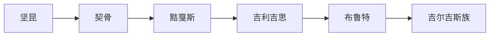

# 吉尔吉斯族

## 概括

吉尔吉斯族是近现代民族名称，历史上与叶尼塞黠戛斯、天山吉利吉思 / 布鲁特和中亚草原多源人群有关。

## 起源

吉尔吉斯族位于黠戛斯到现代吉尔吉斯族的名称和族群转化链条中。它反映的是不同时期汉文、蒙元或清代文献对 Kyrgyz / Kirghiz 相关人群的称呼。

### 起源详细补充

- 核心线索与叶尼塞、天山和中亚草原有关。
- 名称变化不等于单一血缘群体原封不动迁移。
- 族群形成中包含突厥语化、草原迁徙和中亚地方融合。

## 变迁

吉尔吉斯族承接布鲁特线索，并向现代吉尔吉斯族过渡。近现代民族识别以后，吉尔吉斯族成为固定民族身份。

## 演进图

### 变迁详细补充

- 这一线索跨越叶尼塞、阿尔泰、天山和中亚草原。
- “吉利吉思”“布鲁特”“吉尔吉斯”多是时代和文献系统不同造成的名称差异。
- 现代吉尔吉斯族不能直接还原为某一个古代名称。

## 世系说明

吉尔吉斯族不是单一王朝或固定家族，而是Kyrgyz / Kirghiz 相关族群在特定时代的名称或现代民族名称，没有能够连续排列的统一君主世系。可考世系应参考黠戛斯等早期线索等具体政权或部族。

## 所属大类

- [突厥语族与北方草原](/%E4%BA%BA%E6%96%87%E7%A7%91%E5%AD%A6/%E5%8E%86%E5%8F%B2-%E4%B8%AD%E5%9B%BD/%E6%B0%91%E6%97%8F/%E7%AA%81%E5%8E%A5%E8%AF%AD%E6%97%8F%E4%B8%8E%E5%8C%97%E6%96%B9%E8%8D%89%E5%8E%9F/README.md)

## 相关笔记

- [黠戛斯](/%E4%BA%BA%E6%96%87%E7%A7%91%E5%AD%A6/%E5%8E%86%E5%8F%B2-%E4%B8%AD%E5%9B%BD/%E6%B0%91%E6%97%8F/%E7%AA%81%E5%8E%A5%E8%AF%AD%E6%97%8F%E4%B8%8E%E5%8C%97%E6%96%B9%E8%8D%89%E5%8E%9F/%E5%8F%B6%E5%B0%BC%E5%A1%9E%E5%90%89%E5%B0%94%E5%90%89%E6%96%AF/%E9%BB%A0%E6%88%9B%E6%96%AF.md)
- [坚昆](/%E4%BA%BA%E6%96%87%E7%A7%91%E5%AD%A6/%E5%8E%86%E5%8F%B2-%E4%B8%AD%E5%9B%BD/%E6%B0%91%E6%97%8F/%E7%AA%81%E5%8E%A5%E8%AF%AD%E6%97%8F%E4%B8%8E%E5%8C%97%E6%96%B9%E8%8D%89%E5%8E%9F/%E5%8F%B6%E5%B0%BC%E5%A1%9E%E5%90%89%E5%B0%94%E5%90%89%E6%96%AF/%E5%9D%9A%E6%98%86.md)
- [华夏周边民族](/%E4%BA%BA%E6%96%87%E7%A7%91%E5%AD%A6/%E5%8E%86%E5%8F%B2-%E4%B8%AD%E5%9B%BD/%E6%B0%91%E6%97%8F/README.md)
- [起源](/%E4%BA%BA%E6%96%87%E7%A7%91%E5%AD%A6/%E5%8E%86%E5%8F%B2-%E4%B8%AD%E5%9B%BD/%E6%B0%91%E6%97%8F/README.md#起源)
- [变迁](/%E4%BA%BA%E6%96%87%E7%A7%91%E5%AD%A6/%E5%8E%86%E5%8F%B2-%E4%B8%AD%E5%9B%BD/%E6%B0%91%E6%97%8F/README.md#变迁)

## 参考

- [Yenisei Kyrgyz](https://en.wikipedia.org/wiki/Yenisei_Kyrgyz)
