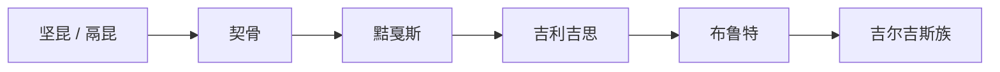

# 坚昆

## 概括

坚昆是汉代文献中对叶尼塞上游 Kyrgyz / 黠戛斯相关人群的早期称谓之一，常与鬲昆、契骨、黠戛斯、吉利吉思等名称放在同一长时段线索中理解。

## 起源

坚昆主要指活动于叶尼塞上游、米努辛斯克盆地及南西伯利亚一带的早期 Kyrgyz 相关人群。它不是现代吉尔吉斯族的直接同义词，而是古代汉文称谓链条中的一个早期节点。

### 起源详细补充

- 核心区域在叶尼塞上游和阿尔泰、萨彦山地周边。
- 名称与后来的契骨、黠戛斯、吉利吉思等多有音译和时代差异。
- 早期坚昆可能包含多种草原、森林草原人群，后世逐渐纳入突厥语世界。

## 变迁

坚昆在汉唐之间的称谓逐渐转化为契骨、黠戛斯等。唐代黠戛斯击破回鹘汗国后短暂主导漠北，后续一部分线索进入吉利吉思、布鲁特和吉尔吉斯族叙事。

## 演进图

### 变迁详细补充

- 坚昆不是一个有连续王统的国家名称。
- 唐代以后更常见的对应称谓是黠戛斯。
- 近现代吉尔吉斯族与这一线索有关，但还包含天山、中亚草原多源融合。

## 世系说明

坚昆不是单一王朝或固定家族，而是叶尼塞 Kyrgyz 相关人群的早期汉文称谓，没有能够连续排列的统一君主世系。可考世系应参考黠戛斯、吉利吉思、吉尔吉斯等具体政权或部族。

## 所属大类

- [突厥语族与北方草原](/%E4%BA%BA%E6%96%87%E7%A7%91%E5%AD%A6/%E5%8E%86%E5%8F%B2-%E4%B8%AD%E5%9B%BD/%E6%B0%91%E6%97%8F/%E7%AA%81%E5%8E%A5%E8%AF%AD%E6%97%8F%E4%B8%8E%E5%8C%97%E6%96%B9%E8%8D%89%E5%8E%9F/README.md)

## 相关笔记

- [黠戛斯](/%E4%BA%BA%E6%96%87%E7%A7%91%E5%AD%A6/%E5%8E%86%E5%8F%B2-%E4%B8%AD%E5%9B%BD/%E6%B0%91%E6%97%8F/%E7%AA%81%E5%8E%A5%E8%AF%AD%E6%97%8F%E4%B8%8E%E5%8C%97%E6%96%B9%E8%8D%89%E5%8E%9F/%E5%8F%B6%E5%B0%BC%E5%A1%9E%E5%90%89%E5%B0%94%E5%90%89%E6%96%AF/%E9%BB%A0%E6%88%9B%E6%96%AF.md)
- [契骨](/%E4%BA%BA%E6%96%87%E7%A7%91%E5%AD%A6/%E5%8E%86%E5%8F%B2-%E4%B8%AD%E5%9B%BD/%E6%B0%91%E6%97%8F/%E7%AA%81%E5%8E%A5%E8%AF%AD%E6%97%8F%E4%B8%8E%E5%8C%97%E6%96%B9%E8%8D%89%E5%8E%9F/%E5%8F%B6%E5%B0%BC%E5%A1%9E%E5%90%89%E5%B0%94%E5%90%89%E6%96%AF/%E5%A5%91%E9%AA%A8.md)
- [华夏周边民族](/%E4%BA%BA%E6%96%87%E7%A7%91%E5%AD%A6/%E5%8E%86%E5%8F%B2-%E4%B8%AD%E5%9B%BD/%E6%B0%91%E6%97%8F/README.md)
- [起源](/%E4%BA%BA%E6%96%87%E7%A7%91%E5%AD%A6/%E5%8E%86%E5%8F%B2-%E4%B8%AD%E5%9B%BD/%E6%B0%91%E6%97%8F/README.md#起源)
- [变迁](/%E4%BA%BA%E6%96%87%E7%A7%91%E5%AD%A6/%E5%8E%86%E5%8F%B2-%E4%B8%AD%E5%9B%BD/%E6%B0%91%E6%97%8F/README.md#变迁)

## 参考

- [Yenisei Kyrgyz](https://en.wikipedia.org/wiki/Yenisei_Kyrgyz)
