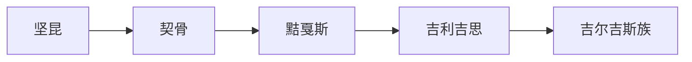

# 契骨

## 概括

契骨是隋唐以前后对叶尼塞 Kyrgyz / 黠戛斯相关人群的汉文音译之一，在图中位于坚昆与黠戛斯之间。

## 起源

契骨承接坚昆、鬲昆等早期称谓，主要指叶尼塞上游和南西伯利亚草原森林交界的人群。

### 起源详细补充

- 契骨与纥骨、护骨、黠戛斯等名称常被视为同一大线索的不同时代转写。
- 它更适合放在突厥语族与北方草原下，而非单独作为现代民族。
- 其语言和文化在唐代资料中已与突厥、回鹘世界密切相连。

## 变迁

契骨名称在唐代逐渐让位于黠戛斯。黠戛斯击破回鹘汗国后影响漠北，后续又与吉利吉思、布鲁特和吉尔吉斯族名称相连。

## 演进图

### 变迁详细补充

- 契骨是称谓链条节点，不是连续王朝。
- 唐以后“黠戛斯”成为更常见的汉文称谓。
- 它与现代吉尔吉斯族有历史名称关系，但不能简单等同。

## 世系说明

契骨不是单一王朝或固定家族，而是叶尼塞 Kyrgyz 相关人群的阶段性称谓，没有能够连续排列的统一君主世系。可考世系应参考黠戛斯、吉尔吉斯等具体政权或部族。

## 所属大类

- [突厥语族与北方草原](/%E4%BA%BA%E6%96%87%E7%A7%91%E5%AD%A6/%E5%8E%86%E5%8F%B2-%E4%B8%AD%E5%9B%BD/%E6%B0%91%E6%97%8F/%E7%AA%81%E5%8E%A5%E8%AF%AD%E6%97%8F%E4%B8%8E%E5%8C%97%E6%96%B9%E8%8D%89%E5%8E%9F/README.md)

## 相关笔记

- [坚昆](/%E4%BA%BA%E6%96%87%E7%A7%91%E5%AD%A6/%E5%8E%86%E5%8F%B2-%E4%B8%AD%E5%9B%BD/%E6%B0%91%E6%97%8F/%E7%AA%81%E5%8E%A5%E8%AF%AD%E6%97%8F%E4%B8%8E%E5%8C%97%E6%96%B9%E8%8D%89%E5%8E%9F/%E5%8F%B6%E5%B0%BC%E5%A1%9E%E5%90%89%E5%B0%94%E5%90%89%E6%96%AF/%E5%9D%9A%E6%98%86.md)
- [黠戛斯](/%E4%BA%BA%E6%96%87%E7%A7%91%E5%AD%A6/%E5%8E%86%E5%8F%B2-%E4%B8%AD%E5%9B%BD/%E6%B0%91%E6%97%8F/%E7%AA%81%E5%8E%A5%E8%AF%AD%E6%97%8F%E4%B8%8E%E5%8C%97%E6%96%B9%E8%8D%89%E5%8E%9F/%E5%8F%B6%E5%B0%BC%E5%A1%9E%E5%90%89%E5%B0%94%E5%90%89%E6%96%AF/%E9%BB%A0%E6%88%9B%E6%96%AF.md)
- [华夏周边民族](/%E4%BA%BA%E6%96%87%E7%A7%91%E5%AD%A6/%E5%8E%86%E5%8F%B2-%E4%B8%AD%E5%9B%BD/%E6%B0%91%E6%97%8F/README.md)
- [起源](/%E4%BA%BA%E6%96%87%E7%A7%91%E5%AD%A6/%E5%8E%86%E5%8F%B2-%E4%B8%AD%E5%9B%BD/%E6%B0%91%E6%97%8F/README.md#起源)
- [变迁](/%E4%BA%BA%E6%96%87%E7%A7%91%E5%AD%A6/%E5%8E%86%E5%8F%B2-%E4%B8%AD%E5%9B%BD/%E6%B0%91%E6%97%8F/README.md#变迁)

