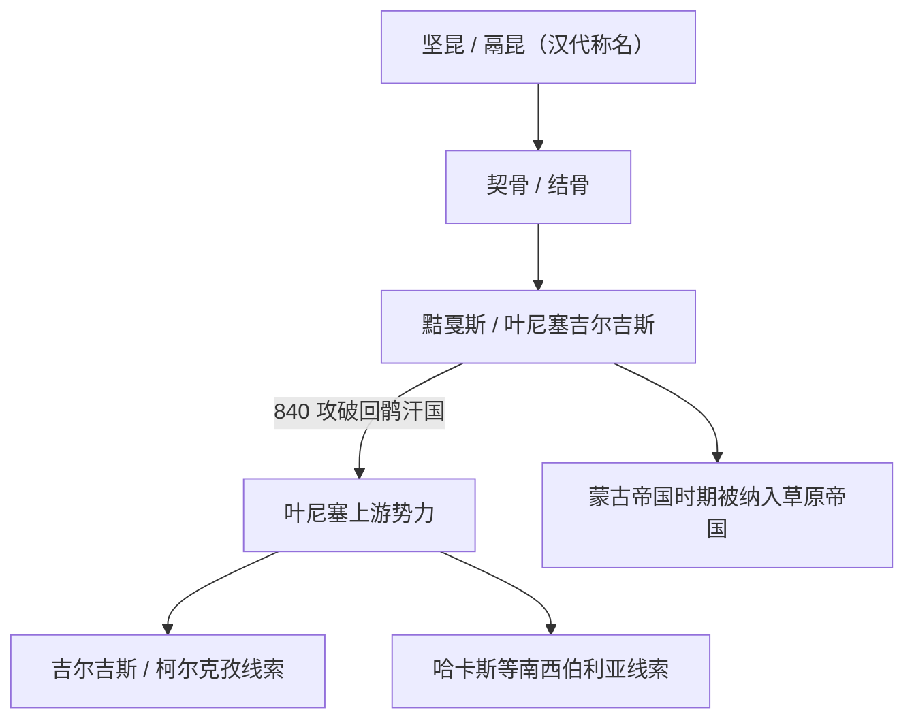

# 黠戛斯

## 校正版演进图

> “坚昆、契骨、黠戛斯、吉尔吉斯”更适合作为不同时期称名和族群连续性线索，不宜写成完全不变的血缘直线。

## 概括

黠戛斯 / 叶尼塞吉尔吉斯是叶尼塞上游和米努辛斯克盆地的重要突厥语族群。

## 起源

坚昆、鬲昆、结骨、黠戛斯等称名线索

### 起源详细补充

- 黠戛斯早期称坚昆、鬲昆、结骨等，核心在叶尼塞上游和米努辛斯克盆地。
- 它与铁勒不同，长期保留南西伯利亚区域特色。
- 语言上通常归入突厥语族，但也吸收了叶尼塞和南西伯利亚本地成分。

## 变迁

840 年击败回鹘汗国，后部分留居叶尼塞，部分南迁或西迁，是吉尔吉斯、哈卡斯等族群史的重要线索。

### 变迁详细补充

- 汉唐之间多次臣属于匈奴、突厥、回鹘等强权。
- 840年击破回鹘汗国后短暂影响漠北格局。
- 后期一部分留在叶尼塞形成哈卡斯等线索，一部分与天山吉尔吉斯、柯尔克孜形成有关。

## 世系说明

黠戛斯不是一个单一王朝或固定家族名称，而是叶尼塞上游和中亚北部的部族共同体，唐代虽有可汗称号，但完整世系不清，因此没有能够连续排列的统一君主世系。可考的政治世系应分别放在柯尔克孜相关后续族群和具体汗国等具体政权或部族笔记中。

## 所属大类

- [突厥语族与北方草原](/%E4%BA%BA%E6%96%87%E7%A7%91%E5%AD%A6/%E5%8E%86%E5%8F%B2-%E4%B8%AD%E5%9B%BD/%E6%B0%91%E6%97%8F/%E7%AA%81%E5%8E%A5%E8%AF%AD%E6%97%8F%E4%B8%8E%E5%8C%97%E6%96%B9%E8%8D%89%E5%8E%9F/README.md)

## 相关总览

- [华夏周边民族](/%E4%BA%BA%E6%96%87%E7%A7%91%E5%AD%A6/%E5%8E%86%E5%8F%B2-%E4%B8%AD%E5%9B%BD/%E6%B0%91%E6%97%8F/README.md)
- [起源](/%E4%BA%BA%E6%96%87%E7%A7%91%E5%AD%A6/%E5%8E%86%E5%8F%B2-%E4%B8%AD%E5%9B%BD/%E6%B0%91%E6%97%8F/README.md#起源)
- [变迁](/%E4%BA%BA%E6%96%87%E7%A7%91%E5%AD%A6/%E5%8E%86%E5%8F%B2-%E4%B8%AD%E5%9B%BD/%E6%B0%91%E6%97%8F/README.md#变迁)
