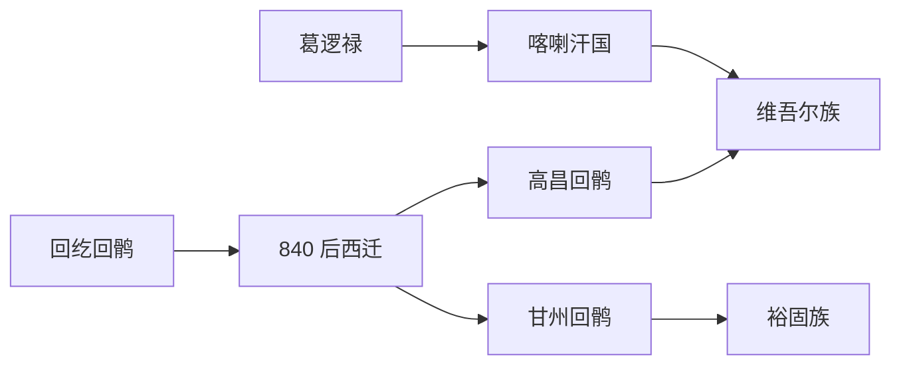

# 回鹘西迁与西域

本目录是“突厥语族与北方草原”下的二级线索，用于收纳回鹘西迁与西域相关民族、部族或政权笔记。

## 演进图

## 包含笔记

- [高昌回鹘](/%E4%BA%BA%E6%96%87%E7%A7%91%E5%AD%A6/%E5%8E%86%E5%8F%B2-%E4%B8%AD%E5%9B%BD/%E6%B0%91%E6%97%8F/%E7%AA%81%E5%8E%A5%E8%AF%AD%E6%97%8F%E4%B8%8E%E5%8C%97%E6%96%B9%E8%8D%89%E5%8E%9F/%E5%9B%9E%E9%B9%98%E8%A5%BF%E8%BF%81%E4%B8%8E%E8%A5%BF%E5%9F%9F/%E9%AB%98%E6%98%8C%E5%9B%9E%E9%B9%98.md)
- [甘州回鹘](/%E4%BA%BA%E6%96%87%E7%A7%91%E5%AD%A6/%E5%8E%86%E5%8F%B2-%E4%B8%AD%E5%9B%BD/%E6%B0%91%E6%97%8F/%E7%AA%81%E5%8E%A5%E8%AF%AD%E6%97%8F%E4%B8%8E%E5%8C%97%E6%96%B9%E8%8D%89%E5%8E%9F/%E5%9B%9E%E9%B9%98%E8%A5%BF%E8%BF%81%E4%B8%8E%E8%A5%BF%E5%9F%9F/%E7%94%98%E5%B7%9E%E5%9B%9E%E9%B9%98.md)
- [喀喇汗国](/%E4%BA%BA%E6%96%87%E7%A7%91%E5%AD%A6/%E5%8E%86%E5%8F%B2-%E4%B8%AD%E5%9B%BD/%E6%B0%91%E6%97%8F/%E7%AA%81%E5%8E%A5%E8%AF%AD%E6%97%8F%E4%B8%8E%E5%8C%97%E6%96%B9%E8%8D%89%E5%8E%9F/%E5%9B%9E%E9%B9%98%E8%A5%BF%E8%BF%81%E4%B8%8E%E8%A5%BF%E5%9F%9F/%E5%96%80%E5%96%87%E6%B1%97%E5%9B%BD.md)
- [裕固族](/%E4%BA%BA%E6%96%87%E7%A7%91%E5%AD%A6/%E5%8E%86%E5%8F%B2-%E4%B8%AD%E5%9B%BD/%E6%B0%91%E6%97%8F/%E7%AA%81%E5%8E%A5%E8%AF%AD%E6%97%8F%E4%B8%8E%E5%8C%97%E6%96%B9%E8%8D%89%E5%8E%9F/%E5%9B%9E%E9%B9%98%E8%A5%BF%E8%BF%81%E4%B8%8E%E8%A5%BF%E5%9F%9F/%E8%A3%95%E5%9B%BA%E6%97%8F.md)
- [维吾尔族](/%E4%BA%BA%E6%96%87%E7%A7%91%E5%AD%A6/%E5%8E%86%E5%8F%B2-%E4%B8%AD%E5%9B%BD/%E6%B0%91%E6%97%8F/%E7%AA%81%E5%8E%A5%E8%AF%AD%E6%97%8F%E4%B8%8E%E5%8C%97%E6%96%B9%E8%8D%89%E5%8E%9F/%E5%9B%9E%E9%B9%98%E8%A5%BF%E8%BF%81%E4%B8%8E%E8%A5%BF%E5%9F%9F/%E7%BB%B4%E5%90%BE%E5%B0%94%E6%97%8F.md)

## 上级目录

- [突厥语族与北方草原](/%E4%BA%BA%E6%96%87%E7%A7%91%E5%AD%A6/%E5%8E%86%E5%8F%B2-%E4%B8%AD%E5%9B%BD/%E6%B0%91%E6%97%8F/%E7%AA%81%E5%8E%A5%E8%AF%AD%E6%97%8F%E4%B8%8E%E5%8C%97%E6%96%B9%E8%8D%89%E5%8E%9F/README.md)
- [华夏周边民族](/%E4%BA%BA%E6%96%87%E7%A7%91%E5%AD%A6/%E5%8E%86%E5%8F%B2-%E4%B8%AD%E5%9B%BD/%E6%B0%91%E6%97%8F/README.md)
