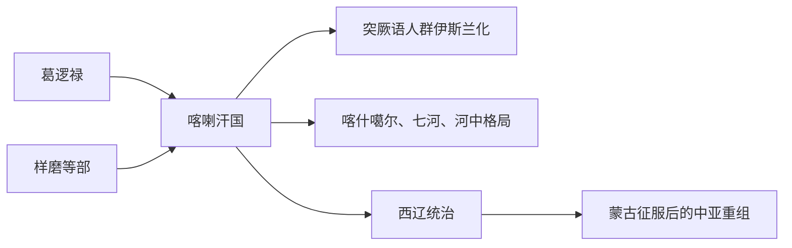

# 喀喇汗国

## 概括

喀喇汗国是 9 至 13 世纪中亚和西域西部的突厥语王朝，通常与葛逻禄、样磨、处月 / 迟逻等部族联盟和突厥语伊斯兰化有关。

## 起源

喀喇汗国起源于七河、天山西部和喀什噶尔周边的突厥语部族联盟，葛逻禄是其形成的重要背景。

### 起源详细补充

- 喀喇汗国不是回鹘汗国的简单延续，而是葛逻禄等多部族联盟发展出的王朝。
- 它是中亚突厥语人群伊斯兰化的重要节点。
- 其统治范围连接河中、喀什噶尔、七河和西域绿洲。

## 变迁

喀喇汗国接受伊斯兰教后，推动西域西部和中亚突厥语文学、城市和宗教格局变化。后来被西辽、花剌子模和蒙古征服体系吸收。

## 演进图

### 变迁详细补充

- 喀喇汗国是突厥语世界转向伊斯兰文明圈的关键政权。
- 它与葛逻禄关系密切，但也包含样磨、处月等多种部族成分。
- 其后续影响进入察合台语、维吾尔和中亚突厥语文化传统。

## 君主世系表（节选）

| 顺序 | 姓名 / 称号 | 在位时间 | 关键事件 / 备注 |
|---|---|---|---|
| 1 | 萨图克·博格拉汗 | 10 世纪 | 传统上被视为喀喇汗王朝接受伊斯兰教的关键君主。 |
| 2 | 穆萨·博格拉汗 | 10 世纪 | 推动伊斯兰化。 |
| 3 | 阿里·阿尔斯兰汗 | 10 世纪后期 | 喀喇汗统治集团分支之一。 |
| 4 | 哈桑·博格拉汗 | 10 世纪后期 | 与萨曼王朝、中亚城市相关。 |
| 5 | 优素福·卡迪尔汗 | 11 世纪 | 喀什噶尔一系重要君主。 |
| 6 | 伊卜拉欣·塔木哈赤汗 | 11 世纪 | 西喀喇汗重要统治者。 |
| 7 | 后期诸汗 | 12-13 世纪 | 东西分裂，受西辽、花剌子模和蒙古影响。 |

## 所属大类

- [突厥语族与北方草原](/%E4%BA%BA%E6%96%87%E7%A7%91%E5%AD%A6/%E5%8E%86%E5%8F%B2-%E4%B8%AD%E5%9B%BD/%E6%B0%91%E6%97%8F/%E7%AA%81%E5%8E%A5%E8%AF%AD%E6%97%8F%E4%B8%8E%E5%8C%97%E6%96%B9%E8%8D%89%E5%8E%9F/README.md)

## 相关笔记

- [葛逻禄](/%E4%BA%BA%E6%96%87%E7%A7%91%E5%AD%A6/%E5%8E%86%E5%8F%B2-%E4%B8%AD%E5%9B%BD/%E6%B0%91%E6%97%8F/%E7%AA%81%E5%8E%A5%E8%AF%AD%E6%97%8F%E4%B8%8E%E5%8C%97%E6%96%B9%E8%8D%89%E5%8E%9F/%E7%AA%81%E5%8E%A5%E9%93%81%E5%8B%92%E8%AF%B8%E9%83%A8/%E8%91%9B%E9%80%BB%E7%A6%84.md)
- [西域绿洲与印欧](/%E4%BA%BA%E6%96%87%E7%A7%91%E5%AD%A6/%E5%8E%86%E5%8F%B2-%E4%B8%AD%E5%9B%BD/%E6%B0%91%E6%97%8F/%E8%A5%BF%E5%9F%9F%E7%BB%BF%E6%B4%B2%E4%B8%8E%E5%8D%B0%E6%AC%A7/README.md)
- [华夏周边民族](/%E4%BA%BA%E6%96%87%E7%A7%91%E5%AD%A6/%E5%8E%86%E5%8F%B2-%E4%B8%AD%E5%9B%BD/%E6%B0%91%E6%97%8F/README.md)
- [起源](/%E4%BA%BA%E6%96%87%E7%A7%91%E5%AD%A6/%E5%8E%86%E5%8F%B2-%E4%B8%AD%E5%9B%BD/%E6%B0%91%E6%97%8F/README.md#起源)
- [变迁](/%E4%BA%BA%E6%96%87%E7%A7%91%E5%AD%A6/%E5%8E%86%E5%8F%B2-%E4%B8%AD%E5%9B%BD/%E6%B0%91%E6%97%8F/README.md#变迁)

## 参考

- [Kara-Khanid Khanate](https://en.wikipedia.org/wiki/Kara-Khanid_Khanate)
- [Karluks](https://en.wikipedia.org/wiki/Karluks)
