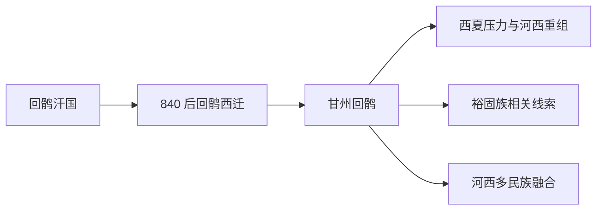

# 甘州回鹘

## 概括

甘州回鹘是回鹘汗国崩溃后迁入河西走廊、以甘州一带为中心的回鹘政权，又称河西回鹘。

## 起源

甘州回鹘源于 840 年后西迁的回鹘部众，进入河西走廊后与吐蕃、归义军、宋、辽、西夏等力量互动。

### 起源详细补充

- 核心区域在甘州、肃州、沙州及河西走廊。
- 它与高昌回鹘同属回鹘西迁后的不同区域分支。
- 后续与裕固族形成史有重要关系。

## 变迁

甘州回鹘在五代宋初维持区域政权，后受西夏扩张影响。其余部与河西多民族社会融合，是裕固族等线索的重要来源之一。

## 演进图

### 变迁详细补充

- 甘州回鹘比高昌回鹘更偏河西走廊线索。
- 其后续不应简单等同现代维吾尔族，更常与裕固族和河西回鹘遗民联系。
- 它也是唐宋之间河西走廊民族格局的重要环节。

## 世系说明

甘州回鹘不是单一王朝或固定家族，而是回鹘西迁后形成的河西区域政权，没有能够连续排列的统一君主世系。可考世系应参考裕固族、回纥回鹘等具体政权或部族。

## 所属大类

- [突厥语族与北方草原](/%E4%BA%BA%E6%96%87%E7%A7%91%E5%AD%A6/%E5%8E%86%E5%8F%B2-%E4%B8%AD%E5%9B%BD/%E6%B0%91%E6%97%8F/%E7%AA%81%E5%8E%A5%E8%AF%AD%E6%97%8F%E4%B8%8E%E5%8C%97%E6%96%B9%E8%8D%89%E5%8E%9F/README.md)

## 相关笔记

- [回纥回鹘](/%E4%BA%BA%E6%96%87%E7%A7%91%E5%AD%A6/%E5%8E%86%E5%8F%B2-%E4%B8%AD%E5%9B%BD/%E6%B0%91%E6%97%8F/%E7%AA%81%E5%8E%A5%E8%AF%AD%E6%97%8F%E4%B8%8E%E5%8C%97%E6%96%B9%E8%8D%89%E5%8E%9F/%E7%AA%81%E5%8E%A5%E9%93%81%E5%8B%92%E8%AF%B8%E9%83%A8/%E5%9B%9E%E7%BA%A5%E5%9B%9E%E9%B9%98.md)
- [裕固族](/%E4%BA%BA%E6%96%87%E7%A7%91%E5%AD%A6/%E5%8E%86%E5%8F%B2-%E4%B8%AD%E5%9B%BD/%E6%B0%91%E6%97%8F/%E7%AA%81%E5%8E%A5%E8%AF%AD%E6%97%8F%E4%B8%8E%E5%8C%97%E6%96%B9%E8%8D%89%E5%8E%9F/%E5%9B%9E%E9%B9%98%E8%A5%BF%E8%BF%81%E4%B8%8E%E8%A5%BF%E5%9F%9F/%E8%A3%95%E5%9B%BA%E6%97%8F.md)
- [华夏周边民族](/%E4%BA%BA%E6%96%87%E7%A7%91%E5%AD%A6/%E5%8E%86%E5%8F%B2-%E4%B8%AD%E5%9B%BD/%E6%B0%91%E6%97%8F/README.md)
- [起源](/%E4%BA%BA%E6%96%87%E7%A7%91%E5%AD%A6/%E5%8E%86%E5%8F%B2-%E4%B8%AD%E5%9B%BD/%E6%B0%91%E6%97%8F/README.md#起源)
- [变迁](/%E4%BA%BA%E6%96%87%E7%A7%91%E5%AD%A6/%E5%8E%86%E5%8F%B2-%E4%B8%AD%E5%9B%BD/%E6%B0%91%E6%97%8F/README.md#变迁)

## 参考

- [Ganzhou Uyghur Kingdom](https://en.wikipedia.org/wiki/Ganzhou_Uyghur_Kingdom)
