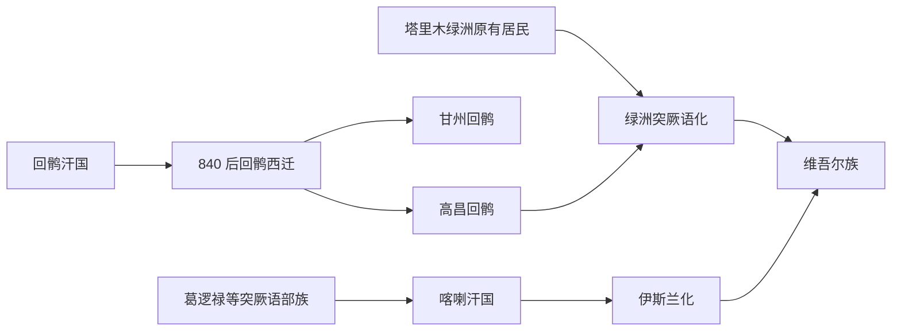

# 维吾尔族

## 概括

维吾尔族是近现代新疆和中亚地区的重要突厥语民族。其形成与回鹘西迁、高昌回鹘、喀喇汗国、塔里木绿洲居民、葛逻禄等突厥语部族以及伊斯兰化过程有关，不能简单写成“回鹘单线后裔”。

## 起源

维吾尔族的族源包含漠北回鹘西迁后的回鹘人群、塔里木盆地原有绿洲居民、葛逻禄等突厥语部族、中亚伊朗语和吐火罗语背景人群，以及后续蒙古、中亚和汉地因素。

### 起源详细补充

- 回鹘是维吾尔族形成史的重要来源，但不是唯一来源。
- 高昌回鹘代表佛教、摩尼教和绿洲回鹘传统，喀喇汗国代表突厥语人群伊斯兰化的重要阶段。
- 近现代维吾尔族身份是在长期绿洲社会、语言转用、宗教转型和民族识别中形成的。

## 变迁

840 年回鹘汗国被黠戛斯击破后，回鹘人群西迁到河西和西域。高昌回鹘维持佛教绿洲王国，喀喇汗国推动西域西部伊斯兰化。宋元明清以后，塔里木绿洲逐渐形成突厥语、伊斯兰文化为主的社会，近现代固定为维吾尔族身份。

## 演进图

### 变迁详细补充

- 高昌回鹘、甘州回鹘和喀喇汗国分别代表回鹘西迁后的不同区域方向。
- 塔里木绿洲居民经过长期突厥语化和伊斯兰化，成为维吾尔族形成的重要基础。
- 维吾尔族是现代民族共同体，不应直接等同于唐代回鹘汗国。

## 世系说明

维吾尔族是近现代民族共同体，不是单一王朝或固定家族，因此没有统一君主世系。相关政治世系可参考回纥回鹘、高昌回鹘、喀喇汗国等具体政权。

## 所属大类

- [突厥语族与北方草原](/%E4%BA%BA%E6%96%87%E7%A7%91%E5%AD%A6/%E5%8E%86%E5%8F%B2-%E4%B8%AD%E5%9B%BD/%E6%B0%91%E6%97%8F/%E7%AA%81%E5%8E%A5%E8%AF%AD%E6%97%8F%E4%B8%8E%E5%8C%97%E6%96%B9%E8%8D%89%E5%8E%9F/README.md)

## 相关笔记

- [回纥回鹘](/%E4%BA%BA%E6%96%87%E7%A7%91%E5%AD%A6/%E5%8E%86%E5%8F%B2-%E4%B8%AD%E5%9B%BD/%E6%B0%91%E6%97%8F/%E7%AA%81%E5%8E%A5%E8%AF%AD%E6%97%8F%E4%B8%8E%E5%8C%97%E6%96%B9%E8%8D%89%E5%8E%9F/%E7%AA%81%E5%8E%A5%E9%93%81%E5%8B%92%E8%AF%B8%E9%83%A8/%E5%9B%9E%E7%BA%A5%E5%9B%9E%E9%B9%98.md)
- [高昌回鹘](/%E4%BA%BA%E6%96%87%E7%A7%91%E5%AD%A6/%E5%8E%86%E5%8F%B2-%E4%B8%AD%E5%9B%BD/%E6%B0%91%E6%97%8F/%E7%AA%81%E5%8E%A5%E8%AF%AD%E6%97%8F%E4%B8%8E%E5%8C%97%E6%96%B9%E8%8D%89%E5%8E%9F/%E5%9B%9E%E9%B9%98%E8%A5%BF%E8%BF%81%E4%B8%8E%E8%A5%BF%E5%9F%9F/%E9%AB%98%E6%98%8C%E5%9B%9E%E9%B9%98.md)
- [喀喇汗国](/%E4%BA%BA%E6%96%87%E7%A7%91%E5%AD%A6/%E5%8E%86%E5%8F%B2-%E4%B8%AD%E5%9B%BD/%E6%B0%91%E6%97%8F/%E7%AA%81%E5%8E%A5%E8%AF%AD%E6%97%8F%E4%B8%8E%E5%8C%97%E6%96%B9%E8%8D%89%E5%8E%9F/%E5%9B%9E%E9%B9%98%E8%A5%BF%E8%BF%81%E4%B8%8E%E8%A5%BF%E5%9F%9F/%E5%96%80%E5%96%87%E6%B1%97%E5%9B%BD.md)
- [华夏周边民族](/%E4%BA%BA%E6%96%87%E7%A7%91%E5%AD%A6/%E5%8E%86%E5%8F%B2-%E4%B8%AD%E5%9B%BD/%E6%B0%91%E6%97%8F/README.md)
- [起源](/%E4%BA%BA%E6%96%87%E7%A7%91%E5%AD%A6/%E5%8E%86%E5%8F%B2-%E4%B8%AD%E5%9B%BD/%E6%B0%91%E6%97%8F/README.md#起源)
- [变迁](/%E4%BA%BA%E6%96%87%E7%A7%91%E5%AD%A6/%E5%8E%86%E5%8F%B2-%E4%B8%AD%E5%9B%BD/%E6%B0%91%E6%97%8F/README.md#变迁)

## 参考

- [Uyghurs](https://en.wikipedia.org/wiki/Uyghurs)
- [Qocho](https://en.wikipedia.org/wiki/Qocho)
- [Kara-Khanid Khanate](https://en.wikipedia.org/wiki/Kara-Khanid_Khanate)
