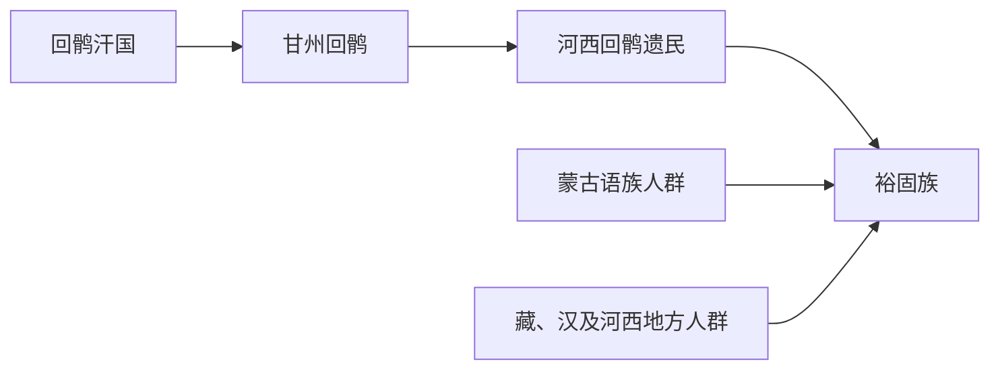

# 裕固族

## 概括

裕固族是主要分布于甘肃肃南一带的现代民族，通常与甘州回鹘、河西回鹘遗民和蒙古、藏、汉等多源融合有关。

## 起源

裕固族形成与回鹘西迁后的河西回鹘关系密切，但其现代民族身份还包含长期河西走廊多民族融合。

### 起源详细补充

- 东部裕固语属蒙古语族，西部裕固语属突厥语族，体现多源融合。
- 历史上与甘州回鹘、撒里畏兀儿等名称相关。
- 形成区域集中在河西走廊和祁连山北麓。

## 变迁

甘州回鹘被西夏和后续政权冲击后，河西回鹘遗民与蒙古、藏、汉等人群长期互动，近现代民族识别中形成裕固族。

## 演进图

### 变迁详细补充

- 裕固族不能只看作“回鹘直系后裔”，其语言和族源都呈多源格局。
- 甘州回鹘是其重要历史来源。
- 现代裕固族身份是近现代民族识别和地方历史共同作用的结果。

## 世系说明

裕固族不是单一王朝或固定家族，而是现代民族共同体，不是古代王朝，没有能够连续排列的统一君主世系。可考世系应参考甘州回鹘等历史来源等具体政权或部族。

## 所属大类

- [突厥语族与北方草原](/%E4%BA%BA%E6%96%87%E7%A7%91%E5%AD%A6/%E5%8E%86%E5%8F%B2-%E4%B8%AD%E5%9B%BD/%E6%B0%91%E6%97%8F/%E7%AA%81%E5%8E%A5%E8%AF%AD%E6%97%8F%E4%B8%8E%E5%8C%97%E6%96%B9%E8%8D%89%E5%8E%9F/README.md)

## 相关笔记

- [甘州回鹘](/%E4%BA%BA%E6%96%87%E7%A7%91%E5%AD%A6/%E5%8E%86%E5%8F%B2-%E4%B8%AD%E5%9B%BD/%E6%B0%91%E6%97%8F/%E7%AA%81%E5%8E%A5%E8%AF%AD%E6%97%8F%E4%B8%8E%E5%8C%97%E6%96%B9%E8%8D%89%E5%8E%9F/%E5%9B%9E%E9%B9%98%E8%A5%BF%E8%BF%81%E4%B8%8E%E8%A5%BF%E5%9F%9F/%E7%94%98%E5%B7%9E%E5%9B%9E%E9%B9%98.md)
- [回纥回鹘](/%E4%BA%BA%E6%96%87%E7%A7%91%E5%AD%A6/%E5%8E%86%E5%8F%B2-%E4%B8%AD%E5%9B%BD/%E6%B0%91%E6%97%8F/%E7%AA%81%E5%8E%A5%E8%AF%AD%E6%97%8F%E4%B8%8E%E5%8C%97%E6%96%B9%E8%8D%89%E5%8E%9F/%E7%AA%81%E5%8E%A5%E9%93%81%E5%8B%92%E8%AF%B8%E9%83%A8/%E5%9B%9E%E7%BA%A5%E5%9B%9E%E9%B9%98.md)
- [华夏周边民族](/%E4%BA%BA%E6%96%87%E7%A7%91%E5%AD%A6/%E5%8E%86%E5%8F%B2-%E4%B8%AD%E5%9B%BD/%E6%B0%91%E6%97%8F/README.md)
- [起源](/%E4%BA%BA%E6%96%87%E7%A7%91%E5%AD%A6/%E5%8E%86%E5%8F%B2-%E4%B8%AD%E5%9B%BD/%E6%B0%91%E6%97%8F/README.md#起源)
- [变迁](/%E4%BA%BA%E6%96%87%E7%A7%91%E5%AD%A6/%E5%8E%86%E5%8F%B2-%E4%B8%AD%E5%9B%BD/%E6%B0%91%E6%97%8F/README.md#变迁)

## 参考

- [Yugur](https://en.wikipedia.org/wiki/Yugur)
- [Ganzhou Uyghur Kingdom](https://en.wikipedia.org/wiki/Ganzhou_Uyghur_Kingdom)
