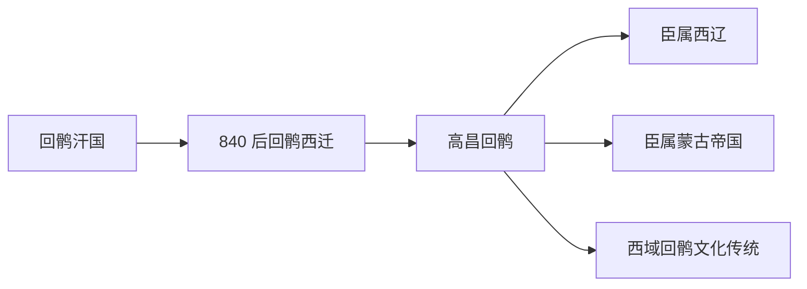

# 高昌回鹘

## 概括

高昌回鹘又称 Qocho / 高昌回鹘王国，是回鹘汗国崩溃后西迁回鹘在吐鲁番、高昌、别失八里一带建立的绿洲政权。

## 起源

840 年黠戛斯攻破漠北回鹘汗国后，回鹘部众分向河西、西域和中亚迁徙，其中一支进入吐鲁番盆地，建立高昌回鹘。

### 起源详细补充

- 核心区域在吐鲁番、高昌、别失八里、哈密和龟兹周边。
- 其文化深受佛教、摩尼教、汉地和吐火罗绿洲传统影响。
- 它是回鹘从草原汗国转向绿洲城邦政权的重要节点。

## 变迁

高昌回鹘长期作为西域绿洲政权存在，后来臣属于西辽和蒙古。蒙古时代高昌回鹘贵族在帝国文书、佛教和行政体系中仍有影响。

## 演进图

### 变迁详细补充

- 高昌回鹘不是现代维吾尔族的唯一来源，但对西域突厥语和回鹘文化传统影响很大。
- 其政权形态从草原汗国转为绿洲王国。
- 在蒙古帝国时期，高昌回鹘书吏和佛教文化有重要地位。

## 世系说明

高昌回鹘不是单一王朝或固定家族，而是回鹘西迁后形成的绿洲政权和区域共同体，没有能够连续排列的统一君主世系。可考世系应参考回纥回鹘、裕固族、维吾尔族相关线索等具体政权或部族。

## 所属大类

- [突厥语族与北方草原](/%E4%BA%BA%E6%96%87%E7%A7%91%E5%AD%A6/%E5%8E%86%E5%8F%B2-%E4%B8%AD%E5%9B%BD/%E6%B0%91%E6%97%8F/%E7%AA%81%E5%8E%A5%E8%AF%AD%E6%97%8F%E4%B8%8E%E5%8C%97%E6%96%B9%E8%8D%89%E5%8E%9F/README.md)

## 相关笔记

- [回纥回鹘](/%E4%BA%BA%E6%96%87%E7%A7%91%E5%AD%A6/%E5%8E%86%E5%8F%B2-%E4%B8%AD%E5%9B%BD/%E6%B0%91%E6%97%8F/%E7%AA%81%E5%8E%A5%E8%AF%AD%E6%97%8F%E4%B8%8E%E5%8C%97%E6%96%B9%E8%8D%89%E5%8E%9F/%E7%AA%81%E5%8E%A5%E9%93%81%E5%8B%92%E8%AF%B8%E9%83%A8/%E5%9B%9E%E7%BA%A5%E5%9B%9E%E9%B9%98.md)
- [甘州回鹘](/%E4%BA%BA%E6%96%87%E7%A7%91%E5%AD%A6/%E5%8E%86%E5%8F%B2-%E4%B8%AD%E5%9B%BD/%E6%B0%91%E6%97%8F/%E7%AA%81%E5%8E%A5%E8%AF%AD%E6%97%8F%E4%B8%8E%E5%8C%97%E6%96%B9%E8%8D%89%E5%8E%9F/%E5%9B%9E%E9%B9%98%E8%A5%BF%E8%BF%81%E4%B8%8E%E8%A5%BF%E5%9F%9F/%E7%94%98%E5%B7%9E%E5%9B%9E%E9%B9%98.md)
- [华夏周边民族](/%E4%BA%BA%E6%96%87%E7%A7%91%E5%AD%A6/%E5%8E%86%E5%8F%B2-%E4%B8%AD%E5%9B%BD/%E6%B0%91%E6%97%8F/README.md)
- [起源](/%E4%BA%BA%E6%96%87%E7%A7%91%E5%AD%A6/%E5%8E%86%E5%8F%B2-%E4%B8%AD%E5%9B%BD/%E6%B0%91%E6%97%8F/README.md#起源)
- [变迁](/%E4%BA%BA%E6%96%87%E7%A7%91%E5%AD%A6/%E5%8E%86%E5%8F%B2-%E4%B8%AD%E5%9B%BD/%E6%B0%91%E6%97%8F/README.md#变迁)

