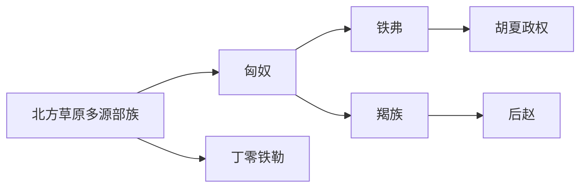

# 早期草原与内迁

本目录是“突厥语族与北方草原”下的二级线索，用于收纳早期草原与内迁相关民族、部族或政权笔记。

## 演进图

## 包含笔记

- [匈奴](/%E4%BA%BA%E6%96%87%E7%A7%91%E5%AD%A6/%E5%8E%86%E5%8F%B2-%E4%B8%AD%E5%9B%BD/%E6%B0%91%E6%97%8F/%E7%AA%81%E5%8E%A5%E8%AF%AD%E6%97%8F%E4%B8%8E%E5%8C%97%E6%96%B9%E8%8D%89%E5%8E%9F/%E6%97%A9%E6%9C%9F%E8%8D%89%E5%8E%9F%E4%B8%8E%E5%86%85%E8%BF%81/%E5%8C%88%E5%A5%B4.md)
- [丁零铁勒](/%E4%BA%BA%E6%96%87%E7%A7%91%E5%AD%A6/%E5%8E%86%E5%8F%B2-%E4%B8%AD%E5%9B%BD/%E6%B0%91%E6%97%8F/%E7%AA%81%E5%8E%A5%E8%AF%AD%E6%97%8F%E4%B8%8E%E5%8C%97%E6%96%B9%E8%8D%89%E5%8E%9F/%E6%97%A9%E6%9C%9F%E8%8D%89%E5%8E%9F%E4%B8%8E%E5%86%85%E8%BF%81/%E4%B8%81%E9%9B%B6%E9%93%81%E5%8B%92.md)
- [铁弗](/%E4%BA%BA%E6%96%87%E7%A7%91%E5%AD%A6/%E5%8E%86%E5%8F%B2-%E4%B8%AD%E5%9B%BD/%E6%B0%91%E6%97%8F/%E7%AA%81%E5%8E%A5%E8%AF%AD%E6%97%8F%E4%B8%8E%E5%8C%97%E6%96%B9%E8%8D%89%E5%8E%9F/%E6%97%A9%E6%9C%9F%E8%8D%89%E5%8E%9F%E4%B8%8E%E5%86%85%E8%BF%81/%E9%93%81%E5%BC%97.md)
- [羯族](/%E4%BA%BA%E6%96%87%E7%A7%91%E5%AD%A6/%E5%8E%86%E5%8F%B2-%E4%B8%AD%E5%9B%BD/%E6%B0%91%E6%97%8F/%E7%AA%81%E5%8E%A5%E8%AF%AD%E6%97%8F%E4%B8%8E%E5%8C%97%E6%96%B9%E8%8D%89%E5%8E%9F/%E6%97%A9%E6%9C%9F%E8%8D%89%E5%8E%9F%E4%B8%8E%E5%86%85%E8%BF%81/%E7%BE%AF%E6%97%8F.md)

## 上级目录

- [突厥语族与北方草原](/%E4%BA%BA%E6%96%87%E7%A7%91%E5%AD%A6/%E5%8E%86%E5%8F%B2-%E4%B8%AD%E5%9B%BD/%E6%B0%91%E6%97%8F/%E7%AA%81%E5%8E%A5%E8%AF%AD%E6%97%8F%E4%B8%8E%E5%8C%97%E6%96%B9%E8%8D%89%E5%8E%9F/README.md)
- [华夏周边民族](/%E4%BA%BA%E6%96%87%E7%A7%91%E5%AD%A6/%E5%8E%86%E5%8F%B2-%E4%B8%AD%E5%9B%BD/%E6%B0%91%E6%97%8F/README.md)
