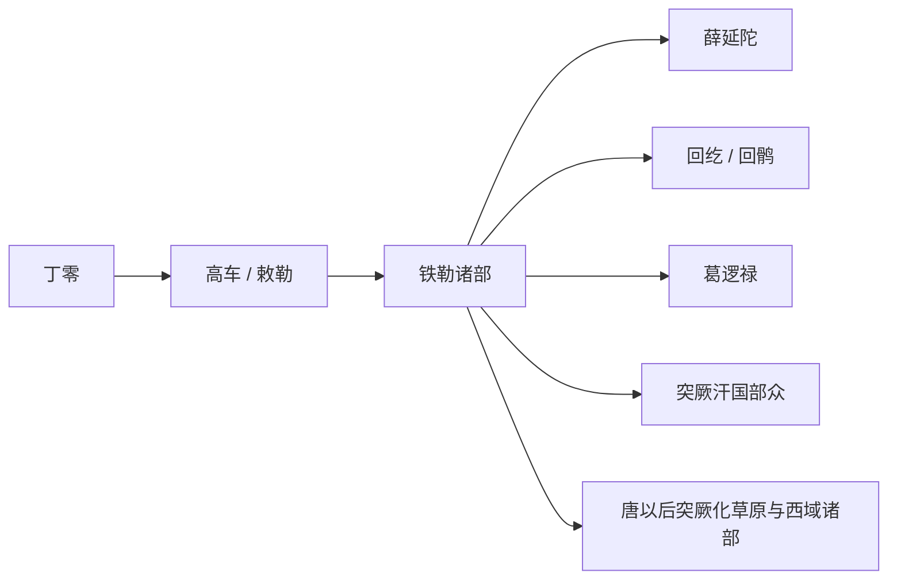

# 丁零铁勒

## 概括

丁零、高车、敕勒、铁勒是北方草原和南西伯利亚文献中常见的相关称谓，通常与突厥语族早期部族联系讨论。

## 起源

丁零、高车、敕勒、铁勒诸部

### 起源详细补充

- 核心区域在贝加尔湖以南、叶尼塞上游、蒙古高原北部和阿尔泰一带。
- 丁零、高车、敕勒、铁勒之间有称谓承续和部族泛称关系，但不是完全等同的固定民族名。
- 它们常被放入突厥语族早期史讨论，但具体语言和族属仍需按时期分别判断。

## 变迁

隋唐时期铁勒诸部中出现薛延陀、回纥、葛逻禄等重要部族；部分成为突厥汗国、回鹘汗国和唐朝边疆体系的组成部分。

### 变迁详细补充

- 汉魏时期多受匈奴、鲜卑等草原帝国影响。
- 南北朝至隋唐时期，铁勒诸部成为突厥、薛延陀、回鹘、葛逻禄等部族的重要背景。
- 唐以后，铁勒作为统称逐渐消失，后续部众并入回鹘、突厥化中亚部族和北方草原诸集团。

## 演进图

## 世系说明

丁零、铁勒不是一个单一王朝或固定家族名称，而是北方草原多个部族的泛称和阶段性称谓，因此没有能够连续排列的统一君主世系。可考的政治世系应分别放在薛延陀、回纥回鹘、葛逻禄、黠戛斯等具体政权或部族笔记中。

## 所属大类

- [突厥语族与北方草原](/%E4%BA%BA%E6%96%87%E7%A7%91%E5%AD%A6/%E5%8E%86%E5%8F%B2-%E4%B8%AD%E5%9B%BD/%E6%B0%91%E6%97%8F/%E7%AA%81%E5%8E%A5%E8%AF%AD%E6%97%8F%E4%B8%8E%E5%8C%97%E6%96%B9%E8%8D%89%E5%8E%9F/README.md)

## 相关总览

- [华夏周边民族](/%E4%BA%BA%E6%96%87%E7%A7%91%E5%AD%A6/%E5%8E%86%E5%8F%B2-%E4%B8%AD%E5%9B%BD/%E6%B0%91%E6%97%8F/README.md)
- [起源](/%E4%BA%BA%E6%96%87%E7%A7%91%E5%AD%A6/%E5%8E%86%E5%8F%B2-%E4%B8%AD%E5%9B%BD/%E6%B0%91%E6%97%8F/README.md#起源)
- [变迁](/%E4%BA%BA%E6%96%87%E7%A7%91%E5%AD%A6/%E5%8E%86%E5%8F%B2-%E4%B8%AD%E5%9B%BD/%E6%B0%91%E6%97%8F/README.md#变迁)
