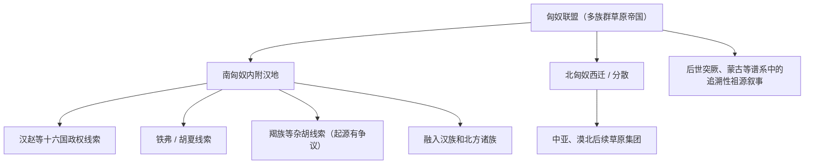

# 匈奴

## 校正版演进图

> 原图把匈奴后裔和多个后世民族画成较确定的直线关系。校正版保留南北匈奴、内附、分散和后世追溯线索，但不把匈奴语言或血缘定为单一来源。

## 概括

北方草原帝国，兴起于战国秦汉之际，冒顿单于时期统一漠北并控制河套、西域交通。其语言归属仍有争议，可能包含突厥、蒙古、叶尼塞、伊朗语等多种成分，因此不能直接写成突厥语族源头。

## 起源

东周北方游牧群体、匈奴联盟

### 起源详细补充

- 匈奴形成于战国末至秦汉之际的蒙古高原和阴山、河套地区。
- 它是多部族草原帝国，包含不同来源的游牧、半农牧和边地人群。
- 匈奴语言归属没有定论，不能简单定为突厥语、蒙古语或其他单一语言。

## 变迁

南匈奴内附并融入汉地；北匈奴西迁或分散；部分后世族群和政权在文献中被追溯为匈奴后裔，如铁弗、羯、突厥阿史那传说等，但需谨慎。

### 变迁详细补充

- 冒顿单于时期统一漠北并压迫月氏、东胡、乌孙等周边势力。
- 东汉时期分裂为南、北匈奴：南匈奴内附汉地，北匈奴西迁或分散。
- 十六国时期的汉赵、铁弗胡夏、羯族等都有匈奴或匈奴附属部众线索，但多已高度混合。

## 主要单于世系（节选）

匈奴单于世系较长，且汉文记载在早期、分裂期和南北匈奴时期详略不一。这里列出对匈奴国家形成和分裂最关键的可考单于。

| 顺序 | 姓名 / 称号 | 在位时间 | 与前任关系 | 关键事件 / 备注 |
|---|---|---|---|---|
| 1 | 头曼单于 | 约前 3 世纪末-前 209 | 不详 | 冒顿之父，秦汉之际匈奴早期首领。 |
| 2 | **冒顿单于** | 前 209-前 174 | 头曼之子 | 击败东胡、月氏，建立强大的匈奴帝国。 |
| 3 | 老上单于 | 前 174-前 161 | 冒顿之子 | 继续压制月氏，维持对汉优势。 |
| 4 | 军臣单于 | 前 161-前 126 | 老上之子 | 汉武帝前期主要对手。 |
| 5 | 伊稚斜单于 | 前 126-前 114 | 军臣弟 | 汉匈战争激化，匈奴势力受损。 |
| 6 | 乌维单于 | 前 114-前 105 | 伊稚斜之子 | 继续与汉对抗。 |
| 7 | 儿单单于 | 前 105-前 102 | 乌维之子 | 在位较短。 |
| 8 | 呴犁湖单于 | 前 102-前 101 | 儿单叔父 | 在位很短。 |
| 9 | 且鞮侯单于 | 前 101-前 96 | 呴犁湖弟 | 匈奴内部压力加重。 |
| 10 | 狐鹿姑单于 | 前 96-前 85 | 且鞮侯之子 | 与汉继续战争。 |
| 11 | 壶衍鞮单于 | 前 85-前 68 | 狐鹿姑之子 | 匈奴逐渐衰弱。 |
| 12 | 虚闾权渠单于 | 前 68-前 60 | 壶衍鞮之子 | 死后匈奴内乱。 |
| 13 | **呼韩邪单于** | 前 58-前 31 | 匈奴贵族 | 南下附汉，匈奴分裂的重要节点。 |
| 14 | 郅支单于 | 前 56-前 36 | 呼韩邪兄 | 与呼韩邪并立，西迁中亚，前 36 年被汉军击杀。 |
| 15 | 呼都而尸道皋若鞮单于 | 18-46 | 呼韩邪后裔 | 东汉初匈奴单于。 |
| 16 | 比 / 南匈奴醢落尸逐鞮单于 | 48-56 | 匈奴贵族 | 南匈奴附汉，南北匈奴分裂固定化。 |
| 17 | 呼厨泉单于 | 195-216 | 南匈奴单于 | 曹操时期被留居邺城，南匈奴政治独立性进一步削弱。 |

## 所属大类

- [突厥语族与北方草原](/%E4%BA%BA%E6%96%87%E7%A7%91%E5%AD%A6/%E5%8E%86%E5%8F%B2-%E4%B8%AD%E5%9B%BD/%E6%B0%91%E6%97%8F/%E7%AA%81%E5%8E%A5%E8%AF%AD%E6%97%8F%E4%B8%8E%E5%8C%97%E6%96%B9%E8%8D%89%E5%8E%9F/README.md)

## 相关总览

- [华夏周边民族](/%E4%BA%BA%E6%96%87%E7%A7%91%E5%AD%A6/%E5%8E%86%E5%8F%B2-%E4%B8%AD%E5%9B%BD/%E6%B0%91%E6%97%8F/README.md)
- [起源](/%E4%BA%BA%E6%96%87%E7%A7%91%E5%AD%A6/%E5%8E%86%E5%8F%B2-%E4%B8%AD%E5%9B%BD/%E6%B0%91%E6%97%8F/README.md#起源)
- [变迁](/%E4%BA%BA%E6%96%87%E7%A7%91%E5%AD%A6/%E5%8E%86%E5%8F%B2-%E4%B8%AD%E5%9B%BD/%E6%B0%91%E6%97%8F/README.md#变迁)
