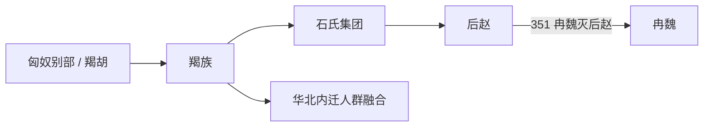

# 羯族

## 概括

羯是十六国时期的杂胡族群，石勒建立后赵。其起源争议很大，有匈奴别部、月氏、粟特、叶尼塞、突厥等多种假说。

## 起源

南匈奴附属部众或中亚来源杂胡，未有定论

### 起源详细补充

- 羯族是十六国时期山西、河北一带的杂胡族群，史料极少。
- 它原属南匈奴系统下的附属部众，但是否独立民族存在争议。
- 关于其来源有月氏、粟特、康居、叶尼塞、突厥等多种假说，不能定论。

## 变迁

后赵灭亡后遭受严重打击，作为独立族名很快消失，残余多融入北方其他人群。

### 变迁详细补充

- 石勒建立后赵，使羯族成为十六国政治舞台上的核心统治集团之一。
- 后赵后期内乱和冉闵屠杀使羯人遭受毁灭性打击。
- 此后羯作为族名基本消失，残余应融入北方汉人和其他胡族。

## 演进图

## 主要世系表

羯族最可考的政权世系是石氏后赵。

| 顺序 | 姓名 | 庙号 / 谥号 | 在位时间 | 关键事件 / 备注 |
|---|---|---|---|---|
| 1 | **石勒** | 高祖 / 明皇帝 | 319-333 | 建立后赵，羯族政权代表人物。 |
| 2 | 石弘 | 海阳王 | 333-334 | 石勒之子，被石虎废黜。 |
| 3 | 石虎 | 太祖 / 武皇帝 | 334-349 | 后赵强盛但统治残酷。 |
| 4 | 石世 | 谯王 | 349 | 在位极短。 |
| 5 | 石遵 | 彭城王 | 349 | 被石鉴所杀。 |
| 6 | 石鉴 | 义阳王 | 349-350 | 后赵内乱。 |
| 7 | 石祗 | 新兴王 | 350-351 | 351 年被杀，后赵亡。 |

## 所属大类

- [突厥语族与北方草原](/%E4%BA%BA%E6%96%87%E7%A7%91%E5%AD%A6/%E5%8E%86%E5%8F%B2-%E4%B8%AD%E5%9B%BD/%E6%B0%91%E6%97%8F/%E7%AA%81%E5%8E%A5%E8%AF%AD%E6%97%8F%E4%B8%8E%E5%8C%97%E6%96%B9%E8%8D%89%E5%8E%9F/README.md)

## 相关总览

- [华夏周边民族](/%E4%BA%BA%E6%96%87%E7%A7%91%E5%AD%A6/%E5%8E%86%E5%8F%B2-%E4%B8%AD%E5%9B%BD/%E6%B0%91%E6%97%8F/README.md)
- [起源](/%E4%BA%BA%E6%96%87%E7%A7%91%E5%AD%A6/%E5%8E%86%E5%8F%B2-%E4%B8%AD%E5%9B%BD/%E6%B0%91%E6%97%8F/README.md#起源)
- [变迁](/%E4%BA%BA%E6%96%87%E7%A7%91%E5%AD%A6/%E5%8E%86%E5%8F%B2-%E4%B8%AD%E5%9B%BD/%E6%B0%91%E6%97%8F/README.md#变迁)
