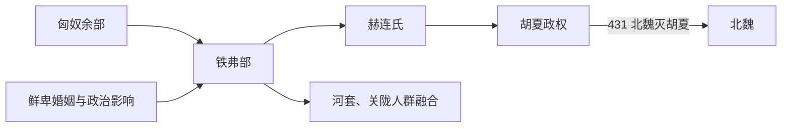

# 铁弗

## 概括

铁弗是十六国时期与南匈奴、鲜卑、乌桓等混合有关的族群名称，赫连勃勃建立胡夏。

## 起源

南匈奴、鲜卑、乌桓等多源混合

### 起源详细补充

- 铁弗是十六国时期的混合族群名，通常与南匈奴、鲜卑和乌桓等融合有关。
- 其核心统治家族刘 / 赫连氏自称匈奴后裔。
- “铁弗”不是早期草原大族，而是魏晋北方族群重组中的政治名称。

## 变迁

胡夏被北魏灭亡后，铁弗部众或融入北魏和北方各族。

### 变迁详细补充

- 赫连勃勃建立胡夏，以统万城为中心控制陕北、河套和关中一带。
- 胡夏与后秦、北魏、西秦等政权反复攻战。
- 431年前后胡夏灭亡后，部众被北魏吸收，铁弗作为独立族名逐渐消失。

## 演进图

## 主要世系表

铁弗最可考的政治世系是赫连氏胡夏政权。

| 顺序 | 姓名 | 身份 / 称号 | 在位时间 | 关键事件 / 备注 |
|---|---|---|---|---|
| 1 | 刘卫辰 | 铁弗部首领 | 4 世纪后期-391 | 赫连勃勃之父，控制河套一带，后为北魏击败。 |
| 2 | **赫连勃勃** | 胡夏武烈帝 | 407-425 | 建立胡夏，筑统万城。 |
| 3 | 赫连昌 | 胡夏皇帝 | 425-428 | 被北魏俘获。 |
| 4 | 赫连定 | 胡夏末帝 | 428-431 | 431 年被吐谷浑俘，胡夏亡。 |

## 所属大类

- [突厥语族与北方草原](/%E4%BA%BA%E6%96%87%E7%A7%91%E5%AD%A6/%E5%8E%86%E5%8F%B2-%E4%B8%AD%E5%9B%BD/%E6%B0%91%E6%97%8F/%E7%AA%81%E5%8E%A5%E8%AF%AD%E6%97%8F%E4%B8%8E%E5%8C%97%E6%96%B9%E8%8D%89%E5%8E%9F/README.md)

## 相关总览

- [华夏周边民族](/%E4%BA%BA%E6%96%87%E7%A7%91%E5%AD%A6/%E5%8E%86%E5%8F%B2-%E4%B8%AD%E5%9B%BD/%E6%B0%91%E6%97%8F/README.md)
- [起源](/%E4%BA%BA%E6%96%87%E7%A7%91%E5%AD%A6/%E5%8E%86%E5%8F%B2-%E4%B8%AD%E5%9B%BD/%E6%B0%91%E6%97%8F/README.md#起源)
- [变迁](/%E4%BA%BA%E6%96%87%E7%A7%91%E5%AD%A6/%E5%8E%86%E5%8F%B2-%E4%B8%AD%E5%9B%BD/%E6%B0%91%E6%97%8F/README.md#变迁)
