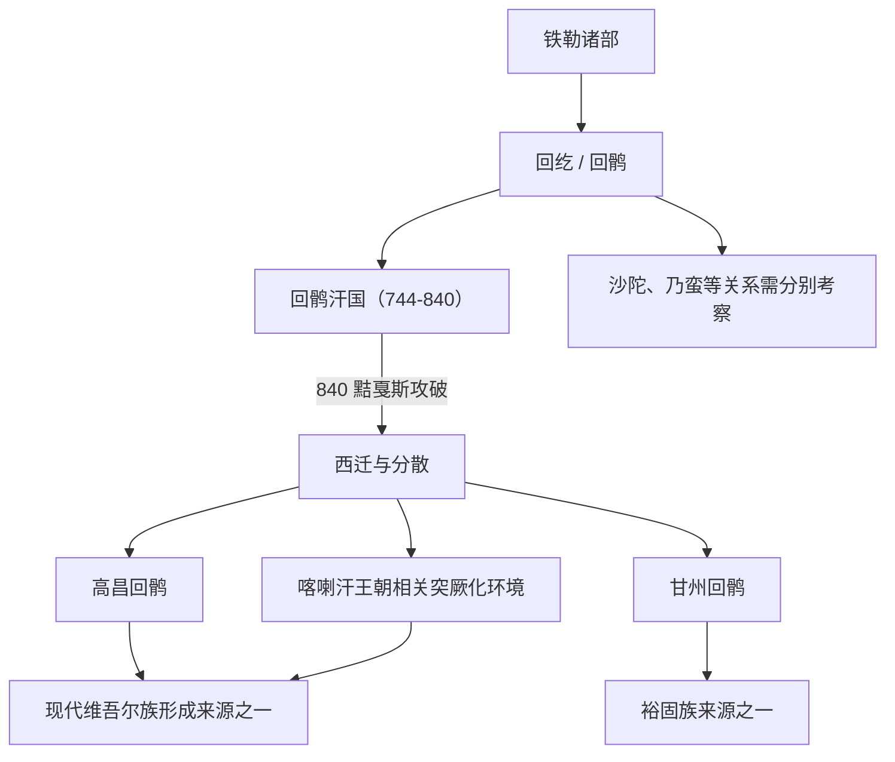

# 回纥回鹘

## 校正版演进图

> 现代维吾尔族不能只由回鹘单线形成，还包含塔里木绿洲居民、葛逻禄、伊朗语人群和后续伊斯兰化等多重因素。

## 概括

回纥 / 回鹘源于铁勒诸部，唐代取代后突厥建立回鹘汗国。

## 起源

铁勒诸部、回纥部

### 起源详细补充

- 回纥源于铁勒诸部，唐代逐渐成为漠北重要力量。
- “回纥”后改称“回鹘”，是政治称号、部族名和文化共同体名称的结合。
- 回鹘与唐朝、粟特商人、摩尼教和佛教文化都有密切联系。

## 变迁

840 年汗国被黠戛斯击破后，回鹘分散到西域、河西和甘州等地，形成高昌回鹘、甘州回鹘等；现代维吾尔族形成与回鹘有关，但还包含绿洲居民、葛逻禄、伊朗语人群等多源成分。

### 变迁详细补充

- 744年建立回鹘汗国，取代后突厥成为漠北霸主。
- 840年被黠戛斯击破后，回鹘分散到高昌、甘州、河西和塔里木绿洲。
- 现代维吾尔族形成与回鹘有关，但还包含绿洲居民、葛逻禄、伊朗语人群和伊斯兰化过程。

## 可汗世系表（节选）

回纥 / 回鹘汗国可汗世系有多种汉文译名，这里列出漠北回鹘汗国主线关键可汗。

| 顺序 | 姓名 / 称号 | 在位时间 | 关键事件 / 备注 |
|---|---|---|---|
| 1 | **骨力裴罗 / 怀仁可汗** | 744-747 | 联合葛逻禄、拔悉密击败后突厥，建立回纥汗国。 |
| 2 | 葛勒可汗 / 磨延啜 | 747-759 | 助唐平安史之乱，回纥势力增强。 |
| 3 | 牟羽可汗 | 759-779 | 引入摩尼教，回纥文化转型。 |
| 4 | 顿莫贺达干 / 武义成功可汗 | 779-789 | 杀牟羽可汗后即位。 |
| 5 | 多逻斯可汗 / 忠贞可汗 | 789-790 | 在位短。 |
| 6 | 阿啜可汗 / 奉诚可汗 | 790-795 | 继承危机。 |
| 7 | 骨咄禄可汗 / 怀信可汗 | 795-805 | 药罗葛氏后权力转移，汗国重整。 |
| 8 | 滕里野合俱录毗伽可汗 | 805-808 | 回鹘中期可汗。 |
| 9 | 保义可汗 | 808-821 | 与唐保持和亲、互市关系。 |
| 10 | 崇德可汗 | 821-824 | 回鹘后期。 |
| 11 | 昭礼可汗 | 824-832 | 内部矛盾加剧。 |
| 12 | 彰信可汗 | 832-839 | 被杀，汗国动荡。 |
| 13 | 遏捻可汗 | 839-840 | 840 年黠戛斯攻破回鹘汗国，漠北回鹘瓦解。 |

## 所属大类

- [突厥语族与北方草原](/%E4%BA%BA%E6%96%87%E7%A7%91%E5%AD%A6/%E5%8E%86%E5%8F%B2-%E4%B8%AD%E5%9B%BD/%E6%B0%91%E6%97%8F/%E7%AA%81%E5%8E%A5%E8%AF%AD%E6%97%8F%E4%B8%8E%E5%8C%97%E6%96%B9%E8%8D%89%E5%8E%9F/README.md)

## 相关笔记

- [高昌回鹘](/%E4%BA%BA%E6%96%87%E7%A7%91%E5%AD%A6/%E5%8E%86%E5%8F%B2-%E4%B8%AD%E5%9B%BD/%E6%B0%91%E6%97%8F/%E7%AA%81%E5%8E%A5%E8%AF%AD%E6%97%8F%E4%B8%8E%E5%8C%97%E6%96%B9%E8%8D%89%E5%8E%9F/%E5%9B%9E%E9%B9%98%E8%A5%BF%E8%BF%81%E4%B8%8E%E8%A5%BF%E5%9F%9F/%E9%AB%98%E6%98%8C%E5%9B%9E%E9%B9%98.md)
- [甘州回鹘](/%E4%BA%BA%E6%96%87%E7%A7%91%E5%AD%A6/%E5%8E%86%E5%8F%B2-%E4%B8%AD%E5%9B%BD/%E6%B0%91%E6%97%8F/%E7%AA%81%E5%8E%A5%E8%AF%AD%E6%97%8F%E4%B8%8E%E5%8C%97%E6%96%B9%E8%8D%89%E5%8E%9F/%E5%9B%9E%E9%B9%98%E8%A5%BF%E8%BF%81%E4%B8%8E%E8%A5%BF%E5%9F%9F/%E7%94%98%E5%B7%9E%E5%9B%9E%E9%B9%98.md)
- [裕固族](/%E4%BA%BA%E6%96%87%E7%A7%91%E5%AD%A6/%E5%8E%86%E5%8F%B2-%E4%B8%AD%E5%9B%BD/%E6%B0%91%E6%97%8F/%E7%AA%81%E5%8E%A5%E8%AF%AD%E6%97%8F%E4%B8%8E%E5%8C%97%E6%96%B9%E8%8D%89%E5%8E%9F/%E5%9B%9E%E9%B9%98%E8%A5%BF%E8%BF%81%E4%B8%8E%E8%A5%BF%E5%9F%9F/%E8%A3%95%E5%9B%BA%E6%97%8F.md)
- [维吾尔族](/%E4%BA%BA%E6%96%87%E7%A7%91%E5%AD%A6/%E5%8E%86%E5%8F%B2-%E4%B8%AD%E5%9B%BD/%E6%B0%91%E6%97%8F/%E7%AA%81%E5%8E%A5%E8%AF%AD%E6%97%8F%E4%B8%8E%E5%8C%97%E6%96%B9%E8%8D%89%E5%8E%9F/%E5%9B%9E%E9%B9%98%E8%A5%BF%E8%BF%81%E4%B8%8E%E8%A5%BF%E5%9F%9F/%E7%BB%B4%E5%90%BE%E5%B0%94%E6%97%8F.md)

## 相关总览

- [华夏周边民族](/%E4%BA%BA%E6%96%87%E7%A7%91%E5%AD%A6/%E5%8E%86%E5%8F%B2-%E4%B8%AD%E5%9B%BD/%E6%B0%91%E6%97%8F/README.md)
- [起源](/%E4%BA%BA%E6%96%87%E7%A7%91%E5%AD%A6/%E5%8E%86%E5%8F%B2-%E4%B8%AD%E5%9B%BD/%E6%B0%91%E6%97%8F/README.md#起源)
- [变迁](/%E4%BA%BA%E6%96%87%E7%A7%91%E5%AD%A6/%E5%8E%86%E5%8F%B2-%E4%B8%AD%E5%9B%BD/%E6%B0%91%E6%97%8F/README.md#变迁)
