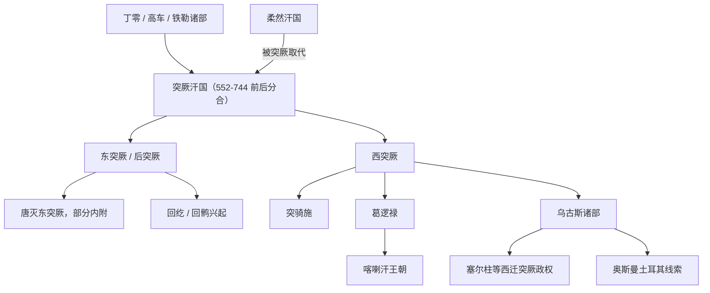

# 突厥

## 校正版演进图

> 原图中“西突厥 → 奥斯曼”过于跳跃。校正版通过乌古斯诸部和塞尔柱等中间线索表达西迁突厥语人群的长期演变。

## 概括

突厥兴起于 6 世纪，阿史那氏建立突厥汗国，击败柔然后控制蒙古高原并向中亚扩展。

## 起源

铁勒诸部、阿史那集团、柔然旧属

### 起源详细补充

- 突厥兴起于阿尔泰山一带，阿史那氏最初受柔然控制。
- “突厥”既是汗国政治名称，也是后来突厥语族扩散的重要标识。
- 突厥汗国形成吸收了铁勒、柔然旧属和中亚草原多种部族。

## 变迁

突厥汗国分裂为东西突厥，唐朝设都护体系后仍有后突厥、突骑施、葛逻禄、乌古斯等分化线索，突厥语族随后广泛扩散于中亚和西亚。

### 变迁详细补充

- 552年前后突厥推翻柔然，建立横跨蒙古高原和中亚的汗国。
- 汗国分裂为东、西突厥，唐朝又通过战争、羁縻和都护府体系重组其旧部。
- 突厥语族后来通过葛逻禄、乌古斯、钦察、回鹘等分支扩散到中亚、西亚和东欧。

## 可汗世系表（节选）

突厥汗国经历第一汗国、东西突厥分裂和后突厥汗国，世系复杂。这里列出主线关键可汗。

| 顺序 | 姓名 / 称号 | 在位时间 | 所属阶段 | 关键事件 / 备注 |
|---|---|---|---|---|
| 1 | **土门 / 伊利可汗** | 552 | 第一突厥汗国 | 灭柔然，建立突厥汗国。 |
| 2 | 乙息记可汗 | 552-553 | 第一突厥汗国 | 土门之子，在位短。 |
| 3 | **木杆可汗** | 553-572 | 第一突厥汗国 | 汗国强盛，控制漠北与西域通道。 |
| 4 | 佗钵可汗 | 572-581 | 第一突厥汗国 | 后期内部继承矛盾加深。 |
| 5 | 沙钵略可汗 | 581-587 | 东突厥 | 东西突厥分裂背景下的东部可汗。 |
| 6 | 达头可汗 | 576-603 | 西突厥 / 突厥大可汗 | 西部强权，曾争夺大可汗地位。 |
| 7 | 始毕可汗 | 609-619 | 东突厥 | 隋末唐初东突厥强盛。 |
| 8 | 处罗可汗 | 619-620 | 东突厥 | 在位短。 |
| 9 | 颉利可汗 | 620-630 | 东突厥 | 630 年被唐击败，东突厥第一阶段结束。 |
| 10 | 乙毗咄陆可汗 | 638-653 | 西突厥 | 西突厥后期可汗。 |
| 11 | 阿史那贺鲁 | 651-657 | 西突厥 | 657 年被唐平定。 |
| 12 | **骨咄禄 / 颉跌利施可汗** | 682-691 | 后突厥汗国 | 复兴突厥汗国。 |
| 13 | 默啜可汗 | 691-716 | 后突厥汗国 | 后突厥强盛期。 |
| 14 | **毗伽可汗** | 716-734 | 后突厥汗国 | 与阙特勤、暾欲谷共同维系统治。 |
| 15 | 伊然可汗 | 734-741 | 后突厥汗国 | 后突厥衰落。 |
| 16 | 白眉可汗 | 741-745 | 后突厥汗国 | 745 年被回纥等击败，后突厥亡。 |

## 所属大类

- [突厥语族与北方草原](/%E4%BA%BA%E6%96%87%E7%A7%91%E5%AD%A6/%E5%8E%86%E5%8F%B2-%E4%B8%AD%E5%9B%BD/%E6%B0%91%E6%97%8F/%E7%AA%81%E5%8E%A5%E8%AF%AD%E6%97%8F%E4%B8%8E%E5%8C%97%E6%96%B9%E8%8D%89%E5%8E%9F/README.md)

## 相关总览

- [华夏周边民族](/%E4%BA%BA%E6%96%87%E7%A7%91%E5%AD%A6/%E5%8E%86%E5%8F%B2-%E4%B8%AD%E5%9B%BD/%E6%B0%91%E6%97%8F/README.md)
- [起源](/%E4%BA%BA%E6%96%87%E7%A7%91%E5%AD%A6/%E5%8E%86%E5%8F%B2-%E4%B8%AD%E5%9B%BD/%E6%B0%91%E6%97%8F/README.md#起源)
- [变迁](/%E4%BA%BA%E6%96%87%E7%A7%91%E5%AD%A6/%E5%8E%86%E5%8F%B2-%E4%B8%AD%E5%9B%BD/%E6%B0%91%E6%97%8F/README.md#变迁)
