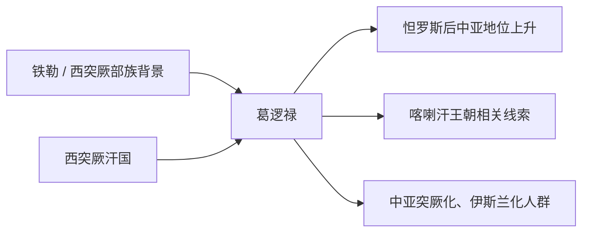

# 葛逻禄

## 概括

葛逻禄是突厥语族部族联盟之一，活跃于阿尔泰、中亚和七河地区。

## 起源

铁勒 / 突厥语族部族

### 起源详细补充

- 葛逻禄是西突厥旧地和阿尔泰、七河地区的重要突厥语部族。
- 它与铁勒、突厥汗国和中亚绿洲之间长期互动。
- 葛逻禄不是一个单一氏族，而是多个部落组成的政治和军事集团。

## 变迁

唐代以后参与西突厥旧地政治，后来与喀喇汗王朝和中亚突厥化关系密切。

### 变迁详细补充

- 唐代以后葛逻禄在西突厥旧地兴起，并参与怛罗斯以后中亚格局变化。
- 葛逻禄、样磨、处月等部族与喀喇汗王朝形成密切相关。
- 在中亚伊斯兰化和突厥化过程中，葛逻禄成为维吾尔、乌兹别克等多种后续线索之一。

## 演进图

## 世系说明

葛逻禄不是一个单一王朝或固定家族名称，而是由多个部落组成的突厥语部族集团，早期没有连续可考的单一王统，因此没有能够连续排列的统一君主世系。可考的政治世系应分别放在喀喇汗王朝等后续具体政权等具体政权或部族笔记中。

## 所属大类

- [突厥语族与北方草原](/%E4%BA%BA%E6%96%87%E7%A7%91%E5%AD%A6/%E5%8E%86%E5%8F%B2-%E4%B8%AD%E5%9B%BD/%E6%B0%91%E6%97%8F/%E7%AA%81%E5%8E%A5%E8%AF%AD%E6%97%8F%E4%B8%8E%E5%8C%97%E6%96%B9%E8%8D%89%E5%8E%9F/README.md)

## 相关总览

- [华夏周边民族](/%E4%BA%BA%E6%96%87%E7%A7%91%E5%AD%A6/%E5%8E%86%E5%8F%B2-%E4%B8%AD%E5%9B%BD/%E6%B0%91%E6%97%8F/README.md)
- [起源](/%E4%BA%BA%E6%96%87%E7%A7%91%E5%AD%A6/%E5%8E%86%E5%8F%B2-%E4%B8%AD%E5%9B%BD/%E6%B0%91%E6%97%8F/README.md#起源)
- [变迁](/%E4%BA%BA%E6%96%87%E7%A7%91%E5%AD%A6/%E5%8E%86%E5%8F%B2-%E4%B8%AD%E5%9B%BD/%E6%B0%91%E6%97%8F/README.md#变迁)
