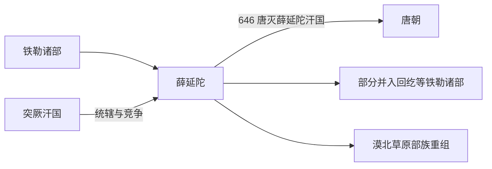

# 薛延陀

## 概括

薛延陀是铁勒诸部中的强大部族，唐初曾在漠北建立汗国。

## 起源

铁勒诸部

### 起源详细补充

- 薛延陀源于铁勒诸部，是漠北草原上的部族联盟。
- 它的名称可能由薛部与延陀部联合而来。
- 薛延陀的兴起依赖东突厥衰落和唐朝北方战略调整。

## 变迁

唐太宗时期薛延陀汗国一度取代东突厥旧势力，后被唐与回纥等击破，部众分散并融入其他草原集团。

### 变迁详细补充

- 唐初薛延陀一度成为漠北强权，接受唐朝册封又保持独立实力。
- 其汗国在唐与回纥等部夹击下瓦解。
- 灭亡后部众分散，部分并入唐朝羁縻体系，部分融入回鹘和其他草原部族。

## 演进图

## 可汗世系表

| 顺序 | 姓名 / 称号 | 在位时间 | 关键事件 / 备注 |
|---|---|---|---|
| 1 | 乙失钵 | 7 世纪初 | 薛延陀早期首领，受西突厥体系影响。 |
| 2 | **夷男 / 真珠毗伽可汗** | 628-645 | 唐太宗册为真珠毗伽可汗，薛延陀强盛。 |
| 3 | 拔灼 | 645-646 | 夷男之子，继位后与唐关系恶化。 |
| 4 | 咄摩支 | 646 | 末期可汗，646 年薛延陀汗国被唐军和回纥等击破。 |

## 所属大类

- [突厥语族与北方草原](/%E4%BA%BA%E6%96%87%E7%A7%91%E5%AD%A6/%E5%8E%86%E5%8F%B2-%E4%B8%AD%E5%9B%BD/%E6%B0%91%E6%97%8F/%E7%AA%81%E5%8E%A5%E8%AF%AD%E6%97%8F%E4%B8%8E%E5%8C%97%E6%96%B9%E8%8D%89%E5%8E%9F/README.md)

## 相关总览

- [华夏周边民族](/%E4%BA%BA%E6%96%87%E7%A7%91%E5%AD%A6/%E5%8E%86%E5%8F%B2-%E4%B8%AD%E5%9B%BD/%E6%B0%91%E6%97%8F/README.md)
- [起源](/%E4%BA%BA%E6%96%87%E7%A7%91%E5%AD%A6/%E5%8E%86%E5%8F%B2-%E4%B8%AD%E5%9B%BD/%E6%B0%91%E6%97%8F/README.md#起源)
- [变迁](/%E4%BA%BA%E6%96%87%E7%A7%91%E5%AD%A6/%E5%8E%86%E5%8F%B2-%E4%B8%AD%E5%9B%BD/%E6%B0%91%E6%97%8F/README.md#变迁)
