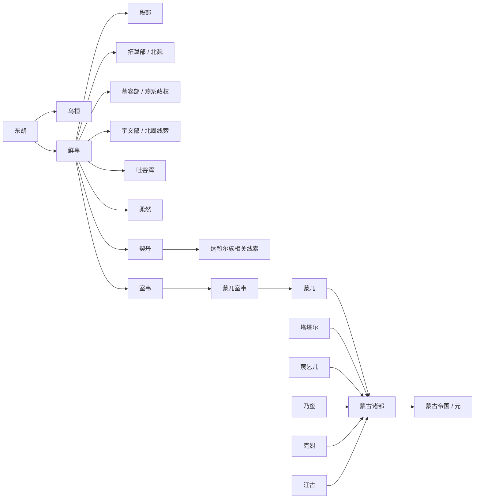

# 蒙古语族与东胡

## 概括

以东胡、乌桓、鲜卑、柔然、契丹、室韦、蒙古等为主线，主要活动于辽西、东北西部、大兴安岭、蒙古高原和漠北。这里采用“蒙古语族 / 旁蒙古语相关线索”的谨慎表述。

## 起源

东胡是战国秦汉文献中的东北草原族群称谓，乌桓、鲜卑常被视为其后续分支。契丹、室韦、蒙古等与蒙古语族或旁蒙古语关系密切，但具体族群形成包含多部族整合。

## 变迁

这一大类的演进通常不是单线血缘继承，而是多部族联盟、迁徙、征服、内附、语言转用和文化融合的结果。

## 演进图

## 包含民族

### [东胡鲜卑诸部](/%E4%BA%BA%E6%96%87%E7%A7%91%E5%AD%A6/%E5%8E%86%E5%8F%B2-%E4%B8%AD%E5%9B%BD/%E6%B0%91%E6%97%8F/%E8%92%99%E5%8F%A4%E8%AF%AD%E6%97%8F%E4%B8%8E%E4%B8%9C%E8%83%A1/%E4%B8%9C%E8%83%A1%E9%B2%9C%E5%8D%91%E8%AF%B8%E9%83%A8/README.md)

- [东胡](/%E4%BA%BA%E6%96%87%E7%A7%91%E5%AD%A6/%E5%8E%86%E5%8F%B2-%E4%B8%AD%E5%9B%BD/%E6%B0%91%E6%97%8F/%E8%92%99%E5%8F%A4%E8%AF%AD%E6%97%8F%E4%B8%8E%E4%B8%9C%E8%83%A1/%E4%B8%9C%E8%83%A1%E9%B2%9C%E5%8D%91%E8%AF%B8%E9%83%A8/%E4%B8%9C%E8%83%A1.md)
- [乌桓](/%E4%BA%BA%E6%96%87%E7%A7%91%E5%AD%A6/%E5%8E%86%E5%8F%B2-%E4%B8%AD%E5%9B%BD/%E6%B0%91%E6%97%8F/%E8%92%99%E5%8F%A4%E8%AF%AD%E6%97%8F%E4%B8%8E%E4%B8%9C%E8%83%A1/%E4%B8%9C%E8%83%A1%E9%B2%9C%E5%8D%91%E8%AF%B8%E9%83%A8/%E4%B9%8C%E6%A1%93.md)
- [鲜卑](/%E4%BA%BA%E6%96%87%E7%A7%91%E5%AD%A6/%E5%8E%86%E5%8F%B2-%E4%B8%AD%E5%9B%BD/%E6%B0%91%E6%97%8F/%E8%92%99%E5%8F%A4%E8%AF%AD%E6%97%8F%E4%B8%8E%E4%B8%9C%E8%83%A1/%E4%B8%9C%E8%83%A1%E9%B2%9C%E5%8D%91%E8%AF%B8%E9%83%A8/%E9%B2%9C%E5%8D%91.md)
- [段部](/%E4%BA%BA%E6%96%87%E7%A7%91%E5%AD%A6/%E5%8E%86%E5%8F%B2-%E4%B8%AD%E5%9B%BD/%E6%B0%91%E6%97%8F/%E8%92%99%E5%8F%A4%E8%AF%AD%E6%97%8F%E4%B8%8E%E4%B8%9C%E8%83%A1/%E4%B8%9C%E8%83%A1%E9%B2%9C%E5%8D%91%E8%AF%B8%E9%83%A8/%E6%AE%B5%E9%83%A8.md)
- [拓跋部](/%E4%BA%BA%E6%96%87%E7%A7%91%E5%AD%A6/%E5%8E%86%E5%8F%B2-%E4%B8%AD%E5%9B%BD/%E6%B0%91%E6%97%8F/%E8%92%99%E5%8F%A4%E8%AF%AD%E6%97%8F%E4%B8%8E%E4%B8%9C%E8%83%A1/%E4%B8%9C%E8%83%A1%E9%B2%9C%E5%8D%91%E8%AF%B8%E9%83%A8/%E6%8B%93%E8%B7%8B%E9%83%A8.md)
- [慕容部](/%E4%BA%BA%E6%96%87%E7%A7%91%E5%AD%A6/%E5%8E%86%E5%8F%B2-%E4%B8%AD%E5%9B%BD/%E6%B0%91%E6%97%8F/%E8%92%99%E5%8F%A4%E8%AF%AD%E6%97%8F%E4%B8%8E%E4%B8%9C%E8%83%A1/%E4%B8%9C%E8%83%A1%E9%B2%9C%E5%8D%91%E8%AF%B8%E9%83%A8/%E6%85%95%E5%AE%B9%E9%83%A8.md)
- [宇文部](/%E4%BA%BA%E6%96%87%E7%A7%91%E5%AD%A6/%E5%8E%86%E5%8F%B2-%E4%B8%AD%E5%9B%BD/%E6%B0%91%E6%97%8F/%E8%92%99%E5%8F%A4%E8%AF%AD%E6%97%8F%E4%B8%8E%E4%B8%9C%E8%83%A1/%E4%B8%9C%E8%83%A1%E9%B2%9C%E5%8D%91%E8%AF%B8%E9%83%A8/%E5%AE%87%E6%96%87%E9%83%A8.md)
- [柔然](/%E4%BA%BA%E6%96%87%E7%A7%91%E5%AD%A6/%E5%8E%86%E5%8F%B2-%E4%B8%AD%E5%9B%BD/%E6%B0%91%E6%97%8F/%E8%92%99%E5%8F%A4%E8%AF%AD%E6%97%8F%E4%B8%8E%E4%B8%9C%E8%83%A1/%E4%B8%9C%E8%83%A1%E9%B2%9C%E5%8D%91%E8%AF%B8%E9%83%A8/%E6%9F%94%E7%84%B6.md)
- [吐谷浑](/%E4%BA%BA%E6%96%87%E7%A7%91%E5%AD%A6/%E5%8E%86%E5%8F%B2-%E4%B8%AD%E5%9B%BD/%E6%B0%91%E6%97%8F/%E8%92%99%E5%8F%A4%E8%AF%AD%E6%97%8F%E4%B8%8E%E4%B8%9C%E8%83%A1/%E4%B8%9C%E8%83%A1%E9%B2%9C%E5%8D%91%E8%AF%B8%E9%83%A8/%E5%90%90%E8%B0%B7%E6%B5%91.md)

### [契丹与东北旁蒙古](/%E4%BA%BA%E6%96%87%E7%A7%91%E5%AD%A6/%E5%8E%86%E5%8F%B2-%E4%B8%AD%E5%9B%BD/%E6%B0%91%E6%97%8F/%E8%92%99%E5%8F%A4%E8%AF%AD%E6%97%8F%E4%B8%8E%E4%B8%9C%E8%83%A1/%E5%A5%91%E4%B8%B9%E4%B8%8E%E4%B8%9C%E5%8C%97%E6%97%81%E8%92%99%E5%8F%A4/README.md)

- [契丹](/%E4%BA%BA%E6%96%87%E7%A7%91%E5%AD%A6/%E5%8E%86%E5%8F%B2-%E4%B8%AD%E5%9B%BD/%E6%B0%91%E6%97%8F/%E8%92%99%E5%8F%A4%E8%AF%AD%E6%97%8F%E4%B8%8E%E4%B8%9C%E8%83%A1/%E5%A5%91%E4%B8%B9%E4%B8%8E%E4%B8%9C%E5%8C%97%E6%97%81%E8%92%99%E5%8F%A4/%E5%A5%91%E4%B8%B9.md)
- [达斡尔族](/%E4%BA%BA%E6%96%87%E7%A7%91%E5%AD%A6/%E5%8E%86%E5%8F%B2-%E4%B8%AD%E5%9B%BD/%E6%B0%91%E6%97%8F/%E8%92%99%E5%8F%A4%E8%AF%AD%E6%97%8F%E4%B8%8E%E4%B8%9C%E8%83%A1/%E5%A5%91%E4%B8%B9%E4%B8%8E%E4%B8%9C%E5%8C%97%E6%97%81%E8%92%99%E5%8F%A4/%E8%BE%BE%E6%96%A1%E5%B0%94%E6%97%8F.md)

### [室韦蒙古源流](/%E4%BA%BA%E6%96%87%E7%A7%91%E5%AD%A6/%E5%8E%86%E5%8F%B2-%E4%B8%AD%E5%9B%BD/%E6%B0%91%E6%97%8F/%E8%92%99%E5%8F%A4%E8%AF%AD%E6%97%8F%E4%B8%8E%E4%B8%9C%E8%83%A1/%E5%AE%A4%E9%9F%A6%E8%92%99%E5%8F%A4%E6%BA%90%E6%B5%81/README.md)

- [室韦](/%E4%BA%BA%E6%96%87%E7%A7%91%E5%AD%A6/%E5%8E%86%E5%8F%B2-%E4%B8%AD%E5%9B%BD/%E6%B0%91%E6%97%8F/%E8%92%99%E5%8F%A4%E8%AF%AD%E6%97%8F%E4%B8%8E%E4%B8%9C%E8%83%A1/%E5%AE%A4%E9%9F%A6%E8%92%99%E5%8F%A4%E6%BA%90%E6%B5%81/%E5%AE%A4%E9%9F%A6.md)
- [蒙兀室韦](/%E4%BA%BA%E6%96%87%E7%A7%91%E5%AD%A6/%E5%8E%86%E5%8F%B2-%E4%B8%AD%E5%9B%BD/%E6%B0%91%E6%97%8F/%E8%92%99%E5%8F%A4%E8%AF%AD%E6%97%8F%E4%B8%8E%E4%B8%9C%E8%83%A1/%E5%AE%A4%E9%9F%A6%E8%92%99%E5%8F%A4%E6%BA%90%E6%B5%81/%E8%92%99%E5%85%80%E5%AE%A4%E9%9F%A6.md)
- [蒙兀](/%E4%BA%BA%E6%96%87%E7%A7%91%E5%AD%A6/%E5%8E%86%E5%8F%B2-%E4%B8%AD%E5%9B%BD/%E6%B0%91%E6%97%8F/%E8%92%99%E5%8F%A4%E8%AF%AD%E6%97%8F%E4%B8%8E%E4%B8%9C%E8%83%A1/%E5%AE%A4%E9%9F%A6%E8%92%99%E5%8F%A4%E6%BA%90%E6%B5%81/%E8%92%99%E5%85%80.md)
- [蒙古](/%E4%BA%BA%E6%96%87%E7%A7%91%E5%AD%A6/%E5%8E%86%E5%8F%B2-%E4%B8%AD%E5%9B%BD/%E6%B0%91%E6%97%8F/%E8%92%99%E5%8F%A4%E8%AF%AD%E6%97%8F%E4%B8%8E%E4%B8%9C%E8%83%A1/%E5%AE%A4%E9%9F%A6%E8%92%99%E5%8F%A4%E6%BA%90%E6%B5%81/%E8%92%99%E5%8F%A4.md)

### [蒙古帝国前诸部](/%E4%BA%BA%E6%96%87%E7%A7%91%E5%AD%A6/%E5%8E%86%E5%8F%B2-%E4%B8%AD%E5%9B%BD/%E6%B0%91%E6%97%8F/%E8%92%99%E5%8F%A4%E8%AF%AD%E6%97%8F%E4%B8%8E%E4%B8%9C%E8%83%A1/%E8%92%99%E5%8F%A4%E5%B8%9D%E5%9B%BD%E5%89%8D%E8%AF%B8%E9%83%A8/README.md)

- [塔塔尔](/%E4%BA%BA%E6%96%87%E7%A7%91%E5%AD%A6/%E5%8E%86%E5%8F%B2-%E4%B8%AD%E5%9B%BD/%E6%B0%91%E6%97%8F/%E8%92%99%E5%8F%A4%E8%AF%AD%E6%97%8F%E4%B8%8E%E4%B8%9C%E8%83%A1/%E8%92%99%E5%8F%A4%E5%B8%9D%E5%9B%BD%E5%89%8D%E8%AF%B8%E9%83%A8/%E5%A1%94%E5%A1%94%E5%B0%94.md)
- [蔑乞儿](/%E4%BA%BA%E6%96%87%E7%A7%91%E5%AD%A6/%E5%8E%86%E5%8F%B2-%E4%B8%AD%E5%9B%BD/%E6%B0%91%E6%97%8F/%E8%92%99%E5%8F%A4%E8%AF%AD%E6%97%8F%E4%B8%8E%E4%B8%9C%E8%83%A1/%E8%92%99%E5%8F%A4%E5%B8%9D%E5%9B%BD%E5%89%8D%E8%AF%B8%E9%83%A8/%E8%94%91%E4%B9%9E%E5%84%BF.md)
- [乃蛮](/%E4%BA%BA%E6%96%87%E7%A7%91%E5%AD%A6/%E5%8E%86%E5%8F%B2-%E4%B8%AD%E5%9B%BD/%E6%B0%91%E6%97%8F/%E8%92%99%E5%8F%A4%E8%AF%AD%E6%97%8F%E4%B8%8E%E4%B8%9C%E8%83%A1/%E8%92%99%E5%8F%A4%E5%B8%9D%E5%9B%BD%E5%89%8D%E8%AF%B8%E9%83%A8/%E4%B9%83%E8%9B%AE.md)
- [克烈](/%E4%BA%BA%E6%96%87%E7%A7%91%E5%AD%A6/%E5%8E%86%E5%8F%B2-%E4%B8%AD%E5%9B%BD/%E6%B0%91%E6%97%8F/%E8%92%99%E5%8F%A4%E8%AF%AD%E6%97%8F%E4%B8%8E%E4%B8%9C%E8%83%A1/%E8%92%99%E5%8F%A4%E5%B8%9D%E5%9B%BD%E5%89%8D%E8%AF%B8%E9%83%A8/%E5%85%8B%E7%83%88.md)
- [汪古](/%E4%BA%BA%E6%96%87%E7%A7%91%E5%AD%A6/%E5%8E%86%E5%8F%B2-%E4%B8%AD%E5%9B%BD/%E6%B0%91%E6%97%8F/%E8%92%99%E5%8F%A4%E8%AF%AD%E6%97%8F%E4%B8%8E%E4%B8%9C%E8%83%A1/%E8%92%99%E5%8F%A4%E5%B8%9D%E5%9B%BD%E5%89%8D%E8%AF%B8%E9%83%A8/%E6%B1%AA%E5%8F%A4.md)

## 相关总览

- [起源](/%E4%BA%BA%E6%96%87%E7%A7%91%E5%AD%A6/%E5%8E%86%E5%8F%B2-%E4%B8%AD%E5%9B%BD/%E6%B0%91%E6%97%8F/README.md#起源)
- [变迁](/%E4%BA%BA%E6%96%87%E7%A7%91%E5%AD%A6/%E5%8E%86%E5%8F%B2-%E4%B8%AD%E5%9B%BD/%E6%B0%91%E6%97%8F/README.md#变迁)
