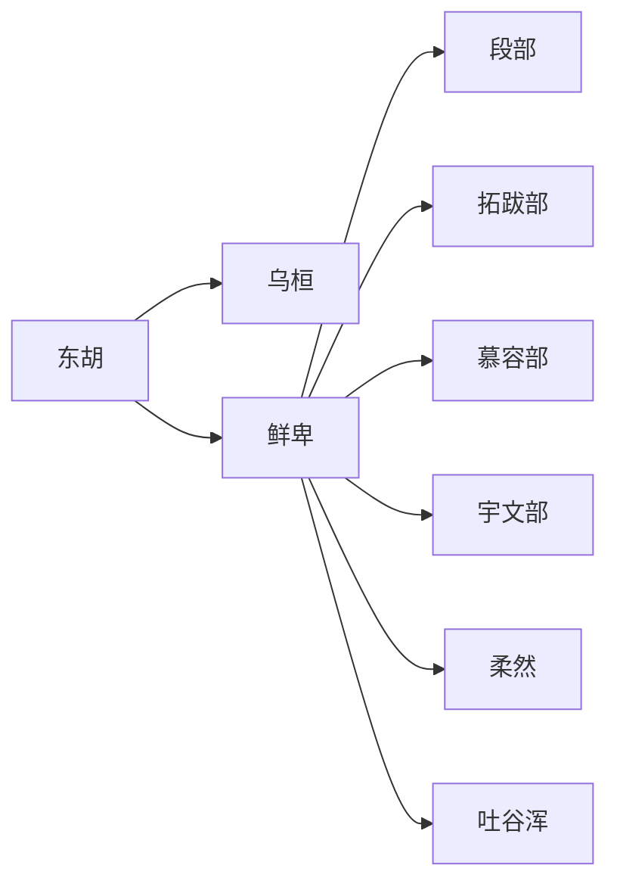

# 东胡鲜卑诸部

本目录是“蒙古语族与东胡”下的二级线索，用于收纳东胡鲜卑诸部相关民族、部族或政权笔记。

## 演进图

## 包含笔记

- [东胡](/%E4%BA%BA%E6%96%87%E7%A7%91%E5%AD%A6/%E5%8E%86%E5%8F%B2-%E4%B8%AD%E5%9B%BD/%E6%B0%91%E6%97%8F/%E8%92%99%E5%8F%A4%E8%AF%AD%E6%97%8F%E4%B8%8E%E4%B8%9C%E8%83%A1/%E4%B8%9C%E8%83%A1%E9%B2%9C%E5%8D%91%E8%AF%B8%E9%83%A8/%E4%B8%9C%E8%83%A1.md)
- [乌桓](/%E4%BA%BA%E6%96%87%E7%A7%91%E5%AD%A6/%E5%8E%86%E5%8F%B2-%E4%B8%AD%E5%9B%BD/%E6%B0%91%E6%97%8F/%E8%92%99%E5%8F%A4%E8%AF%AD%E6%97%8F%E4%B8%8E%E4%B8%9C%E8%83%A1/%E4%B8%9C%E8%83%A1%E9%B2%9C%E5%8D%91%E8%AF%B8%E9%83%A8/%E4%B9%8C%E6%A1%93.md)
- [鲜卑](/%E4%BA%BA%E6%96%87%E7%A7%91%E5%AD%A6/%E5%8E%86%E5%8F%B2-%E4%B8%AD%E5%9B%BD/%E6%B0%91%E6%97%8F/%E8%92%99%E5%8F%A4%E8%AF%AD%E6%97%8F%E4%B8%8E%E4%B8%9C%E8%83%A1/%E4%B8%9C%E8%83%A1%E9%B2%9C%E5%8D%91%E8%AF%B8%E9%83%A8/%E9%B2%9C%E5%8D%91.md)
- [段部](/%E4%BA%BA%E6%96%87%E7%A7%91%E5%AD%A6/%E5%8E%86%E5%8F%B2-%E4%B8%AD%E5%9B%BD/%E6%B0%91%E6%97%8F/%E8%92%99%E5%8F%A4%E8%AF%AD%E6%97%8F%E4%B8%8E%E4%B8%9C%E8%83%A1/%E4%B8%9C%E8%83%A1%E9%B2%9C%E5%8D%91%E8%AF%B8%E9%83%A8/%E6%AE%B5%E9%83%A8.md)
- [拓跋部](/%E4%BA%BA%E6%96%87%E7%A7%91%E5%AD%A6/%E5%8E%86%E5%8F%B2-%E4%B8%AD%E5%9B%BD/%E6%B0%91%E6%97%8F/%E8%92%99%E5%8F%A4%E8%AF%AD%E6%97%8F%E4%B8%8E%E4%B8%9C%E8%83%A1/%E4%B8%9C%E8%83%A1%E9%B2%9C%E5%8D%91%E8%AF%B8%E9%83%A8/%E6%8B%93%E8%B7%8B%E9%83%A8.md)
- [慕容部](/%E4%BA%BA%E6%96%87%E7%A7%91%E5%AD%A6/%E5%8E%86%E5%8F%B2-%E4%B8%AD%E5%9B%BD/%E6%B0%91%E6%97%8F/%E8%92%99%E5%8F%A4%E8%AF%AD%E6%97%8F%E4%B8%8E%E4%B8%9C%E8%83%A1/%E4%B8%9C%E8%83%A1%E9%B2%9C%E5%8D%91%E8%AF%B8%E9%83%A8/%E6%85%95%E5%AE%B9%E9%83%A8.md)
- [宇文部](/%E4%BA%BA%E6%96%87%E7%A7%91%E5%AD%A6/%E5%8E%86%E5%8F%B2-%E4%B8%AD%E5%9B%BD/%E6%B0%91%E6%97%8F/%E8%92%99%E5%8F%A4%E8%AF%AD%E6%97%8F%E4%B8%8E%E4%B8%9C%E8%83%A1/%E4%B8%9C%E8%83%A1%E9%B2%9C%E5%8D%91%E8%AF%B8%E9%83%A8/%E5%AE%87%E6%96%87%E9%83%A8.md)
- [柔然](/%E4%BA%BA%E6%96%87%E7%A7%91%E5%AD%A6/%E5%8E%86%E5%8F%B2-%E4%B8%AD%E5%9B%BD/%E6%B0%91%E6%97%8F/%E8%92%99%E5%8F%A4%E8%AF%AD%E6%97%8F%E4%B8%8E%E4%B8%9C%E8%83%A1/%E4%B8%9C%E8%83%A1%E9%B2%9C%E5%8D%91%E8%AF%B8%E9%83%A8/%E6%9F%94%E7%84%B6.md)
- [吐谷浑](/%E4%BA%BA%E6%96%87%E7%A7%91%E5%AD%A6/%E5%8E%86%E5%8F%B2-%E4%B8%AD%E5%9B%BD/%E6%B0%91%E6%97%8F/%E8%92%99%E5%8F%A4%E8%AF%AD%E6%97%8F%E4%B8%8E%E4%B8%9C%E8%83%A1/%E4%B8%9C%E8%83%A1%E9%B2%9C%E5%8D%91%E8%AF%B8%E9%83%A8/%E5%90%90%E8%B0%B7%E6%B5%91.md)

## 上级目录

- [蒙古语族与东胡](/%E4%BA%BA%E6%96%87%E7%A7%91%E5%AD%A6/%E5%8E%86%E5%8F%B2-%E4%B8%AD%E5%9B%BD/%E6%B0%91%E6%97%8F/%E8%92%99%E5%8F%A4%E8%AF%AD%E6%97%8F%E4%B8%8E%E4%B8%9C%E8%83%A1/README.md)
- [华夏周边民族](/%E4%BA%BA%E6%96%87%E7%A7%91%E5%AD%A6/%E5%8E%86%E5%8F%B2-%E4%B8%AD%E5%9B%BD/%E6%B0%91%E6%97%8F/README.md)
