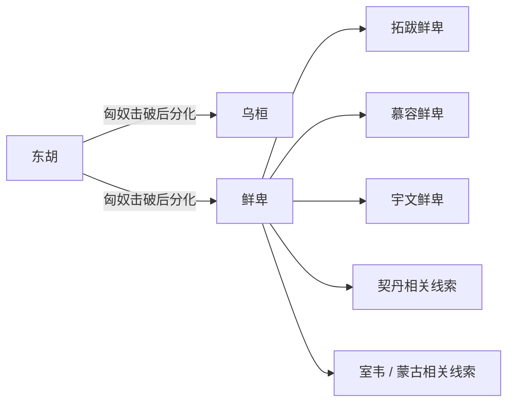

# 东胡

## 概括

东胡是战国至秦汉之际活动于燕赵以北、辽西和内蒙古东部的草原族群称谓。

## 起源

东北草原和辽西一带古代游牧群体

### 起源详细补充

- 东胡是战国秦汉文献中对燕赵以北、辽西和内蒙古东部草原人群的称谓。
- 它不是现代民族名，也不能直接等同蒙古族祖先。
- 东胡系统可能包含多种东北草原和森林草原人群。

## 变迁

被匈奴冒顿击败后，余部分化为乌桓、鲜卑等线索；东胡本身不是现代民族。

### 变迁详细补充

- 秦汉之际被匈奴冒顿单于击败后，东胡作为政治整体瓦解。
- 余部据乌桓山、鲜卑山发展为乌桓和鲜卑等线索。
- 东胡名称消失后，其后续影响通过鲜卑、契丹、室韦、蒙古等传统叙述延续。

## 演进图

## 世系说明

东胡不是一个单一王朝或固定家族名称，而是战国秦汉文献中的东北草原族群泛称，不是单一王朝，因此没有能够连续排列的统一君主世系。可考的政治世系应分别放在乌桓、鲜卑、契丹、蒙古等具体政权或部族笔记中。

## 所属大类

- [蒙古语族与东胡](/%E4%BA%BA%E6%96%87%E7%A7%91%E5%AD%A6/%E5%8E%86%E5%8F%B2-%E4%B8%AD%E5%9B%BD/%E6%B0%91%E6%97%8F/%E8%92%99%E5%8F%A4%E8%AF%AD%E6%97%8F%E4%B8%8E%E4%B8%9C%E8%83%A1/README.md)

## 相关总览

- [华夏周边民族](/%E4%BA%BA%E6%96%87%E7%A7%91%E5%AD%A6/%E5%8E%86%E5%8F%B2-%E4%B8%AD%E5%9B%BD/%E6%B0%91%E6%97%8F/README.md)
- [起源](/%E4%BA%BA%E6%96%87%E7%A7%91%E5%AD%A6/%E5%8E%86%E5%8F%B2-%E4%B8%AD%E5%9B%BD/%E6%B0%91%E6%97%8F/README.md#起源)
- [变迁](/%E4%BA%BA%E6%96%87%E7%A7%91%E5%AD%A6/%E5%8E%86%E5%8F%B2-%E4%B8%AD%E5%9B%BD/%E6%B0%91%E6%97%8F/README.md#变迁)
