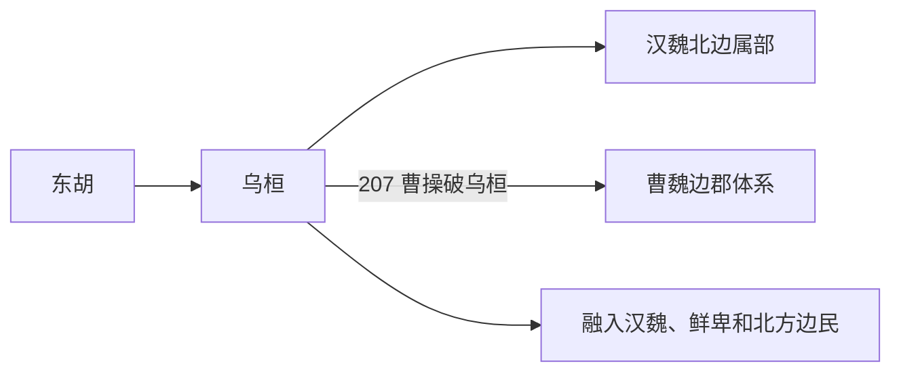

# 乌桓

## 概括

乌桓又作乌丸，传统上视为东胡余部之一，活动于辽西、上谷、渔阳等北边郡附近。

## 起源

东胡余部

### 起源详细补充

- 乌桓传统上视为东胡余部之一，因居乌桓山得名。
- 其活动区在辽西、上谷、渔阳、右北平等汉代北边郡外。
- 乌桓与匈奴、汉朝、鲜卑长期互动，族属上应放入东胡系统讨论。

## 变迁

东汉末年被曹操击破后衰落，部分内迁融入汉地和其他胡族，部分附属于鲜卑。

### 变迁详细补充

- 西汉后期被迁置于边郡附近，承担侦察匈奴和边防功能。
- 东汉末辽西乌桓一度强盛，后被曹操北征击破。
- 此后乌桓大多内迁、附鲜卑或融入汉地和北方杂胡。

## 演进图

## 世系说明

乌桓不是一个单一王朝或固定家族名称，而是东胡之后的部族集团，汉魏时期多以大人、单于、部帅见于史籍，没有连续统一王统，因此没有能够连续排列的统一君主世系。可考的政治世系应分别放在鲜卑、契丹、蒙古等具体政权或部族笔记中。

## 所属大类

- [蒙古语族与东胡](/%E4%BA%BA%E6%96%87%E7%A7%91%E5%AD%A6/%E5%8E%86%E5%8F%B2-%E4%B8%AD%E5%9B%BD/%E6%B0%91%E6%97%8F/%E8%92%99%E5%8F%A4%E8%AF%AD%E6%97%8F%E4%B8%8E%E4%B8%9C%E8%83%A1/README.md)

## 相关总览

- [华夏周边民族](/%E4%BA%BA%E6%96%87%E7%A7%91%E5%AD%A6/%E5%8E%86%E5%8F%B2-%E4%B8%AD%E5%9B%BD/%E6%B0%91%E6%97%8F/README.md)
- [起源](/%E4%BA%BA%E6%96%87%E7%A7%91%E5%AD%A6/%E5%8E%86%E5%8F%B2-%E4%B8%AD%E5%9B%BD/%E6%B0%91%E6%97%8F/README.md#起源)
- [变迁](/%E4%BA%BA%E6%96%87%E7%A7%91%E5%AD%A6/%E5%8E%86%E5%8F%B2-%E4%B8%AD%E5%9B%BD/%E6%B0%91%E6%97%8F/README.md#变迁)
