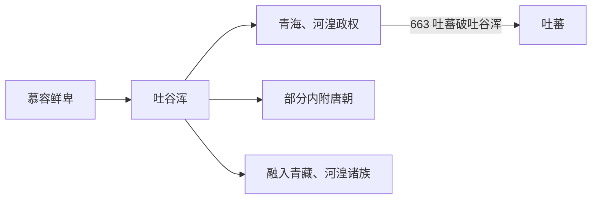

# 吐谷浑

## 概括

吐谷浑由慕容鲜卑西迁青海、河湟后形成，长期处于中原、吐蕃和西域之间。

## 起源

慕容鲜卑西迁集团与河湟本地人群

### 起源详细补充

- 吐谷浑由慕容鲜卑一支西迁青海、河湟而形成。
- 其统治区处于中原、吐蕃、西域和羌氐诸部之间。
- 吐谷浑内部长期吸收羌、藏、汉和西域成分。

## 变迁

663 年被吐蕃击败，部分融入吐蕃，部分内迁唐境或融入当地族群。

### 变迁详细补充

- 西晋末至唐初，吐谷浑控制青海湖周边和丝路南道部分交通。
- 663年被吐蕃击败后失去主体政权。
- 一部分贵族和部众内迁唐朝，一部分融入吐蕃、河湟和青海地方族群。

## 演进图

## 君主世系表（节选）

| 顺序 | 姓名 | 称号 / 身份 | 在位时间 | 关键事件 / 备注 |
|---|---|---|---|---|
| 1 | **吐谷浑** | 始祖 | 约 4 世纪初 | 慕容鲜卑分支西迁，成为国名来源。 |
| 2 | 吐延 | 首领 | 约 329-351 | 吐谷浑之子。 |
| 3 | 叶延 | 首领 | 约 351-376 | 据说始用吐谷浑为姓氏 / 国号。 |
| 4 | 视连 | 首领 | 约 376-390 | 早期扩张。 |
| 5 | 视罴 | 首领 | 约 390-400 | 承继政权。 |
| 6 | 乌纥提 | 首领 | 约 400-405 | 早期君主。 |
| 7 | 树洛干 | 首领 | 约 405-417 | 与西秦等互动。 |
| 8 | 阿豺 | 首领 | 约 417-424 | 吐谷浑重要君主。 |
| 9 | 慕璝 | 首领 | 约 424-436 | 继续经营青海。 |
| 10 | 伏连筹 | 可汗 / 王 | 490-529 | 吐谷浑中期强盛。 |
| 11 | 夸吕 | 可汗 | 540-591 | 长期在位。 |
| 12 | 伏允 | 可汗 | 597-635 | 被唐击败。 |
| 13 | 慕容顺 | 西平郡王 | 635 | 唐扶立，在位短。 |
| 14 | 诺曷钵 | 河源郡王 / 可汗 | 635-688 | 吐谷浑后期，受唐与吐蕃压力。 |

## 所属大类

- [蒙古语族与东胡](/%E4%BA%BA%E6%96%87%E7%A7%91%E5%AD%A6/%E5%8E%86%E5%8F%B2-%E4%B8%AD%E5%9B%BD/%E6%B0%91%E6%97%8F/%E8%92%99%E5%8F%A4%E8%AF%AD%E6%97%8F%E4%B8%8E%E4%B8%9C%E8%83%A1/README.md)

## 相关总览

- [华夏周边民族](/%E4%BA%BA%E6%96%87%E7%A7%91%E5%AD%A6/%E5%8E%86%E5%8F%B2-%E4%B8%AD%E5%9B%BD/%E6%B0%91%E6%97%8F/README.md)
- [起源](/%E4%BA%BA%E6%96%87%E7%A7%91%E5%AD%A6/%E5%8E%86%E5%8F%B2-%E4%B8%AD%E5%9B%BD/%E6%B0%91%E6%97%8F/README.md#起源)
- [变迁](/%E4%BA%BA%E6%96%87%E7%A7%91%E5%AD%A6/%E5%8E%86%E5%8F%B2-%E4%B8%AD%E5%9B%BD/%E6%B0%91%E6%97%8F/README.md#变迁)
