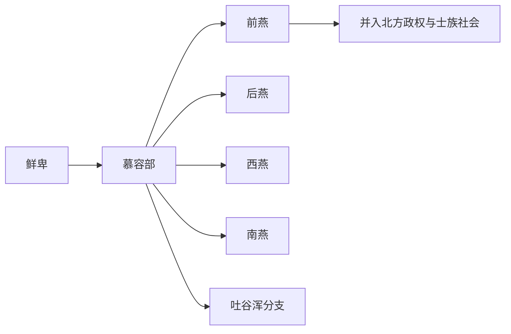

# 慕容部

## 概括

慕容部为鲜卑东部重要部族，活跃于辽西、辽东一带。

## 起源

鲜卑慕容氏

### 起源详细补充

- 慕容部是东部鲜卑代表，核心在辽西、辽东一带。
- 其中心氏族为慕容氏，与段部、宇文部相互竞争。
- 慕容部与中原制度接触较早，建立政权后汉化程度较高。

## 变迁

建立前燕、后燕、西燕、南燕等政权；一支西迁青海形成吐谷浑。

### 变迁详细补充

- 十六国时期建立前燕、后燕、西燕、南燕等政权。
- 一支西迁河湟和青海，形成吐谷浑政权。
- 慕容诸燕灭亡后，贵族和部众多融入北魏、北朝汉族和西北族群。

## 演进图

## 主要世系表（慕容燕政权）

| 顺序 | 姓名 | 政权 / 称号 | 在位时间 | 关键事件 / 备注 |
|---|---|---|---|---|
| 1 | 慕容廆 | 慕容部首领 | 285-333 | 奠定辽西慕容部基础。 |
| 2 | **慕容皝** | 前燕文明帝 | 333-348 | 建立前燕国家形态。 |
| 3 | 慕容儁 | 前燕景昭帝 | 348-360 | 称帝，前燕进入中原。 |
| 4 | 慕容暐 | 前燕幽帝 | 360-370 | 前秦灭前燕。 |
| 5 | **慕容垂** | 后燕成武帝 | 384-396 | 淝水后复兴燕政权。 |
| 6 | 慕容宝 | 后燕惠愍帝 | 396-398 | 后燕衰落。 |
| 7 | 慕容盛 | 后燕昭武帝 | 398-401 | 后燕内乱。 |
| 8 | 慕容熙 | 后燕昭文帝 | 401-407 | 后燕亡。 |
| 9 | 慕容德 | 南燕献武帝 | 398-405 | 建南燕。 |
| 10 | 慕容超 | 南燕末帝 | 405-410 | 410 年东晋刘裕灭南燕。 |

## 所属大类

- [蒙古语族与东胡](/%E4%BA%BA%E6%96%87%E7%A7%91%E5%AD%A6/%E5%8E%86%E5%8F%B2-%E4%B8%AD%E5%9B%BD/%E6%B0%91%E6%97%8F/%E8%92%99%E5%8F%A4%E8%AF%AD%E6%97%8F%E4%B8%8E%E4%B8%9C%E8%83%A1/README.md)

## 相关总览

- [华夏周边民族](/%E4%BA%BA%E6%96%87%E7%A7%91%E5%AD%A6/%E5%8E%86%E5%8F%B2-%E4%B8%AD%E5%9B%BD/%E6%B0%91%E6%97%8F/README.md)
- [起源](/%E4%BA%BA%E6%96%87%E7%A7%91%E5%AD%A6/%E5%8E%86%E5%8F%B2-%E4%B8%AD%E5%9B%BD/%E6%B0%91%E6%97%8F/README.md#起源)
- [变迁](/%E4%BA%BA%E6%96%87%E7%A7%91%E5%AD%A6/%E5%8E%86%E5%8F%B2-%E4%B8%AD%E5%9B%BD/%E6%B0%91%E6%97%8F/README.md#变迁)
