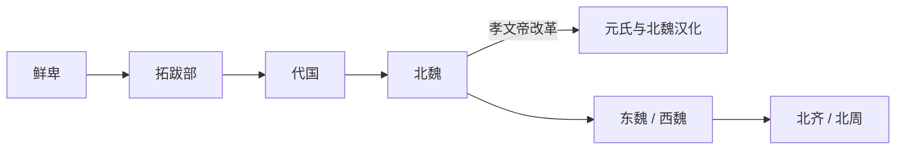

# 拓跋部

## 概括

拓跋部是鲜卑重要部族，祖庭常与大兴安岭嘎仙洞等地联系，后在华北建立代国、北魏。

## 起源

鲜卑拓跋氏

### 起源详细补充

- 拓跋部是鲜卑重要部族，早期活动于大兴安岭、额尔古纳河和漠南地区。
- 拓跋氏以部族联盟首领身份整合周边诸姓。
- 拓跋鲜卑语言可能属于蒙古语族相关范围，但史料有限。

## 变迁

北魏统一北方并推行汉化改革，拓跋氏改姓元，部众广泛融入北朝汉族和其他北方人群。

### 变迁详细补充

- 西晋末拓跋猗卢建立代国，后被前秦灭。
- 386年拓跋珪重建代国并发展为北魏，439年统一北方。
- 孝文帝改革后拓跋氏改姓元，部众深度融入北朝汉化体系。

## 演进图

## 君主世系表（代国至北魏主线）

| 顺序 | 姓名 | 称号 | 在位时间 | 关键事件 / 备注 |
|---|---|---|---|---|
| 1 | 拓跋力微 | 拓跋部首领 | 约 220-277 | 拓跋早期首领，北魏追尊为始祖。 |
| 2 | 拓跋沙漠汗 | 世子 | 未正式在位 | 力微之子，后世追尊。 |
| 3 | 拓跋猗卢 | 代王 | 315-316 | 西晋封代王。 |
| 4 | 拓跋普根 | 代王 | 316 | 在位短。 |
| 5 | 拓跋贺傉 | 代王 | 316-325 | 代国早期君主。 |
| 6 | 拓跋纥那 | 代王 | 325-329、337-338 | 曾两次在位。 |
| 7 | 拓跋翳槐 | 代王 | 329-335、337 | 与纥那争位。 |
| 8 | 拓跋什翼犍 | 代王 | 338-376 | 前秦灭代前最后重要君主。 |
| 9 | **拓跋珪** | 北魏道武帝 | 386-409 | 建立北魏。 |
| 10 | 拓跋嗣 | 北魏明元帝 | 409-423 | 承继北魏。 |
| 11 | **拓跋焘** | 北魏太武帝 | 423-452 | 统一北方。 |
| 12 | 拓跋濬 | 北魏文成帝 | 452-465 | 北魏稳定。 |
| 13 | 拓跋弘 | 北魏献文帝 | 465-471 | 让位孝文帝。 |
| 14 | **元宏 / 拓跋宏** | 北魏孝文帝 | 471-499 | 迁都洛阳，改姓元。 |

## 所属大类

- [蒙古语族与东胡](/%E4%BA%BA%E6%96%87%E7%A7%91%E5%AD%A6/%E5%8E%86%E5%8F%B2-%E4%B8%AD%E5%9B%BD/%E6%B0%91%E6%97%8F/%E8%92%99%E5%8F%A4%E8%AF%AD%E6%97%8F%E4%B8%8E%E4%B8%9C%E8%83%A1/README.md)

## 相关总览

- [华夏周边民族](/%E4%BA%BA%E6%96%87%E7%A7%91%E5%AD%A6/%E5%8E%86%E5%8F%B2-%E4%B8%AD%E5%9B%BD/%E6%B0%91%E6%97%8F/README.md)
- [起源](/%E4%BA%BA%E6%96%87%E7%A7%91%E5%AD%A6/%E5%8E%86%E5%8F%B2-%E4%B8%AD%E5%9B%BD/%E6%B0%91%E6%97%8F/README.md#起源)
- [变迁](/%E4%BA%BA%E6%96%87%E7%A7%91%E5%AD%A6/%E5%8E%86%E5%8F%B2-%E4%B8%AD%E5%9B%BD/%E6%B0%91%E6%97%8F/README.md#变迁)
