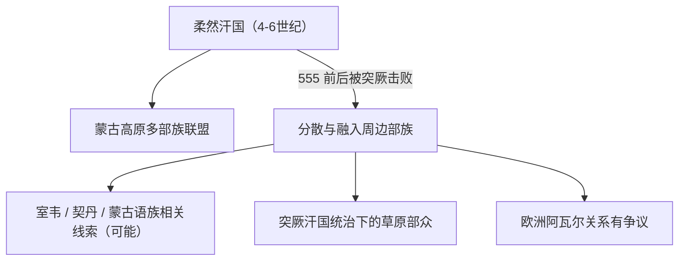

# 柔然

## 校正版演进图

> 柔然与欧洲阿瓦尔可能有关，但不是可直接写成确定继承的关系。

## 概括

柔然是 4 至 6 世纪控制蒙古高原的汗国，语言归属有争议，常被视为蒙古语族或旁蒙古语相关线索。

## 起源

鲜卑、东胡系统和草原多部族联盟

### 起源详细补充

- 柔然兴起于拓跋鲜卑和漠北草原环境中，是多部族汗国。
- 其语言归属仍有争议，近年常被放入蒙古语族或旁蒙古语相关讨论。
- 柔然不是“蒙古族直接祖先”这样的单线概念。

## 变迁

555 年被突厥击败。与欧洲阿瓦尔可能有关，但关系仍有争议，不能写作确定直系。

### 变迁详细补充

- 4至6世纪柔然控制蒙古高原，与北魏长期战争。
- 555年前后被突厥击败后，汗国瓦解，部众分散或归附突厥、契丹、室韦等。
- 欧洲阿瓦尔与柔然可能相关，但证据不足，必须写作有争议。

## 可汗世系表（节选）

| 顺序 | 姓名 / 称号 | 在位时间 | 关键事件 / 备注 |
|---|---|---|---|
| 1 | 木骨闾 | 柔然始祖传说人物 | 4 世纪 | 柔然名称早期祖先叙事。 |
| 2 | 车鹿会 | 部落首领 | 4 世纪 | 柔然早期首领。 |
| 3 | 社仑 / 丘豆伐可汗 | 402-410 | 建立柔然汗国，称可汗。 |
| 4 | 斛律可汗 | 410-414 | 继承社仑。 |
| 5 | 大檀可汗 | 414-429 | 与北魏冲突频繁。 |
| 6 | 吴提可汗 | 429-444 | 柔然中期。 |
| 7 | 吐贺真可汗 | 444-464 | 柔然继续控制漠北。 |
| 8 | 予成可汗 | 464-485 | 柔然后期。 |
| 9 | 豆仑可汗 | 485-492 | 内乱加剧。 |
| 10 | 那盖可汗 | 492-506 | 柔然一度恢复。 |
| 11 | 伏图可汗 | 506-508 | 在位短。 |
| 12 | 丑奴可汗 | 508-520 | 柔然晚期。 |
| 13 | 阿那瓌可汗 | 520-552 | 552 年被突厥击败，柔然主力瓦解。 |

## 所属大类

- [蒙古语族与东胡](/%E4%BA%BA%E6%96%87%E7%A7%91%E5%AD%A6/%E5%8E%86%E5%8F%B2-%E4%B8%AD%E5%9B%BD/%E6%B0%91%E6%97%8F/%E8%92%99%E5%8F%A4%E8%AF%AD%E6%97%8F%E4%B8%8E%E4%B8%9C%E8%83%A1/README.md)

## 相关总览

- [华夏周边民族](/%E4%BA%BA%E6%96%87%E7%A7%91%E5%AD%A6/%E5%8E%86%E5%8F%B2-%E4%B8%AD%E5%9B%BD/%E6%B0%91%E6%97%8F/README.md)
- [起源](/%E4%BA%BA%E6%96%87%E7%A7%91%E5%AD%A6/%E5%8E%86%E5%8F%B2-%E4%B8%AD%E5%9B%BD/%E6%B0%91%E6%97%8F/README.md#起源)
- [变迁](/%E4%BA%BA%E6%96%87%E7%A7%91%E5%AD%A6/%E5%8E%86%E5%8F%B2-%E4%B8%AD%E5%9B%BD/%E6%B0%91%E6%97%8F/README.md#变迁)
