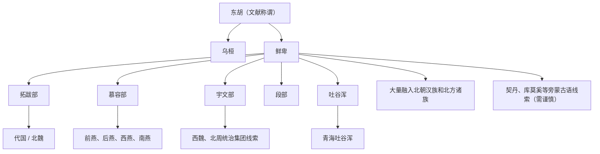

# 鲜卑

## 校正版演进图

> 原图中部分“今某族”直连关系过于确定。校正版只保留鲜卑诸部、政权和融合方向。

## 概括

鲜卑是东胡余部中最重要的一支，东汉以后入主蒙古高原，魏晋南北朝时期形成多个政权。

## 起源

东胡余部、鲜卑山相关部族

### 起源详细补充

- 鲜卑源于东胡余部，是魏晋南北朝北方最重要的族群集合之一。
- 鲜卑不是单一部落，而是拓跋、慕容、宇文、段、吐谷浑等多部族系统。
- 其语言常被视为蒙古语族或旁蒙古语相关，但具体分支仍有争议。

## 变迁

分化出拓跋、慕容、宇文、段、吐谷浑等部，建立北魏、前燕、后燕、南燕、西秦、南凉等政权，大量融入汉族和北方各族。

### 变迁详细补充

- 东汉击败北匈奴后，鲜卑入主蒙古高原并吸收匈奴余部。
- 十六国北朝时期鲜卑建立北魏、前燕、后燕、西秦、南凉等政权。
- 北魏汉化、北朝融合和隋唐统一后，鲜卑作为独立族名消失，大量融入汉族和北方诸族。

## 主要世系表（代表政权）

鲜卑不是单一王朝，以下列出最能代表鲜卑政治演进的拓跋北魏主线；慕容、宇文、吐谷浑另见各自笔记。

| 顺序 | 姓名 | 政权 / 称号 | 在位时间 | 关键事件 / 备注 |
|---|---|---|---|---|
| 1 | 拓跋力微 | 拓跋部首领 | 约 220-277 | 拓跋早期祖先，后世北魏追尊。 |
| 2 | 拓跋猗卢 | 代王 | 315-316 | 受西晋封代王。 |
| 3 | 拓跋什翼犍 | 代王 | 338-376 | 代国后期重要君主。 |
| 4 | **拓跋珪** | 北魏道武帝 | 386-409 | 重建代国并改称魏。 |
| 5 | 拓跋嗣 | 北魏明元帝 | 409-423 | 巩固北魏。 |
| 6 | **拓跋焘** | 北魏太武帝 | 423-452 | 统一北方。 |
| 7 | 拓跋濬 | 北魏文成帝 | 452-465 | 恢复佛教。 |
| 8 | 拓跋弘 | 北魏献文帝 | 465-471 | 让位后为太上皇。 |
| 9 | **元宏 / 拓跋宏** | 北魏孝文帝 | 471-499 | 迁都洛阳，推行汉化改革。 |

## 所属大类

- [蒙古语族与东胡](/%E4%BA%BA%E6%96%87%E7%A7%91%E5%AD%A6/%E5%8E%86%E5%8F%B2-%E4%B8%AD%E5%9B%BD/%E6%B0%91%E6%97%8F/%E8%92%99%E5%8F%A4%E8%AF%AD%E6%97%8F%E4%B8%8E%E4%B8%9C%E8%83%A1/README.md)

## 相关总览

- [华夏周边民族](/%E4%BA%BA%E6%96%87%E7%A7%91%E5%AD%A6/%E5%8E%86%E5%8F%B2-%E4%B8%AD%E5%9B%BD/%E6%B0%91%E6%97%8F/README.md)
- [起源](/%E4%BA%BA%E6%96%87%E7%A7%91%E5%AD%A6/%E5%8E%86%E5%8F%B2-%E4%B8%AD%E5%9B%BD/%E6%B0%91%E6%97%8F/README.md#起源)
- [变迁](/%E4%BA%BA%E6%96%87%E7%A7%91%E5%AD%A6/%E5%8E%86%E5%8F%B2-%E4%B8%AD%E5%9B%BD/%E6%B0%91%E6%97%8F/README.md#变迁)
