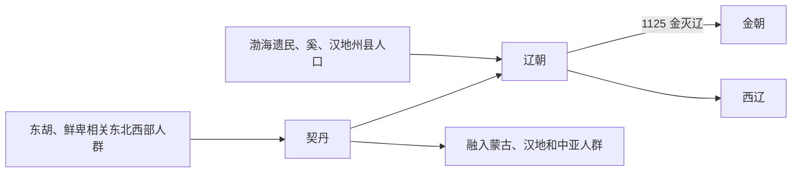

# 契丹

## 概括

契丹是辽河上游和西拉木伦河一带的古代民族，语言通常视为蒙古语族相关或旁蒙古语。

## 起源

东胡、鲜卑、宇文、库莫奚等传统线索

### 起源详细补充

- 契丹活动于西拉木伦河、老哈河和辽河上游一带。
- 其语言通常视为旁蒙古语或蒙古语族相关。
- 契丹与鲜卑、宇文、库莫奚、室韦等东北草原系统有复杂关系。

## 变迁

建立辽朝。辽亡后部分西迁建立西辽，部分融入女真、蒙古、汉族等；“契丹”在欧亚多种语言中成为中国称名来源。

### 变迁详细补充

- 唐末契丹耶律氏兴起，907年后建立辽朝。
- 辽亡后，一支西迁中亚建立西辽，留居东北者被金、蒙古、元吸收。
- 达斡尔族常被讨论为契丹后裔线索之一，但不能写成完全确定。

## 演进图

## 君主世系表（辽朝）

| 顺序 | 姓名 | 庙号 / 谥号 | 在位时间 | 关键事件 / 备注 |
|---|---|---|---|---|
| 1 | **耶律阿保机** | 辽太祖 | 907-926 | 统一契丹诸部，建立辽。 |
| 2 | 耶律德光 | 辽太宗 | 927-947 | 入主中原，改国号辽。 |
| 3 | 耶律阮 | 辽世宗 | 947-951 | 辽初继承斗争。 |
| 4 | 耶律璟 | 辽穆宗 | 951-969 | 内政不稳。 |
| 5 | 耶律贤 | 辽景宗 | 969-982 | 辽宋关系成形。 |
| 6 | **耶律隆绪** | 辽圣宗 | 982-1031 | 辽朝强盛，澶渊之盟。 |
| 7 | 耶律宗真 | 辽兴宗 | 1031-1055 | 辽朝中期。 |
| 8 | 耶律洪基 | 辽道宗 | 1055-1101 | 后期矛盾加深。 |
| 9 | **耶律延禧** | 辽天祚帝 | 1101-1125 | 1125 年金灭辽。 |
| 10 | 耶律大石 | 西辽德宗 | 1132-1143 | 西迁建立西辽。 |

## 所属大类

- [蒙古语族与东胡](/%E4%BA%BA%E6%96%87%E7%A7%91%E5%AD%A6/%E5%8E%86%E5%8F%B2-%E4%B8%AD%E5%9B%BD/%E6%B0%91%E6%97%8F/%E8%92%99%E5%8F%A4%E8%AF%AD%E6%97%8F%E4%B8%8E%E4%B8%9C%E8%83%A1/README.md)

## 相关总览

- [华夏周边民族](/%E4%BA%BA%E6%96%87%E7%A7%91%E5%AD%A6/%E5%8E%86%E5%8F%B2-%E4%B8%AD%E5%9B%BD/%E6%B0%91%E6%97%8F/README.md)
- [起源](/%E4%BA%BA%E6%96%87%E7%A7%91%E5%AD%A6/%E5%8E%86%E5%8F%B2-%E4%B8%AD%E5%9B%BD/%E6%B0%91%E6%97%8F/README.md#起源)
- [变迁](/%E4%BA%BA%E6%96%87%E7%A7%91%E5%AD%A6/%E5%8E%86%E5%8F%B2-%E4%B8%AD%E5%9B%BD/%E6%B0%91%E6%97%8F/README.md#变迁)
