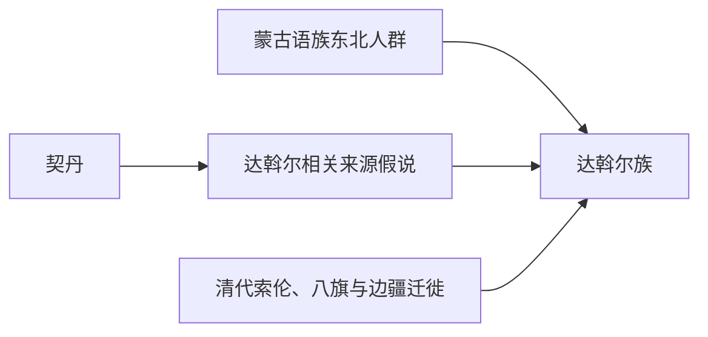

# 达斡尔族

## 概括

达斡尔族是现代蒙古语族民族之一，主要分布于嫩江流域、呼伦贝尔和黑龙江等地，常被讨论为与契丹遗民有关系。

## 起源

达斡尔族语言属蒙古语族，保留若干被认为与契丹相关的底层特征；族源还包含东北边疆多民族融合。

### 起源详细补充

- 主要活动区域与蒙古高原、辽西、兴安岭或东北边疆相关。
- 族属关系常涉及东胡、鲜卑、室韦、契丹和蒙古诸部的多层融合。
- 不宜把部族名称直接等同现代民族或单一血缘。

## 变迁

达斡尔族在蒙古语族与东胡线索中多作为部族、分支或现代民族节点存在，其后续多进入蒙古帝国、元代族群重组或近现代民族识别。

## 演进图

### 变迁详细补充

- 其变迁主要通过联盟、征服、归附和融合完成。
- 成吉思汗统一蒙古诸部后，许多原部族名逐渐转化为氏族、部落或地域身份。
- 现代民族身份和古代部族名称之间需要区分。

## 世系说明

达斡尔族不是单一王朝或固定家族，而是蒙古高原或东北边疆的部族 / 现代民族名称，没有能够连续排列的统一君主世系。可考世系应参考蒙古、契丹、鲜卑等主线等具体政权或部族。

## 所属大类

- [蒙古语族与东胡](/%E4%BA%BA%E6%96%87%E7%A7%91%E5%AD%A6/%E5%8E%86%E5%8F%B2-%E4%B8%AD%E5%9B%BD/%E6%B0%91%E6%97%8F/%E8%92%99%E5%8F%A4%E8%AF%AD%E6%97%8F%E4%B8%8E%E4%B8%9C%E8%83%A1/README.md)

## 相关笔记

- [蒙古](/%E4%BA%BA%E6%96%87%E7%A7%91%E5%AD%A6/%E5%8E%86%E5%8F%B2-%E4%B8%AD%E5%9B%BD/%E6%B0%91%E6%97%8F/%E8%92%99%E5%8F%A4%E8%AF%AD%E6%97%8F%E4%B8%8E%E4%B8%9C%E8%83%A1/%E5%AE%A4%E9%9F%A6%E8%92%99%E5%8F%A4%E6%BA%90%E6%B5%81/%E8%92%99%E5%8F%A4.md)
- [室韦](/%E4%BA%BA%E6%96%87%E7%A7%91%E5%AD%A6/%E5%8E%86%E5%8F%B2-%E4%B8%AD%E5%9B%BD/%E6%B0%91%E6%97%8F/%E8%92%99%E5%8F%A4%E8%AF%AD%E6%97%8F%E4%B8%8E%E4%B8%9C%E8%83%A1/%E5%AE%A4%E9%9F%A6%E8%92%99%E5%8F%A4%E6%BA%90%E6%B5%81/%E5%AE%A4%E9%9F%A6.md)
- [华夏周边民族](/%E4%BA%BA%E6%96%87%E7%A7%91%E5%AD%A6/%E5%8E%86%E5%8F%B2-%E4%B8%AD%E5%9B%BD/%E6%B0%91%E6%97%8F/README.md)
- [起源](/%E4%BA%BA%E6%96%87%E7%A7%91%E5%AD%A6/%E5%8E%86%E5%8F%B2-%E4%B8%AD%E5%9B%BD/%E6%B0%91%E6%97%8F/README.md#起源)
- [变迁](/%E4%BA%BA%E6%96%87%E7%A7%91%E5%AD%A6/%E5%8E%86%E5%8F%B2-%E4%B8%AD%E5%9B%BD/%E6%B0%91%E6%97%8F/README.md#变迁)

## 参考

- [Daur people](https://en.wikipedia.org/wiki/Daur_people)
