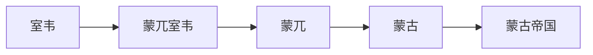

# 室韦蒙古源流

本目录是“蒙古语族与东胡”下的二级线索，用于收纳室韦蒙古源流相关民族、部族或政权笔记。

## 演进图

## 包含笔记

- [室韦](/%E4%BA%BA%E6%96%87%E7%A7%91%E5%AD%A6/%E5%8E%86%E5%8F%B2-%E4%B8%AD%E5%9B%BD/%E6%B0%91%E6%97%8F/%E8%92%99%E5%8F%A4%E8%AF%AD%E6%97%8F%E4%B8%8E%E4%B8%9C%E8%83%A1/%E5%AE%A4%E9%9F%A6%E8%92%99%E5%8F%A4%E6%BA%90%E6%B5%81/%E5%AE%A4%E9%9F%A6.md)
- [蒙兀室韦](/%E4%BA%BA%E6%96%87%E7%A7%91%E5%AD%A6/%E5%8E%86%E5%8F%B2-%E4%B8%AD%E5%9B%BD/%E6%B0%91%E6%97%8F/%E8%92%99%E5%8F%A4%E8%AF%AD%E6%97%8F%E4%B8%8E%E4%B8%9C%E8%83%A1/%E5%AE%A4%E9%9F%A6%E8%92%99%E5%8F%A4%E6%BA%90%E6%B5%81/%E8%92%99%E5%85%80%E5%AE%A4%E9%9F%A6.md)
- [蒙兀](/%E4%BA%BA%E6%96%87%E7%A7%91%E5%AD%A6/%E5%8E%86%E5%8F%B2-%E4%B8%AD%E5%9B%BD/%E6%B0%91%E6%97%8F/%E8%92%99%E5%8F%A4%E8%AF%AD%E6%97%8F%E4%B8%8E%E4%B8%9C%E8%83%A1/%E5%AE%A4%E9%9F%A6%E8%92%99%E5%8F%A4%E6%BA%90%E6%B5%81/%E8%92%99%E5%85%80.md)
- [蒙古](/%E4%BA%BA%E6%96%87%E7%A7%91%E5%AD%A6/%E5%8E%86%E5%8F%B2-%E4%B8%AD%E5%9B%BD/%E6%B0%91%E6%97%8F/%E8%92%99%E5%8F%A4%E8%AF%AD%E6%97%8F%E4%B8%8E%E4%B8%9C%E8%83%A1/%E5%AE%A4%E9%9F%A6%E8%92%99%E5%8F%A4%E6%BA%90%E6%B5%81/%E8%92%99%E5%8F%A4.md)

## 上级目录

- [蒙古语族与东胡](/%E4%BA%BA%E6%96%87%E7%A7%91%E5%AD%A6/%E5%8E%86%E5%8F%B2-%E4%B8%AD%E5%9B%BD/%E6%B0%91%E6%97%8F/%E8%92%99%E5%8F%A4%E8%AF%AD%E6%97%8F%E4%B8%8E%E4%B8%9C%E8%83%A1/README.md)
- [华夏周边民族](/%E4%BA%BA%E6%96%87%E7%A7%91%E5%AD%A6/%E5%8E%86%E5%8F%B2-%E4%B8%AD%E5%9B%BD/%E6%B0%91%E6%97%8F/README.md)
