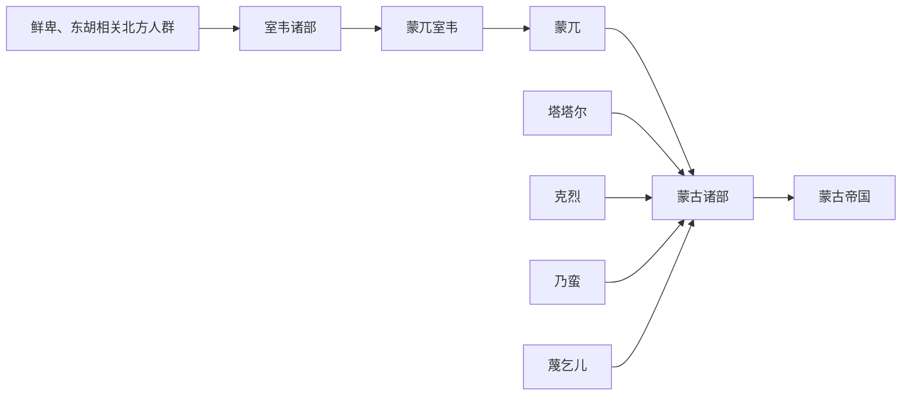

# 室韦

## 概括

室韦是隋唐史籍中对大兴安岭、额尔古纳河和黑龙江流域若干部族的泛称。

## 起源

东胡、鲜卑、契丹相关东北草原森林部族

### 起源详细补充

- 室韦是隋唐文献中对大兴安岭、额尔古纳河、黑龙江上游若干部族的泛称。
- 它不是单一部族，包含南室韦、北室韦、蒙兀室韦等多支。
- 室韦与契丹、奚、蒙古形成史关系密切。

## 变迁

蒙兀室韦是蒙古形成的重要线索之一，但蒙古共同体还吸收克烈、乃蛮、蔑儿乞、塔塔儿等多部族。

### 变迁详细补充

- 唐代室韦时而附突厥、回鹘，时而受契丹影响。
- 蒙兀室韦被视为蒙古部名的重要早期线索。
- 13世纪蒙古共同体形成时，室韦诸部与克烈、乃蛮、塔塔儿等共同被整合。

## 演进图

## 世系说明

室韦不是一个单一王朝或固定家族名称，而是唐宋时期东北和大兴安岭一带多个部族的总称，因此没有能够连续排列的统一君主世系。可考的政治世系应分别放在蒙古、契丹等后续政权等具体政权或部族笔记中。

## 所属大类

- [蒙古语族与东胡](/%E4%BA%BA%E6%96%87%E7%A7%91%E5%AD%A6/%E5%8E%86%E5%8F%B2-%E4%B8%AD%E5%9B%BD/%E6%B0%91%E6%97%8F/%E8%92%99%E5%8F%A4%E8%AF%AD%E6%97%8F%E4%B8%8E%E4%B8%9C%E8%83%A1/README.md)

## 相关笔记

- [蒙兀室韦](/%E4%BA%BA%E6%96%87%E7%A7%91%E5%AD%A6/%E5%8E%86%E5%8F%B2-%E4%B8%AD%E5%9B%BD/%E6%B0%91%E6%97%8F/%E8%92%99%E5%8F%A4%E8%AF%AD%E6%97%8F%E4%B8%8E%E4%B8%9C%E8%83%A1/%E5%AE%A4%E9%9F%A6%E8%92%99%E5%8F%A4%E6%BA%90%E6%B5%81/%E8%92%99%E5%85%80%E5%AE%A4%E9%9F%A6.md)
- [蒙兀](/%E4%BA%BA%E6%96%87%E7%A7%91%E5%AD%A6/%E5%8E%86%E5%8F%B2-%E4%B8%AD%E5%9B%BD/%E6%B0%91%E6%97%8F/%E8%92%99%E5%8F%A4%E8%AF%AD%E6%97%8F%E4%B8%8E%E4%B8%9C%E8%83%A1/%E5%AE%A4%E9%9F%A6%E8%92%99%E5%8F%A4%E6%BA%90%E6%B5%81/%E8%92%99%E5%85%80.md)
- [蒙古](/%E4%BA%BA%E6%96%87%E7%A7%91%E5%AD%A6/%E5%8E%86%E5%8F%B2-%E4%B8%AD%E5%9B%BD/%E6%B0%91%E6%97%8F/%E8%92%99%E5%8F%A4%E8%AF%AD%E6%97%8F%E4%B8%8E%E4%B8%9C%E8%83%A1/%E5%AE%A4%E9%9F%A6%E8%92%99%E5%8F%A4%E6%BA%90%E6%B5%81/%E8%92%99%E5%8F%A4.md)
- [塔塔尔](/%E4%BA%BA%E6%96%87%E7%A7%91%E5%AD%A6/%E5%8E%86%E5%8F%B2-%E4%B8%AD%E5%9B%BD/%E6%B0%91%E6%97%8F/%E8%92%99%E5%8F%A4%E8%AF%AD%E6%97%8F%E4%B8%8E%E4%B8%9C%E8%83%A1/%E8%92%99%E5%8F%A4%E5%B8%9D%E5%9B%BD%E5%89%8D%E8%AF%B8%E9%83%A8/%E5%A1%94%E5%A1%94%E5%B0%94.md)

## 相关总览

- [华夏周边民族](/%E4%BA%BA%E6%96%87%E7%A7%91%E5%AD%A6/%E5%8E%86%E5%8F%B2-%E4%B8%AD%E5%9B%BD/%E6%B0%91%E6%97%8F/README.md)
- [起源](/%E4%BA%BA%E6%96%87%E7%A7%91%E5%AD%A6/%E5%8E%86%E5%8F%B2-%E4%B8%AD%E5%9B%BD/%E6%B0%91%E6%97%8F/README.md#起源)
- [变迁](/%E4%BA%BA%E6%96%87%E7%A7%91%E5%AD%A6/%E5%8E%86%E5%8F%B2-%E4%B8%AD%E5%9B%BD/%E6%B0%91%E6%97%8F/README.md#变迁)
